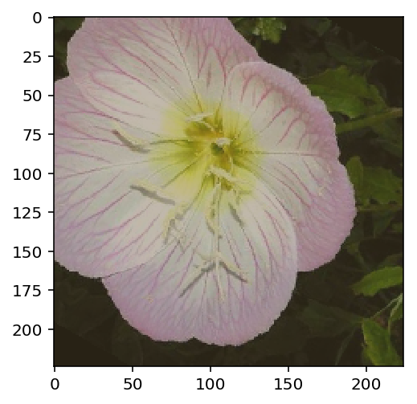
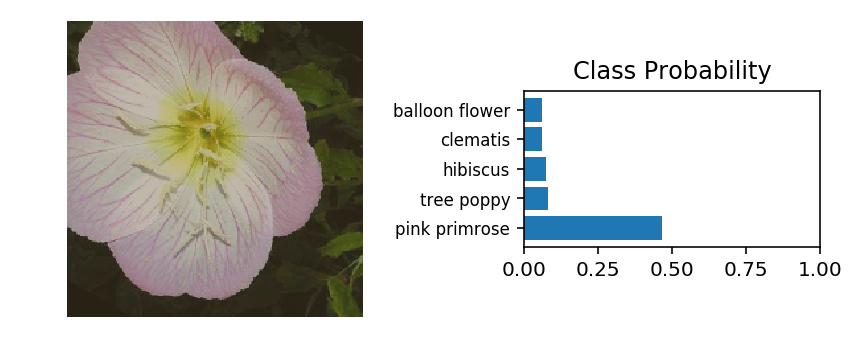

# Developing an AI application

Going forward, AI algorithms will be incorporated into more and more everyday applications. For example, you might want to include an image classifier in a smart phone app. To do this, you'd use a deep learning model trained on hundreds of thousands of images as part of the overall application architecture. A large part of software development in the future will be using these types of models as common parts of applications. 

In this project, you'll train an image classifier to recognize different species of flowers. You can imagine using something like this in a phone app that tells you the name of the flower your camera is looking at. In practice you'd train this classifier, then export it for use in your application. We'll be using [this dataset](http://www.robots.ox.ac.uk/~vgg/data/flowers/102/index.html) of 102 flower categories, you can see a few examples below. 


The project is broken down into multiple steps:

* Load and preprocess the image dataset
* Train the image classifier on your dataset
* Use the trained classifier to predict image content

We'll lead you through each part which you'll implement in Python.

When you've completed this project, you'll have an application that can be trained on any set of labeled images. Here your network will be learning about flowers and end up as a command line application. But, what you do with your new skills depends on your imagination and effort in building a dataset. For example, imagine an app where you take a picture of a car, it tells you what the make and model is, then looks up information about it. Go build your own dataset and make something new.

First up is importing the packages you'll need. It's good practice to keep all the imports at the beginning of your code. As you work through this notebook and find you need to import a package, make sure to add the import up here.

Please make sure if you are running this notebook in the workspace that you have chosen GPU rather than CPU mode.


```python
# Imports here
%matplotlib inline
%config InlineBackend.figure_format = 'retina'

import matplotlib.pyplot as plt

import torch
from torch import nn
from torch import optim
import torch.nn.functional as F
from torchvision import datasets, transforms, models
```

## Load the data

Here you'll use `torchvision` to load the data ([documentation](http://pytorch.org/docs/0.3.0/torchvision/index.html)). The data should be included alongside this notebook, otherwise you can [download it here](https://s3.amazonaws.com/content.udacity-data.com/nd089/flower_data.tar.gz). The dataset is split into three parts, training, validation, and testing. For the training, you'll want to apply transformations such as random scaling, cropping, and flipping. This will help the network generalize leading to better performance. You'll also need to make sure the input data is resized to 224x224 pixels as required by the pre-trained networks.

The validation and testing sets are used to measure the model's performance on data it hasn't seen yet. For this you don't want any scaling or rotation transformations, but you'll need to resize then crop the images to the appropriate size.

The pre-trained networks you'll use were trained on the ImageNet dataset where each color channel was normalized separately. For all three sets you'll need to normalize the means and standard deviations of the images to what the network expects. For the means, it's `[0.485, 0.456, 0.406]` and for the standard deviations `[0.229, 0.224, 0.225]`, calculated from the ImageNet images.  These values will shift each color channel to be centered at 0 and range from -1 to 1.
 


```python
data_dir = 'flowers'
train_dir = data_dir + '/train'
valid_dir = data_dir + '/valid'
test_dir = data_dir + '/test'
```


```python
# TODO: Define your transforms for the training, validation, and testing sets
data_transforms = [
    transforms.Compose([transforms.RandomRotation(30),
                       transforms.RandomResizedCrop(224),
                       transforms.RandomHorizontalFlip(),
                       transforms.ToTensor(),
                       transforms.Normalize([0.485, 0.456, 0.406], 
                                            [0.229, 0.224, 0.225])]),
    transforms.Compose([transforms.Resize(256),
                       transforms.CenterCrop(224),
                       transforms.ToTensor(),
                       transforms.Normalize([0.485, 0.456, 0.406], 
                                            [0.229, 0.224, 0.225])]),
    transforms.Compose([transforms.Resize(256),
                       transforms.CenterCrop(224),
                       transforms.ToTensor(),
                       transforms.Normalize([0.485, 0.456, 0.406], 
                                            [0.229, 0.224, 0.225])])

]

# TODO: Load the datasets with ImageFolder
image_datasets = [
    datasets.ImageFolder(train_dir, transform=data_transforms[0]),
    datasets.ImageFolder(valid_dir, transform=data_transforms[1]),
    datasets.ImageFolder(test_dir, transform=data_transforms[2])
]

# TODO: Using the image datasets and the trainforms, define the dataloaders
dataloaders = [
    torch.utils.data.DataLoader(image_datasets[0], batch_size=64, shuffle=True),
    torch.utils.data.DataLoader(image_datasets[1], batch_size=32),
    torch.utils.data.DataLoader(image_datasets[2], batch_size=32)
]
```

### Label mapping

You'll also need to load in a mapping from category label to category name. You can find this in the file `cat_to_name.json`. It's a JSON object which you can read in with the [`json` module](https://docs.python.org/2/library/json.html). This will give you a dictionary mapping the integer encoded categories to the actual names of the flowers.


```python
import json

with open('cat_to_name.json', 'r') as f:
    cat_to_name = json.load(f)
```


```python
for key in sorted(cat_to_name)[:5]:
    print(key, cat_to_name[key])
```

    1 pink primrose
    10 globe thistle
    100 blanket flower
    101 trumpet creeper
    102 blackberry lily


# Building and training the classifier

Now that the data is ready, it's time to build and train the classifier. As usual, you should use one of the pretrained models from `torchvision.models` to get the image features. Build and train a new feed-forward classifier using those features.

We're going to leave this part up to you. Refer to [the rubric](https://review.udacity.com/#!/rubrics/1663/view) for guidance on successfully completing this section. Things you'll need to do:

* Load a [pre-trained network](http://pytorch.org/docs/master/torchvision/models.html) (If you need a starting point, the VGG networks work great and are straightforward to use)
* Define a new, untrained feed-forward network as a classifier, using ReLU activations and dropout
* Train the classifier layers using backpropagation using the pre-trained network to get the features
* Track the loss and accuracy on the validation set to determine the best hyperparameters

We've left a cell open for you below, but use as many as you need. Our advice is to break the problem up into smaller parts you can run separately. Check that each part is doing what you expect, then move on to the next. You'll likely find that as you work through each part, you'll need to go back and modify your previous code. This is totally normal!

When training make sure you're updating only the weights of the feed-forward network. You should be able to get the validation accuracy above 70% if you build everything right. Make sure to try different hyperparameters (learning rate, units in the classifier, epochs, etc) to find the best model. Save those hyperparameters to use as default values in the next part of the project.

One last important tip if you're using the workspace to run your code: To avoid having your workspace disconnect during the long-running tasks in this notebook, please read in the earlier page in this lesson called Intro to GPU Workspaces about Keeping Your Session Active. You'll want to include code from the workspace_utils.py module.


```python
# TODO: Build and train your network
model = models.vgg16(pretrained=True)
model

```

    Downloading: "https://download.pytorch.org/models/vgg16-397923af.pth" to /root/.torch/models/vgg16-397923af.pth
    100%|██████████| 553433881/553433881 [00:05<00:00, 100279442.58it/s]


    VGG(
      (features): Sequential(
        (0): Conv2d(3, 64, kernel_size=(3, 3), stride=(1, 1), padding=(1, 1))
        (1): ReLU(inplace)
        (2): Conv2d(64, 64, kernel_size=(3, 3), stride=(1, 1), padding=(1, 1))
        (3): ReLU(inplace)
        (4): MaxPool2d(kernel_size=2, stride=2, padding=0, dilation=1, ceil_mode=False)
        (5): Conv2d(64, 128, kernel_size=(3, 3), stride=(1, 1), padding=(1, 1))
        (6): ReLU(inplace)
        (7): Conv2d(128, 128, kernel_size=(3, 3), stride=(1, 1), padding=(1, 1))
        (8): ReLU(inplace)
        (9): MaxPool2d(kernel_size=2, stride=2, padding=0, dilation=1, ceil_mode=False)
        (10): Conv2d(128, 256, kernel_size=(3, 3), stride=(1, 1), padding=(1, 1))
        (11): ReLU(inplace)
        (12): Conv2d(256, 256, kernel_size=(3, 3), stride=(1, 1), padding=(1, 1))
        (13): ReLU(inplace)
        (14): Conv2d(256, 256, kernel_size=(3, 3), stride=(1, 1), padding=(1, 1))
        (15): ReLU(inplace)
        (16): MaxPool2d(kernel_size=2, stride=2, padding=0, dilation=1, ceil_mode=False)
        (17): Conv2d(256, 512, kernel_size=(3, 3), stride=(1, 1), padding=(1, 1))
        (18): ReLU(inplace)
        (19): Conv2d(512, 512, kernel_size=(3, 3), stride=(1, 1), padding=(1, 1))
        (20): ReLU(inplace)
        (21): Conv2d(512, 512, kernel_size=(3, 3), stride=(1, 1), padding=(1, 1))
        (22): ReLU(inplace)
        (23): MaxPool2d(kernel_size=2, stride=2, padding=0, dilation=1, ceil_mode=False)
        (24): Conv2d(512, 512, kernel_size=(3, 3), stride=(1, 1), padding=(1, 1))
        (25): ReLU(inplace)
        (26): Conv2d(512, 512, kernel_size=(3, 3), stride=(1, 1), padding=(1, 1))
        (27): ReLU(inplace)
        (28): Conv2d(512, 512, kernel_size=(3, 3), stride=(1, 1), padding=(1, 1))
        (29): ReLU(inplace)
        (30): MaxPool2d(kernel_size=2, stride=2, padding=0, dilation=1, ceil_mode=False)
      )
      (classifier): Sequential(
        (0): Linear(in_features=25088, out_features=4096, bias=True)
        (1): ReLU(inplace)
        (2): Dropout(p=0.5)
        (3): Linear(in_features=4096, out_features=4096, bias=True)
        (4): ReLU(inplace)
        (5): Dropout(p=0.5)
        (6): Linear(in_features=4096, out_features=1000, bias=True)
      )
    )


```python
config = {
    'drop': 0.5
}
print(model.classifier)
```

    Sequential(
      (0): Linear(in_features=25088, out_features=4096, bias=True)
      (1): ReLU(inplace)
      (2): Dropout(p=0.5)
      (3): Linear(in_features=4096, out_features=4096, bias=True)
      (4): ReLU(inplace)
      (5): Dropout(p=0.5)
      (6): Linear(in_features=4096, out_features=1000, bias=True)
    )


```python
for param in model.parameters():
    param.requires_grad = False

from collections import OrderedDict
classifier = nn.Sequential(OrderedDict([
                          ('fc1', nn.Linear(25088, 4096)),
                          ('relu1', nn.ReLU()),
                          ('dropout1', nn.Dropout(config['drop'])),
                          ('fc2', nn.Linear(4096, 1000)),
                          ('relu2', nn.ReLU()),
                          ('dropout2', nn.Dropout(config['drop'])),
                          ('fc3', nn.Linear(1000, 102)),
                          ('output', nn.LogSoftmax(dim=1))
                          ]))
    
model.classifier = classifier
```


```python
criterion = nn.NLLLoss()
# Only train the classifier parameters, feature parameters are frozen
optimizer = optim.Adam(model.classifier.parameters(), lr=0.001)
```


```python
def validation(model, validationloader, criterion, device = 'cuda'):
    test_loss = 0
    accuracy = 0
    for images, labels in validationloader:
        images, labels = images.to(device), labels.to(device)
        output = model.forward(images)
        test_loss += criterion(output, labels).item()

        ps = torch.exp(output)
        equality = (labels.data == ps.max(dim=1)[1])
        accuracy += equality.type(torch.FloatTensor).mean()
    
    return test_loss, accuracy
```


```python
def do_deep_learning(model, trainloader, epochs, print_every, criterion, optimizer, device='cuda'):
    epochs = epochs
    print_every = print_every
    steps = 0
    running_loss = 0
    
    # change to cuda
    model.to(device)

    for e in range(epochs):
        model.train()
        for images, labels in trainloader:
            steps += 1

            images, labels = images.to(device), labels.to(device)
            optimizer.zero_grad()

            output = model.forward(images)
            loss = criterion(output, labels)
            loss.backward()
            optimizer.step()

            running_loss += loss.item()

            if steps % print_every == 0:
                # Make sure network is in eval mode for inference
                model.eval()

                # Turn off gradients for validation, saves memory and computations
                with torch.no_grad():
                    validation_loss, accuracy = validation(model, dataloaders[1], criterion)

                print("Epoch: {}/{}.. ".format(e+1, epochs),
                      "Training Loss: {:.3f}.. ".format(running_loss/print_every),
                      "Validation Loss: {:.3f}.. ".format(validation_loss/len(dataloaders[1])),
                      "Validation Accuracy: {:.3f}".format(accuracy/len(dataloaders[1])))

                running_loss = 0

                # Make sure training is back on
                model.train()
```


```python
do_deep_learning(model, dataloaders[0], 3, 40, criterion, optimizer)
```

    Epoch: 1/3..  Training Loss: 4.271..  Validation Loss: 2.860..  Validation Accuracy: 0.333
    Epoch: 1/3..  Training Loss: 2.936..  Validation Loss: 1.754..  Validation Accuracy: 0.526
    Epoch: 2/3..  Training Loss: 2.356..  Validation Loss: 1.314..  Validation Accuracy: 0.651
    Epoch: 2/3..  Training Loss: 2.081..  Validation Loss: 1.166..  Validation Accuracy: 0.670
    Epoch: 2/3..  Training Loss: 1.972..  Validation Loss: 1.012..  Validation Accuracy: 0.732
    Epoch: 3/3..  Training Loss: 1.792..  Validation Loss: 0.896..  Validation Accuracy: 0.755
    Epoch: 3/3..  Training Loss: 1.731..  Validation Loss: 0.817..  Validation Accuracy: 0.767


```python
# save the result:
# Base:
# vgg11, learn rate 0.001, epochs 3, 
# classifier = nn.Sequential(OrderedDict([
#                           ('fc1', nn.Linear(25088, 4096)),
#                           ('relu1', nn.ReLU()),
#                           ('dropout1', nn.Dropout(config['drop'])),
#                           ('fc2', nn.Linear(4096, 1000)),
#                           ('relu2', nn.ReLU()),
#                           ('dropout2', nn.Dropout(config['drop'])),
#                           ('fc3', nn.Linear(1000, 102)),
#                           ('output', nn.LogSoftmax(dim=1))
#                           ]))
# accuracy: 0.817
```

## Testing your network

It's good practice to test your trained network on test data, images the network has never seen either in training or validation. This will give you a good estimate for the model's performance on completely new images. Run the test images through the network and measure the accuracy, the same way you did validation. You should be able to reach around 70% accuracy on the test set if the model has been trained well.


```python
def check_accuracy_on_test(model, testloader, device='cuda'):    
    correct = 0
    total = 0
    with torch.no_grad():
        for data in testloader:
            images, labels = data
            outputs = model(images.to(device))
            _, predicted = torch.max(outputs.data, 1)
            total += labels.size(0)
            correct += (predicted == labels.to(device)).sum().item()
    print('Accuracy of the network on the test images: %d %%' % (100 * correct / total))


```


```python
check_accuracy_on_test(model, dataloaders[2])
```

    Accuracy of the network on the test images: 74 %


## Save the checkpoint

Now that your network is trained, save the model so you can load it later for making predictions. You probably want to save other things such as the mapping of classes to indices which you get from one of the image datasets: `image_datasets['train'].class_to_idx`. You can attach this to the model as an attribute which makes inference easier later on.

```model.class_to_idx = image_datasets['train'].class_to_idx```

Remember that you'll want to completely rebuild the model later so you can use it for inference. Make sure to include any information you need in the checkpoint. If you want to load the model and keep training, you'll want to save the number of epochs as well as the optimizer state, `optimizer.state_dict`. You'll likely want to use this trained model in the next part of the project, so best to save it now.


```python
model.class_to_idx = image_datasets[0].class_to_idx
model.idx_to_class = {v: k for k, v in model.class_to_idx.items()}
```


```python
# TODO: Save the checkpoint 
torch.save(model.state_dict(), 'ic_project.pth')
```

## Loading the checkpoint

At this point it's good to write a function that can load a checkpoint and rebuild the model. That way you can come back to this project and keep working on it without having to retrain the network.


```python
# TODO: Write a function that loads a checkpoint and rebuilds the model
def load_checkpoint(model, path):
    state_dict = torch.load(path)
    model.load_state_dict(state_dict)
    return model
```


```python
torch.load('ic_project.pth')
```


    OrderedDict([('features.0.weight', tensor([[[[-0.5537,  0.1427,  0.5290],
                            [-0.5831,  0.3566,  0.7657],
                            [-0.6902, -0.0480,  0.4841]],
                  
                           [[ 0.1755,  0.0099, -0.0814],
                            [ 0.0441, -0.0703, -0.2604],
                            [ 0.1324, -0.1728, -0.1323]],
                  
                           [[ 0.3130, -0.1659, -0.4275],
                            [ 0.4752, -0.0827, -0.4870],
                            [ 0.6320,  0.0193, -0.2775]]],
                  
                  
                          [[[ 0.2325,  0.1267,  0.1861],
                            [-0.4281, -0.2435,  0.2463],
                            [-0.2507,  0.1418, -0.0055]],
                  
                           [[-0.1408, -0.2190,  0.1504],
                            [-0.8413, -0.3518,  0.5640],
                            [-0.2419,  0.5193,  0.5391]],
                  
                           [[-0.3143, -0.3705, -0.1309],
                            [-0.4714, -0.1550,  0.3459],
                            [ 0.0544,  0.5868,  0.4958]]],
                  
                  
                          [[[ 0.1772,  0.5215,  0.0099],
                            [-0.2718, -0.7171,  0.3129],
                            [-0.0758, -0.2208,  0.3346]],
                  
                           [[ 0.3092,  0.6707,  0.0205],
                            [-0.4661, -1.0697,  0.3350],
                            [-0.0803, -0.3052,  0.5446]],
                  
                           [[ 0.3157,  0.4233, -0.3498],
                            [ 0.0864, -0.4646,  0.0118],
                            [ 0.1048, -0.1458, -0.0158]]],
                  
                  
                          ...,
                  
                  
                          [[[ 0.0776,  0.1269,  0.0323],
                            [ 0.2213,  0.2468, -0.0466],
                            [ 0.0464,  0.0282,  0.0175]],
                  
                           [[-0.1833, -0.0674, -0.0072],
                            [-0.0489,  0.0070, -0.1288],
                            [-0.0646, -0.0646,  0.0442]],
                  
                           [[-0.2255, -0.1193, -0.0234],
                            [-0.0992, -0.0151,  0.0010],
                            [-0.0261,  0.0014,  0.1428]]],
                  
                  
                          [[[ 0.0165, -0.0322, -0.0038],
                            [-0.0682, -0.1944, -0.1417],
                            [-0.0695, -0.1834, -0.1742]],
                  
                           [[ 0.0428, -0.0675, -0.0070],
                            [ 0.0118, -0.1496, -0.1236],
                            [ 0.0102, -0.1039, -0.1174]],
                  
                           [[ 0.1266,  0.0850,  0.1307],
                            [ 0.1759,  0.1129,  0.1194],
                            [ 0.1466,  0.0989,  0.1035]]],
                  
                  
                          [[[ 0.0322, -0.1077, -0.2639],
                            [ 0.2796, -0.0374, -0.2547],
                            [ 0.3487,  0.0300, -0.0559]],
                  
                           [[ 0.2506,  0.1554, -0.1743],
                            [ 0.3925,  0.0323, -0.3519],
                            [ 0.1930, -0.1990, -0.2971]],
                  
                           [[ 0.4603,  0.4340,  0.2835],
                            [ 0.1634, -0.0582, -0.1920],
                            [-0.1952, -0.4563, -0.4273]]]], device='cuda:0')),
                 ('features.0.bias',
                  tensor([ 0.4034,  0.3778,  0.4644, -0.3228,  0.3940, -0.3953,  0.3951,
                          -0.5496,  0.2693, -0.7602, -0.3508,  0.2334, -1.3239, -0.1694,
                           0.3938, -0.1026,  0.0460, -0.6995,  0.1549,  0.5628,  0.3011,
                           0.3425,  0.1073,  0.4651,  0.1295,  0.0788, -0.0492, -0.5638,
                           0.1465, -0.3890, -0.0715,  0.0649,  0.2768,  0.3279,  0.5682,
                          -1.2640, -0.8368, -0.9485,  0.1358,  0.2727,  0.1841, -0.5325,
                           0.3507, -0.0827, -1.0248, -0.6912, -0.7711,  0.2612,  0.4033,
                          -0.4802, -0.3066,  0.5807, -1.3325,  0.4844, -0.8160,  0.2386,
                           0.2300,  0.4979,  0.5553,  0.5230, -0.2182,  0.0117, -0.5516,
                           0.2108], device='cuda:0')),
                 ('features.2.weight',
                  tensor([[[[-3.0606e-02, -9.8520e-02, -1.3260e-01],
                            [ 6.8208e-03, -8.3483e-02, -1.6697e-01],
                            [ 3.1015e-02, -6.5803e-02, -1.3171e-01]],
                  
                           [[ 4.7407e-02, -2.7588e-02, -5.1127e-02],
                            [ 7.0129e-02,  8.2528e-03, -1.8340e-02],
                            [ 6.9918e-02,  3.8993e-02,  1.6228e-02]],
                  
                           [[ 7.0700e-02,  5.2703e-03, -4.7362e-02],
                            [ 8.4006e-02,  4.9190e-02, -1.6474e-03],
                            [ 8.5166e-03,  2.2350e-02,  5.9118e-03]],
                  
                           ...,
                  
                           [[ 2.7666e-02,  2.1778e-02, -9.4606e-03],
                            [ 2.5511e-02,  4.1186e-03, -3.4521e-02],
                            [ 2.0150e-02,  3.7068e-02, -1.3509e-02]],
                  
                           [[ 2.1684e-02,  4.1812e-02,  5.8284e-02],
                            [ 2.7431e-02,  3.6847e-02,  3.4335e-02],
                            [-9.4839e-03,  1.9745e-02,  5.0264e-02]],
                  
                           [[ 2.1769e-02, -2.1388e-02, -9.9363e-02],
                            [-5.7156e-02, -7.1328e-02, -7.7600e-02],
                            [-3.7508e-02, -2.5453e-02, -4.5096e-03]]],
                  
                  
                          [[[-1.3319e-02, -7.7979e-02, -1.3496e-01],
                            [-3.7411e-02, -8.1807e-02, -1.4195e-01],
                            [-4.1913e-02, -1.0756e-01, -1.6164e-01]],
                  
                           [[-6.8725e-03,  4.8598e-02,  1.5008e-02],
                            [ 1.8636e-02,  9.8393e-03, -1.5973e-02],
                            [ 9.5164e-04, -3.2665e-02, -3.5824e-02]],
                  
                           [[ 1.4780e-02, -1.4260e-02, -4.4468e-02],
                            [-1.8438e-02,  1.4841e-02, -8.2337e-02],
                            [ 1.8329e-02,  2.1435e-03,  9.0911e-03]],
                  
                           ...,
                  
                           [[ 4.0342e-02,  3.6146e-02,  2.5515e-02],
                            [ 1.5779e-02,  3.1012e-03, -1.0942e-02],
                            [ 2.3790e-02,  1.6440e-02, -2.5835e-02]],
                  
                           [[-2.2844e-02,  2.5371e-03, -2.1714e-02],
                            [ 3.9534e-04, -6.4903e-03,  1.6979e-02],
                            [-4.7200e-03, -2.2301e-02, -2.1298e-02]],
                  
                           [[-2.8434e-02, -2.6771e-02,  2.7432e-02],
                            [-5.8088e-02, -5.5869e-02,  7.0289e-02],
                            [-6.4470e-02, -3.8172e-02,  4.1569e-02]]],
                  
                  
                          [[[ 1.2508e-02,  2.4738e-02,  5.3893e-02],
                            [-2.5838e-02, -1.6176e-02,  2.8344e-02],
                            [ 1.2948e-02,  9.0717e-03,  2.8181e-02]],
                  
                           [[-7.9309e-02, -8.8828e-02, -5.5737e-02],
                            [-4.8359e-02, -1.1139e-01, -1.0901e-02],
                            [ 3.4640e-02,  2.3298e-02,  1.1002e-01]],
                  
                           [[-4.3616e-02, -1.6598e-02, -1.0547e-02],
                            [ 2.8982e-02,  4.5279e-02,  1.6869e-02],
                            [ 8.8168e-02,  1.2599e-01,  7.2292e-02]],
                  
                           ...,
                  
                           [[ 1.3967e-03,  1.5333e-02, -1.7196e-02],
                            [-8.3107e-03, -1.2905e-02, -1.4394e-03],
                            [ 6.3471e-03,  1.7825e-03, -3.3770e-02]],
                  
                           [[-7.9354e-03, -5.8610e-03, -7.6292e-05],
                            [ 6.8661e-04, -6.0019e-03,  1.0119e-02],
                            [ 3.0581e-02,  1.6821e-02,  3.2570e-02]],
                  
                           [[ 5.9351e-02, -7.4398e-03,  3.8274e-02],
                            [-2.0792e-02, -4.8833e-02,  4.0274e-02],
                            [ 2.3138e-02,  7.4794e-03,  3.5027e-02]]],
                  
                  
                          ...,
                  
                  
                          [[[-4.5464e-02, -2.9275e-02,  1.0282e-02],
                            [-4.6952e-02, -4.9473e-02,  1.7632e-02],
                            [-4.3815e-02, -2.4871e-02, -2.4908e-02]],
                  
                           [[-1.9359e-02,  1.5948e-02, -6.3554e-02],
                            [ 3.0096e-02,  2.8515e-02, -6.4439e-02],
                            [-1.4547e-02,  2.2238e-03, -6.3371e-02]],
                  
                           [[-2.7915e-02, -2.1738e-02, -5.1691e-02],
                            [ 1.0889e-02, -5.1994e-02, -5.4649e-02],
                            [-3.9741e-02,  5.2832e-04,  3.5375e-02]],
                  
                           ...,
                  
                           [[-1.9130e-03,  1.0995e-03, -7.4082e-03],
                            [ 1.8428e-03,  8.2602e-03,  1.8680e-02],
                            [ 1.1709e-02,  6.9263e-03,  3.3630e-02]],
                  
                           [[ 8.9195e-03,  3.2807e-02,  3.9282e-02],
                            [-2.5044e-03,  1.7645e-03,  1.4056e-02],
                            [-5.4708e-03,  9.5572e-03,  2.8639e-02]],
                  
                           [[-3.0241e-02, -6.7225e-02, -7.4299e-02],
                            [-3.6222e-02, -9.7721e-03,  6.1669e-02],
                            [-1.6392e-02,  5.8156e-02,  1.2894e-01]]],
                  
                  
                          [[[ 4.0321e-02,  3.7677e-02,  1.7181e-02],
                            [ 4.0298e-02,  2.9479e-02,  1.6698e-02],
                            [-4.8739e-03,  2.1128e-02, -2.6295e-03]],
                  
                           [[ 3.1079e-02, -1.6475e-02,  1.0769e-02],
                            [-5.8626e-02, -4.6721e-02, -2.7764e-02],
                            [-3.1245e-02,  1.7635e-02, -1.2211e-02]],
                  
                           [[-9.8675e-02, -9.8915e-02, -1.3225e-01],
                            [ 7.3214e-02, -7.5238e-03, -7.4033e-02],
                            [ 1.7070e-01,  1.8346e-01,  3.3906e-02]],
                  
                           ...,
                  
                           [[ 2.5318e-02,  3.2680e-02,  5.2874e-03],
                            [-4.1894e-03,  2.0011e-02,  1.6021e-02],
                            [-4.8276e-03, -2.9130e-02,  7.4975e-04]],
                  
                           [[ 7.1959e-03, -5.1528e-03,  5.1333e-03],
                            [-8.6466e-04,  1.2417e-02,  2.0805e-02],
                            [ 2.4862e-03, -1.3194e-02,  3.6563e-03]],
                  
                           [[ 3.2415e-02,  1.0823e-02,  3.1720e-02],
                            [-8.4911e-03,  5.9831e-02,  3.4606e-02],
                            [-2.0674e-02,  1.6525e-02, -1.3183e-02]]],
                  
                  
                          [[[-6.6955e-02,  1.0821e-02,  7.9260e-02],
                            [ 1.0361e-02, -3.3380e-02,  5.2775e-02],
                            [-3.8372e-02, -3.0964e-02,  6.5422e-02]],
                  
                           [[ 5.4925e-02, -1.9160e-01,  9.9709e-02],
                            [-1.8754e-01,  1.3248e-02,  2.4748e-01],
                            [-5.6662e-03,  2.8737e-02, -8.9787e-02]],
                  
                           [[-1.4905e-01, -1.2974e-01,  1.7649e-01],
                            [-1.5774e-01,  1.5130e-01,  8.4126e-02],
                            [ 9.4988e-02,  8.5186e-02, -3.3635e-02]],
                  
                           ...,
                  
                           [[ 1.2278e-02,  3.3348e-02, -1.0524e-02],
                            [ 5.0310e-02, -9.1280e-03, -3.3890e-02],
                            [ 1.3459e-02, -2.9601e-02,  2.6862e-02]],
                  
                           [[ 3.1006e-02,  2.8481e-02,  5.2361e-03],
                            [ 3.8914e-03, -1.8899e-02, -2.1819e-02],
                            [-8.4505e-03, -3.6632e-02, -1.9476e-02]],
                  
                           [[ 2.3835e-02,  4.5658e-02,  6.7297e-02],
                            [ 1.1103e-02,  3.2035e-02, -5.8449e-02],
                            [ 2.6805e-02, -9.3975e-02, -4.0504e-02]]]], device='cuda:0')),
                 ('features.2.bias',
                  tensor([ 0.0020, -0.0902,  0.6164, -0.0818,  0.2450, -0.0488,  0.1307,
                          -0.0290, -0.1429,  0.3068, -0.0399, -0.2524,  0.0999, -0.2326,
                           0.0353, -0.0904,  0.1138, -0.0307, -0.0108, -0.0215,  0.0554,
                           0.1382,  0.0362, -0.4511,  0.0056, -0.0246, -0.4296, -0.1458,
                           0.3813, -0.0359,  0.1184, -0.3527, -0.0239, -0.0235,  0.6499,
                          -0.0634, -0.0152, -0.2285,  0.0941, -0.5053,  0.1906,  0.0944,
                           0.3406, -0.0833,  0.1924, -0.1953, -0.0421, -0.1606,  0.3964,
                           0.2068,  0.1812, -0.1198, -0.0724, -0.1240,  0.1313,  0.1043,
                           0.5469,  0.5208,  0.0509, -0.8278,  0.4372, -0.3734, -0.3264,
                          -0.1213], device='cuda:0')),
                 ('features.5.weight',
                  tensor([[[[-6.2810e-02,  1.1339e-02, -4.0391e-02],
                            [-5.1637e-02, -5.7086e-02, -1.2647e-01],
                            [-1.3824e-02, -5.4079e-02, -8.2741e-02]],
                  
                           [[-5.1361e-02, -3.3589e-02, -3.0128e-02],
                            [-3.1981e-02, -3.5140e-02,  2.4252e-03],
                            [-4.1960e-03, -1.4064e-02,  1.3642e-02]],
                  
                           [[-2.8838e-02,  5.2136e-02,  5.1848e-02],
                            [-3.7392e-02,  1.4356e-01, -3.5255e-02],
                            [-2.9268e-02,  2.1488e-02, -3.1739e-02]],
                  
                           ...,
                  
                           [[-2.3000e-02, -1.1137e-02, -4.2528e-03],
                            [-1.9321e-02, -4.3134e-02, -5.5873e-04],
                            [-4.2867e-02, -1.4233e-02, -1.3526e-02]],
                  
                           [[-2.7698e-02, -1.6312e-02, -2.3137e-02],
                            [ 2.7924e-02,  3.4780e-02, -4.5055e-02],
                            [ 4.9343e-02,  1.1931e-02, -3.7526e-03]],
                  
                           [[ 1.4084e-02,  1.7446e-02, -8.3521e-03],
                            [ 6.4733e-03,  7.4886e-02, -5.2302e-03],
                            [-3.3729e-02,  5.7670e-02, -1.1322e-02]]],
                  
                  
                          [[[-8.6400e-04, -3.0072e-02, -2.5162e-02],
                            [-1.5606e-02, -3.7128e-02, -4.2133e-02],
                            [-4.9897e-03, -2.8128e-03, -4.8388e-02]],
                  
                           [[-2.1050e-02, -1.2844e-02,  2.3434e-03],
                            [-3.1928e-02, -3.5125e-02,  1.3496e-02],
                            [ 1.2840e-02, -2.1722e-03,  1.9916e-02]],
                  
                           [[-5.4853e-02, -1.4703e-02,  5.7742e-02],
                            [-1.4970e-01,  9.0838e-02,  1.8018e-01],
                            [-5.1293e-02,  4.0009e-03,  7.5791e-02]],
                  
                           ...,
                  
                           [[ 1.3281e-02, -2.7738e-02, -4.9568e-02],
                            [ 2.3973e-02, -2.3895e-02, -6.5836e-03],
                            [ 5.9873e-02,  2.1132e-02, -1.5224e-02]],
                  
                           [[-5.2145e-02, -2.6414e-02, -2.5841e-02],
                            [-3.0816e-02, -5.0158e-02,  3.9022e-02],
                            [ 4.1870e-02, -2.2169e-02, -3.2523e-02]],
                  
                           [[-2.4134e-03,  3.2657e-03,  2.7356e-02],
                            [-4.2036e-02,  7.5291e-03, -1.1726e-02],
                            [ 4.0441e-02,  1.2264e-01, -4.8728e-02]]],
                  
                  
                          [[[ 3.3180e-02, -2.2260e-02, -3.3540e-03],
                            [ 1.4570e-02,  7.5933e-02, -5.2729e-02],
                            [-4.9156e-02,  3.9846e-02,  8.7439e-04]],
                  
                           [[ 1.5670e-02,  5.4018e-03,  4.5666e-02],
                            [-6.3589e-03,  4.6707e-02,  4.5305e-02],
                            [-7.1617e-02,  3.8063e-02,  1.4691e-02]],
                  
                           [[-4.5694e-02,  3.2703e-02,  1.1262e-02],
                            [-4.9579e-02,  2.9527e-02, -2.7634e-02],
                            [ 1.1622e-02,  5.6397e-02, -2.6861e-02]],
                  
                           ...,
                  
                           [[ 1.1792e-02, -2.6591e-02, -2.0085e-04],
                            [-6.0890e-02, -5.5885e-02, -3.8149e-02],
                            [ 3.8406e-02, -9.7790e-03, -1.4222e-03]],
                  
                           [[-4.4498e-02, -2.2446e-02, -6.2459e-02],
                            [-2.5728e-02,  1.1222e-02, -2.5034e-02],
                            [ 1.9746e-02, -4.1720e-02, -3.2745e-02]],
                  
                           [[ 2.3275e-02, -5.6597e-04,  1.7023e-02],
                            [-3.7929e-02,  8.4074e-02,  1.5500e-02],
                            [ 8.4187e-03, -5.3071e-02, -1.9120e-02]]],
                  
                  
                          ...,
                  
                  
                          [[[ 6.8440e-03, -9.4784e-03, -1.9466e-02],
                            [-1.7608e-02,  4.3330e-02, -4.1369e-02],
                            [-2.6391e-02, -2.8507e-02, -9.8986e-04]],
                  
                           [[-6.2622e-02, -4.5775e-02,  1.0037e-02],
                            [-3.5123e-02, -5.3560e-02,  2.6610e-02],
                            [ 7.1417e-03, -1.4646e-02,  6.5733e-03]],
                  
                           [[ 1.5414e-02,  2.7492e-01,  2.1435e-01],
                            [-9.2970e-02, -1.7520e-02,  6.8770e-02],
                            [-1.4798e-01, -1.1129e-01, -7.8531e-02]],
                  
                           ...,
                  
                           [[-8.9160e-03,  5.5912e-02,  8.1550e-03],
                            [-8.3287e-03, -3.8522e-02, -4.4384e-02],
                            [ 3.0769e-02,  5.2761e-02, -3.3069e-03]],
                  
                           [[ 4.4858e-03,  1.0840e-01, -9.7890e-03],
                            [-3.9745e-02, -1.3879e-01,  1.2488e-02],
                            [-4.7321e-02, -2.9251e-02, -2.4057e-02]],
                  
                           [[-9.8491e-02,  7.1428e-03, -3.5822e-02],
                            [-3.7229e-02,  1.6014e-01, -2.8598e-02],
                            [-1.4895e-02,  7.6893e-02,  7.7165e-02]]],
                  
                  
                          [[[ 7.3394e-02,  4.9751e-02,  2.0830e-02],
                            [ 1.6439e-02,  1.7401e-02, -2.3603e-02],
                            [-2.3165e-02, -9.2761e-02, -2.4903e-02]],
                  
                           [[-4.5251e-02, -2.4458e-02,  9.8124e-03],
                            [-8.4512e-03, -2.0820e-02,  2.8578e-02],
                            [ 4.5104e-02,  1.2810e-03,  2.3833e-02]],
                  
                           [[ 8.3300e-02,  6.6573e-02,  3.1433e-02],
                            [-1.1266e-01,  9.9167e-02,  1.6835e-01],
                            [-3.5607e-02, -4.2154e-02,  5.0973e-02]],
                  
                           ...,
                  
                           [[-6.1448e-02,  3.5827e-02,  5.3240e-02],
                            [-4.3761e-02, -2.4301e-02,  2.9110e-02],
                            [-3.8008e-04,  3.3345e-02,  5.7502e-03]],
                  
                           [[ 2.8796e-04,  6.5530e-03, -6.0024e-02],
                            [-4.6629e-02, -1.9900e-02,  9.3691e-03],
                            [ 7.9185e-02,  6.4821e-02,  1.0142e-02]],
                  
                           [[ 7.4917e-02,  4.8451e-02,  1.5926e-01],
                            [-4.0570e-02, -1.6576e-01,  3.1683e-02],
                            [-5.5403e-02, -1.4255e-02,  2.3551e-02]]],
                  
                  
                          [[[-1.4041e-02, -9.3939e-03,  3.3714e-02],
                            [ 6.1786e-02, -7.3343e-02, -4.9163e-02],
                            [ 7.0314e-02,  7.0862e-02, -3.5670e-02]],
                  
                           [[-6.0474e-03,  2.3996e-03,  2.4723e-02],
                            [ 1.1873e-02, -1.4914e-02,  2.6962e-02],
                            [-9.5375e-03, -2.8718e-02, -1.2086e-02]],
                  
                           [[-1.0172e-01, -2.3414e-01, -5.6336e-02],
                            [ 7.5019e-02,  1.3930e-03, -6.2536e-02],
                            [ 1.4913e-01,  2.4970e-01,  1.4187e-01]],
                  
                           ...,
                  
                           [[-6.7739e-03, -4.8837e-02, -3.6353e-03],
                            [ 1.8116e-02, -3.6125e-02,  6.8408e-03],
                            [ 3.9892e-02,  4.8252e-04,  1.6367e-02]],
                  
                           [[-6.7317e-02, -1.9475e-01, -9.3308e-02],
                            [ 1.3558e-01,  7.9305e-02, -9.1780e-02],
                            [ 1.0593e-02,  3.3229e-02,  2.0905e-02]],
                  
                           [[ 7.5557e-02, -2.7272e-02,  1.5518e-02],
                            [-6.9644e-03, -1.0359e-01,  4.6841e-02],
                            [ 3.0022e-02, -5.4782e-02,  5.3461e-02]]]], device='cuda:0')),
                 ('features.5.bias',
                  tensor([ 0.0866, -0.0181,  0.1342,  0.0217,  0.0626, -0.0747,  0.0331,
                           0.0904,  0.1834,  0.0745,  0.0599, -0.0143,  0.1710,  0.0063,
                           0.0350,  0.1791, -0.0589,  0.1270,  0.1791,  0.2375,  0.0187,
                          -0.0289,  0.1874,  0.0398,  0.1465,  0.0219,  0.1050,  0.1421,
                          -0.0710, -0.0183,  0.0890,  0.0571,  0.1389,  0.2082,  0.1077,
                           0.0854,  0.0171,  0.2711,  0.0871,  0.0594,  0.3166, -0.0526,
                           0.1508,  0.0641,  0.1760,  0.1703, -0.0646,  0.1362,  0.0167,
                          -0.0678,  0.0631,  0.1492,  0.1051,  0.0478,  0.2765,  0.0723,
                          -0.1261,  0.1634, -0.0645, -0.0079,  0.1438,  0.1614,  0.0255,
                           0.1175, -0.0888,  0.2224,  0.0558,  0.0144,  0.1645, -0.1988,
                           0.0002,  0.0229, -0.1726,  0.0812,  0.0380, -0.1106,  0.0684,
                           0.0533,  0.0056,  0.0683, -0.2563,  0.0812, -0.0692,  0.0545,
                          -0.0599,  0.1202, -0.1720,  0.0710,  0.0310, -0.0808,  0.0513,
                          -0.2062,  0.1945, -0.0890, -0.0861,  0.1709,  0.1631,  0.2255,
                           0.1363, -0.0290, -0.0853, -0.0016,  0.0128, -0.0764, -0.0235,
                           0.0330,  0.1655, -0.0215, -0.0101,  0.1256,  0.2002,  0.1658,
                           0.0250,  0.0905,  0.1588, -0.1416,  0.0882,  0.0490, -0.0779,
                           0.1304,  0.0825,  0.2060,  0.0749, -0.0097, -0.0108,  0.0744,
                           0.0742,  0.1448], device='cuda:0')),
                 ('features.7.weight',
                  tensor([[[[ 2.5788e-02, -1.9852e-02, -1.0697e-02],
                            [-1.6114e-02, -4.1759e-03,  8.4582e-03],
                            [ 4.0309e-03,  1.8973e-02,  3.8059e-02]],
                  
                           [[-5.4261e-02, -2.9872e-02,  1.1506e-02],
                            [-1.8266e-02, -1.5708e-02, -1.2726e-02],
                            [ 2.0867e-02, -5.6425e-03, -5.1218e-04]],
                  
                           [[ 1.8961e-02, -2.3766e-03,  6.1427e-03],
                            [-5.1761e-02, -1.7272e-02,  8.7075e-03],
                            [-4.4383e-02,  2.3661e-02,  9.0710e-02]],
                  
                           ...,
                  
                           [[-1.8603e-02, -2.2412e-02,  1.4266e-03],
                            [-1.0810e-02, -1.2563e-02,  5.8555e-02],
                            [-1.9603e-02,  3.8292e-02,  6.6033e-02]],
                  
                           [[ 8.0053e-02,  4.5974e-02,  4.2854e-02],
                            [ 3.4144e-02,  4.1228e-02,  8.4107e-03],
                            [-8.5212e-02, -7.2149e-02, -6.1367e-02]],
                  
                           [[-5.1872e-02, -1.7269e-02,  8.3412e-03],
                            [-1.5657e-02,  6.5357e-03,  5.3442e-03],
                            [ 7.0546e-02,  6.6640e-02,  2.9743e-02]]],
                  
                  
                          [[[ 1.4477e-02,  1.7372e-02,  3.8637e-02],
                            [ 1.7122e-02,  6.5499e-03,  3.3277e-02],
                            [ 5.1735e-02,  5.2232e-02,  2.2086e-02]],
                  
                           [[-4.9817e-03,  7.8477e-03,  1.0481e-03],
                            [-5.5254e-03,  1.1731e-03, -2.8846e-02],
                            [-1.5166e-02,  1.4712e-02, -2.5996e-02]],
                  
                           [[ 1.4313e-02,  7.7863e-03, -2.5710e-02],
                            [ 3.6445e-02,  3.8037e-02,  2.1568e-02],
                            [ 3.9633e-02,  4.1395e-02, -2.7349e-02]],
                  
                           ...,
                  
                           [[ 1.9668e-02, -1.8495e-02, -4.5170e-03],
                            [ 1.0013e-02,  8.0232e-03, -4.4554e-02],
                            [ 2.3961e-02, -2.2513e-02,  3.8967e-03]],
                  
                           [[-9.3318e-03, -2.7975e-03, -4.5400e-03],
                            [ 1.9306e-03, -3.1315e-02,  6.2495e-03],
                            [ 8.4360e-03, -3.6533e-02,  3.6175e-03]],
                  
                           [[-3.0665e-02, -4.4897e-02, -7.7372e-02],
                            [-3.9120e-02, -6.0861e-02, -8.4005e-02],
                            [ 5.7575e-02, -4.9973e-04, -1.2297e-01]]],
                  
                  
                          [[[-3.7533e-02,  6.1958e-02, -1.5773e-02],
                            [-4.7994e-02, -5.2918e-02, -5.5357e-02],
                            [-9.8468e-04, -2.2081e-02,  8.1542e-03]],
                  
                           [[ 2.1069e-02, -3.1143e-02, -2.8263e-02],
                            [-5.5108e-02, -1.2559e-01, -8.1983e-02],
                            [ 2.1143e-02, -3.4396e-02, -1.1907e-02]],
                  
                           [[-9.8582e-03, -5.1275e-03,  1.4424e-03],
                            [ 5.5997e-02,  1.3562e-01,  1.9257e-02],
                            [-6.5687e-02, -1.8309e-02, -3.9470e-02]],
                  
                           ...,
                  
                           [[ 2.8227e-02,  4.5086e-02, -3.0288e-02],
                            [-1.6840e-02, -2.2179e-03, -3.2186e-02],
                            [-4.6969e-02, -8.1806e-02,  7.7194e-02]],
                  
                           [[-7.4163e-02, -4.7645e-02,  5.8225e-02],
                            [-7.1075e-02,  1.0040e-02,  6.5806e-02],
                            [-3.9398e-03, -9.7729e-03,  9.5199e-02]],
                  
                           [[-4.3413e-02,  2.7101e-02, -1.2636e-02],
                            [ 3.7488e-03,  4.2913e-03,  3.0900e-03],
                            [ 3.3433e-02,  3.0384e-02,  5.1019e-02]]],
                  
                  
                          ...,
                  
                  
                          [[[ 1.5468e-02,  5.1462e-02,  2.2881e-02],
                            [ 5.7329e-02,  1.7325e-02, -1.2769e-02],
                            [ 3.1118e-02, -3.9026e-02, -6.2358e-02]],
                  
                           [[-7.0737e-02, -4.5867e-02, -1.8765e-02],
                            [-6.7420e-03, -1.0010e-02, -6.2032e-02],
                            [ 6.2941e-03, -1.3777e-02, -5.5997e-02]],
                  
                           [[-1.2475e-02,  2.6069e-02, -4.5512e-03],
                            [ 4.8936e-02, -7.6861e-03, -1.0415e-01],
                            [ 1.1287e-02, -4.4848e-02, -8.4382e-03]],
                  
                           ...,
                  
                           [[ 7.0006e-02,  5.7238e-02, -3.4275e-03],
                            [ 4.7454e-02,  4.8209e-03, -8.8796e-02],
                            [ 6.8828e-02, -3.6591e-02, -8.3883e-02]],
                  
                           [[-8.6139e-02, -4.4840e-02, -5.2773e-02],
                            [-3.1619e-02,  8.5002e-04,  2.5091e-02],
                            [ 4.1867e-03,  2.5540e-02,  5.2885e-02]],
                  
                           [[-2.6334e-02, -8.2095e-02, -4.9413e-02],
                            [-1.4520e-02, -6.7272e-02, -4.8400e-02],
                            [-3.4450e-02, -5.3121e-02,  1.4509e-02]]],
                  
                  
                          [[[-2.1221e-02, -2.6395e-02, -6.8177e-02],
                            [-1.3308e-02, -2.4194e-02, -2.1912e-02],
                            [-1.8293e-02, -1.8923e-02, -1.0353e-02]],
                  
                           [[-2.7944e-02, -2.5907e-02, -1.5582e-02],
                            [-4.8443e-02, -6.0070e-03,  1.2176e-04],
                            [-3.3587e-02, -2.2929e-02, -3.5778e-03]],
                  
                           [[-5.3952e-02, -5.4047e-02, -2.1393e-02],
                            [-2.5399e-02, -4.8201e-03,  1.2715e-02],
                            [-3.3006e-02, -9.2941e-03,  4.0095e-03]],
                  
                           ...,
                  
                           [[ 1.0834e-01,  3.6012e-02, -1.4283e-02],
                            [ 6.2926e-02,  9.6225e-03, -1.5355e-02],
                            [ 3.4179e-02, -2.8131e-03, -3.6031e-02]],
                  
                           [[-6.5453e-02, -4.3534e-02, -1.2491e-02],
                            [-6.4196e-02, -5.0347e-02, -1.9350e-02],
                            [-2.0023e-02,  6.0370e-04,  1.2963e-03]],
                  
                           [[-1.2661e-02, -8.3580e-03,  5.1847e-03],
                            [ 4.2209e-03, -1.9068e-02,  1.4444e-02],
                            [ 4.2795e-03,  7.2975e-03,  1.5227e-02]]],
                  
                  
                          [[[-7.0003e-03,  1.0324e-02, -7.5080e-03],
                            [-4.3927e-04,  4.9710e-03,  2.4126e-02],
                            [ 4.4565e-03,  3.8436e-02,  6.3350e-03]],
                  
                           [[-1.2821e-02,  1.2153e-02,  1.8981e-02],
                            [-9.3514e-03,  1.8435e-02, -1.3223e-02],
                            [-5.3401e-04,  1.0125e-02, -6.2764e-03]],
                  
                           [[-3.9147e-05,  2.6507e-02, -2.3274e-02],
                            [-3.3350e-02,  3.1395e-02, -3.3022e-02],
                            [-2.0826e-02,  2.2062e-03, -4.0605e-02]],
                  
                           ...,
                  
                           [[-1.3357e-02,  1.3738e-02, -3.0007e-02],
                            [-4.8696e-03,  3.5501e-02, -3.0733e-02],
                            [-3.6084e-02, -4.8515e-03, -2.5580e-02]],
                  
                           [[ 4.5643e-02, -8.4773e-03, -1.2161e-02],
                            [ 2.9042e-02,  1.0096e-02,  2.8676e-02],
                            [-1.9727e-02, -2.3097e-02,  1.5411e-03]],
                  
                           [[ 4.5912e-02,  5.1751e-02, -1.0848e-02],
                            [-6.4884e-03, -2.1099e-02, -1.6500e-02],
                            [-7.0777e-03, -5.5341e-03,  1.7106e-02]]]], device='cuda:0')),
                 ('features.7.bias',
                  tensor([-0.0262,  0.3756, -0.1096, -0.1291, -0.0331, -0.1777,  0.2666,
                          -0.0003,  0.1015, -0.1363, -0.1349, -0.0823, -0.0387, -0.0135,
                           0.1480,  0.1459,  0.1221, -0.2619, -0.0039,  0.2607, -0.1341,
                           0.0811,  0.0467,  0.0884,  0.9218,  0.1764,  0.2663, -0.0249,
                           0.1491,  0.0536,  0.0603,  0.1167, -0.1255,  0.1778, -0.0381,
                          -0.0706, -0.0163, -0.0089, -0.2624,  0.1835, -0.0247, -0.0160,
                           0.0412, -0.1339,  0.0446, -0.2691, -0.0562,  0.0350, -0.0410,
                          -0.0080, -0.0945,  0.1180, -0.2116,  0.2552,  0.0831, -0.0848,
                           0.0002,  0.0327,  0.0193, -0.0830,  0.1235,  0.1245,  0.0425,
                           0.1983,  0.0359,  0.0332, -0.0151,  0.0175, -0.0557,  0.0186,
                           0.0987,  0.0059, -0.0742,  0.0835,  0.1180,  0.2276,  0.2639,
                           0.0189,  0.0071,  0.0244, -0.0381,  0.1186, -0.0258, -0.1649,
                          -0.0600,  0.1583, -0.0181,  0.0171, -0.0768, -0.1140, -0.0110,
                           0.0154, -0.1781,  0.0242, -0.0618,  0.0583, -0.0226, -0.0044,
                          -0.2152,  0.3571,  0.0704,  0.0898, -0.1222,  0.0284,  0.2813,
                           0.0321, -0.0241,  0.0980,  0.1928,  0.0488,  0.1869, -0.3095,
                           0.0442,  0.2661, -0.0601, -0.1004, -0.2336,  0.0603, -0.0573,
                           0.0403, -0.1885, -0.1059,  0.2728,  0.1737,  0.2609, -0.0351,
                           0.0635,  0.2141], device='cuda:0')),
                 ('features.10.weight',
                  tensor([[[[-1.1008e-02,  5.2181e-04,  2.0165e-02],
                            [-1.9239e-02, -3.1387e-02, -9.3394e-03],
                            [-5.2665e-02, -5.4552e-02, -6.9972e-03]],
                  
                           [[ 2.0017e-02,  1.7184e-02,  2.1192e-02],
                            [ 8.5676e-03,  1.1236e-02,  2.0709e-02],
                            [ 6.6602e-03, -2.2648e-02,  1.2209e-02]],
                  
                           [[ 4.9262e-02,  1.0558e-02, -2.9823e-03],
                            [-8.8304e-04,  1.2206e-02,  2.0749e-03],
                            [ 2.7586e-02,  7.7105e-05,  2.1245e-02]],
                  
                           ...,
                  
                           [[-2.0546e-02,  2.1967e-02,  2.3511e-02],
                            [-6.7902e-02, -8.1078e-03,  2.6165e-02],
                            [-1.0581e-01, -6.6538e-02,  2.7534e-03]],
                  
                           [[ 3.6559e-02,  3.6259e-02,  4.6347e-02],
                            [-9.3869e-03,  7.9205e-03,  3.2348e-02],
                            [-3.5539e-02, -1.5318e-02,  1.1864e-03]],
                  
                           [[-2.1000e-02,  5.7321e-03, -8.2030e-03],
                            [-1.8231e-02,  1.2254e-02,  1.4853e-02],
                            [-3.0732e-02, -5.5477e-03, -2.5914e-03]]],
                  
                  
                          [[[-1.1417e-02, -2.8491e-02, -3.2380e-02],
                            [ 2.3106e-03, -1.5136e-02, -2.7720e-02],
                            [-4.1440e-02, -3.7288e-02, -1.8089e-02]],
                  
                           [[ 3.9357e-03, -6.3219e-03,  6.6615e-03],
                            [ 2.0829e-02,  1.1740e-02, -2.5786e-03],
                            [ 2.2405e-02,  1.2657e-02, -1.9856e-02]],
                  
                           [[ 5.5530e-02,  7.8947e-02,  7.7657e-02],
                            [ 9.1851e-02,  3.1986e-01,  1.6033e-01],
                            [ 7.9647e-02,  2.1483e-01,  1.2694e-01]],
                  
                           ...,
                  
                           [[ 1.3931e-03, -3.2048e-02, -2.0430e-02],
                            [-2.4674e-02, -4.8157e-02, -5.4472e-02],
                            [-3.8650e-02, -5.1003e-02, -2.0275e-02]],
                  
                           [[ 4.0564e-02,  1.2618e-02,  9.2595e-03],
                            [ 2.6360e-02, -1.4243e-02, -1.0471e-02],
                            [-7.4169e-03, -2.0603e-02, -2.5345e-02]],
                  
                           [[ 1.3168e-04,  5.7046e-03, -2.1024e-04],
                            [ 4.6556e-02,  7.7847e-03,  1.2681e-02],
                            [ 6.8144e-04, -1.5033e-02, -1.1644e-02]]],
                  
                  
                          [[[-2.0750e-02, -3.4188e-02, -2.8340e-03],
                            [-4.3754e-02, -5.6995e-02,  1.2863e-02],
                            [-3.1518e-02, -6.6091e-02,  1.4699e-02]],
                  
                           [[ 5.0747e-02, -3.6635e-03,  3.6801e-03],
                            [-1.9261e-03, -4.4846e-02,  5.4276e-02],
                            [-2.3349e-03, -2.0560e-02,  4.7001e-02]],
                  
                           [[ 2.7941e-02,  5.9823e-02, -1.0393e-02],
                            [ 8.7131e-02, -4.7270e-03,  1.1249e-02],
                            [ 6.9137e-02,  7.5738e-04,  1.6339e-02]],
                  
                           ...,
                  
                           [[-2.6982e-02,  4.0079e-02, -7.7930e-03],
                            [-3.7076e-02, -1.9312e-02, -2.7063e-02],
                            [-1.0673e-02, -2.4535e-02,  9.9783e-03]],
                  
                           [[-1.2083e-02,  2.4626e-03, -1.4940e-02],
                            [ 2.1548e-03,  2.9447e-02, -2.1811e-03],
                            [-2.0534e-02,  3.7243e-02, -2.7121e-02]],
                  
                           [[-1.3047e-02, -3.7589e-02, -6.5744e-02],
                            [ 8.3570e-03,  8.3306e-03, -3.1694e-02],
                            [-1.6594e-02, -2.7705e-03, -8.8299e-03]]],
                  
                  
                          ...,
                  
                  
                          [[[ 1.9315e-02,  1.2145e-02, -3.1176e-02],
                            [ 6.3027e-03, -7.1481e-04, -3.1927e-02],
                            [ 1.9364e-02,  4.2052e-03, -1.9566e-02]],
                  
                           [[-1.9855e-02,  1.7430e-02,  2.4015e-02],
                            [ 2.1444e-02,  3.7237e-02,  1.4681e-02],
                            [ 1.5801e-02,  2.6180e-02, -1.6995e-02]],
                  
                           [[ 4.5251e-02,  4.0553e-02, -7.1369e-03],
                            [ 3.3669e-02,  2.8528e-02,  2.5468e-02],
                            [ 8.5669e-04, -2.9174e-02, -1.8554e-02]],
                  
                           ...,
                  
                           [[-2.4969e-02, -3.0427e-02, -9.2000e-03],
                            [ 1.9208e-02, -4.9419e-02, -3.1581e-02],
                            [ 3.0536e-02, -2.1661e-02, -2.9521e-02]],
                  
                           [[ 4.3994e-02,  5.1959e-02,  3.9573e-02],
                            [ 1.3979e-02,  1.1414e-02,  3.1020e-03],
                            [ 3.2651e-04, -8.9496e-03, -7.7691e-03]],
                  
                           [[ 1.4944e-02,  5.2261e-03, -1.3485e-02],
                            [ 3.2752e-02,  3.7579e-02,  2.5116e-02],
                            [ 2.9907e-02,  5.7022e-02,  3.0312e-02]]],
                  
                  
                          [[[ 4.9953e-02,  4.8833e-02,  5.2309e-02],
                            [ 3.7285e-02,  1.9263e-02, -2.6015e-03],
                            [ 2.8197e-02, -1.7366e-02, -1.4688e-02]],
                  
                           [[ 4.1824e-02,  5.1154e-02, -8.5273e-03],
                            [ 3.7180e-02,  3.8831e-02,  3.7352e-03],
                            [ 7.8400e-03,  2.2572e-02, -2.8450e-02]],
                  
                           [[-1.7513e-02,  1.5097e-02,  6.8811e-03],
                            [-1.1041e-02, -4.0475e-02, -1.7788e-02],
                            [-2.0693e-02, -5.6653e-03,  1.1377e-02]],
                  
                           ...,
                  
                           [[ 1.3747e-02,  9.7299e-03,  1.4505e-02],
                            [ 2.7115e-02,  2.3613e-02,  4.5637e-02],
                            [ 2.6436e-02,  5.4756e-02,  1.0891e-02]],
                  
                           [[ 2.0090e-02,  1.5176e-02,  1.1319e-02],
                            [ 8.3680e-03, -1.9435e-02, -1.6546e-02],
                            [ 6.3271e-04, -2.2041e-02,  4.5867e-04]],
                  
                           [[-5.0706e-03,  1.8152e-02, -9.4108e-03],
                            [ 4.8371e-02,  4.0391e-02,  2.3098e-02],
                            [-3.6311e-03, -1.9629e-02, -1.4882e-02]]],
                  
                  
                          [[[-3.8183e-03, -3.6297e-02, -3.2657e-02],
                            [-2.4205e-02, -9.7398e-03,  3.2626e-02],
                            [-5.6366e-03, -4.0292e-03,  2.0640e-03]],
                  
                           [[ 3.1122e-02,  4.8816e-03, -1.5482e-02],
                            [ 6.2455e-02,  5.1292e-02, -1.9035e-02],
                            [ 5.9365e-03,  3.6890e-02, -1.8871e-02]],
                  
                           [[-2.6442e-02, -3.0729e-02, -4.8413e-02],
                            [ 1.6397e-02, -6.3393e-03, -9.1918e-03],
                            [ 2.1574e-03, -5.1694e-02, -2.1939e-02]],
                  
                           ...,
                  
                           [[ 1.9026e-03, -3.0305e-02, -1.5312e-02],
                            [-1.8327e-02,  1.9854e-03,  1.4306e-03],
                            [-3.1173e-02,  2.7919e-02,  3.5750e-02]],
                  
                           [[ 2.5499e-02, -1.9174e-04,  1.8887e-03],
                            [ 2.0551e-02,  4.8186e-03, -2.3756e-02],
                            [ 1.6665e-03,  1.3548e-02, -7.0371e-03]],
                  
                           [[-7.9219e-03, -9.3038e-03, -4.3883e-03],
                            [ 2.5065e-02,  4.2599e-02,  5.9507e-02],
                            [-3.5919e-02, -3.5388e-02, -1.7800e-02]]]], device='cuda:0')),
                 ('features.10.bias',
                  tensor([ 0.0202,  0.0338, -0.0698,  0.0923, -0.0507, -0.1150,  0.0449,
                           0.0521, -0.0903,  0.0583, -0.0690,  0.1236,  0.0341,  0.3370,
                           0.0851,  0.2053, -0.0117,  0.0298,  0.0317,  0.0693,  0.2639,
                           0.0290, -0.0116,  0.2532, -0.0276, -0.0319,  0.1731,  0.1032,
                          -0.0482, -0.0700,  0.1377,  0.1121,  0.1247, -0.1866,  0.0523,
                           0.0129, -0.0979,  0.0436, -0.0428, -0.0525, -0.0452,  0.0206,
                          -0.0350, -0.2777,  0.0497, -0.0120,  0.0802,  0.0229, -0.0659,
                          -0.0475,  0.0331,  0.0134,  0.0792, -0.1670, -0.0224,  0.2618,
                          -0.0800, -0.0817,  0.1192,  0.1644,  0.0690, -0.0693, -0.0453,
                           0.0007,  0.0384,  0.1381, -0.0329,  0.1217, -0.1571,  0.1048,
                           0.2537,  0.0729,  0.0065, -0.1082,  0.0637,  0.1831,  0.0179,
                           0.0243, -0.0031,  0.0226,  0.0155,  0.1098, -0.0128,  0.0941,
                          -0.0131, -0.0109,  0.1651,  0.0746, -0.0199,  0.1716,  0.1827,
                           0.0386, -0.0462,  0.0753, -0.0519,  0.0758, -0.0737,  0.1672,
                          -0.0833,  0.0866,  0.0048,  0.1771,  0.0611,  0.0143, -0.0191,
                          -0.0037, -0.0503,  0.0224,  0.0290, -0.0603,  0.0606,  0.0479,
                           0.0623,  0.0467,  0.0509,  0.0057, -0.1018,  0.3235,  0.0255,
                          -0.0259,  0.0334,  0.0222,  0.0960, -0.0305,  0.1143,  0.0661,
                          -0.0127, -0.1167, -0.1040, -0.0135, -0.0364, -0.0290, -0.0250,
                           0.1876, -0.0326,  0.0989,  0.0342, -0.0897,  0.0944,  0.1789,
                          -0.0282,  0.1338,  0.0010, -0.1821, -0.0319, -0.0067, -0.0338,
                           0.0077, -0.0149,  0.0979,  0.1016,  0.2405,  0.0388,  0.0089,
                          -0.0198,  0.0120,  0.1005, -0.0686, -0.1431, -0.0015,  0.0348,
                           0.0225, -0.0254, -0.0148, -0.1054,  0.0236, -0.0599,  0.0279,
                          -0.0951, -0.0027, -0.0068,  0.0917,  0.0216,  0.0261,  0.1450,
                          -0.0396, -0.0315, -0.1445,  0.0360,  0.0219,  0.1183,  0.0352,
                          -0.0246,  0.0475,  0.1258, -0.1394,  0.0567,  0.0946,  0.0147,
                           0.1129,  0.0779,  0.0804,  0.0271, -0.0323, -0.0129, -0.0387,
                          -0.0446,  0.1217,  0.0598,  0.0433, -0.1319,  0.1268, -0.1234,
                           0.0316, -0.0856,  0.1249,  0.0661,  0.0018, -0.0216, -0.0617,
                           0.2800, -0.0765,  0.1273, -0.0189,  0.0966, -0.1477, -0.0838,
                           0.1879,  0.0175,  0.0795, -0.1509,  0.0410, -0.0384,  0.1817,
                          -0.0146, -0.0034, -0.1029,  0.0061, -0.0540,  0.0698, -0.0075,
                           0.0486,  0.0549,  0.1806,  0.0658,  0.0229,  0.0516, -0.0191,
                          -0.0434,  0.0674, -0.0060, -0.0954, -0.0659,  0.1381, -0.0737,
                          -0.0144, -0.0212, -0.1298, -0.0794,  0.1023, -0.0754, -0.1380,
                          -0.0433,  0.0886,  0.1197,  0.1059], device='cuda:0')),
                 ('features.12.weight',
                  tensor([[[[ 1.4458e-02,  5.4262e-02,  2.5967e-02],
                            [-1.6342e-02,  1.6133e-02,  3.6962e-03],
                            [-8.6773e-02, -4.2430e-02, -2.7797e-02]],
                  
                           [[ 8.4293e-03, -1.0796e-03,  5.8639e-03],
                            [ 5.3881e-03, -3.8932e-03,  2.0397e-02],
                            [-2.7216e-02, -1.7411e-03, -2.5664e-03]],
                  
                           [[-6.0055e-02,  2.7928e-02,  5.7307e-02],
                            [-7.8412e-02,  1.0588e-03, -2.2218e-02],
                            [-2.0841e-02,  5.3504e-02,  9.2433e-03]],
                  
                           ...,
                  
                           [[ 5.4644e-03,  9.6476e-03,  1.4500e-02],
                            [ 7.9505e-04,  7.9915e-03,  5.1864e-03],
                            [-9.7005e-03, -1.4069e-02, -8.9335e-03]],
                  
                           [[ 1.5228e-02, -3.4120e-02, -5.4391e-02],
                            [-8.1824e-03, -7.1585e-03, -3.7906e-02],
                            [-1.5072e-02,  6.2816e-02, -4.9534e-03]],
                  
                           [[ 1.1094e-02,  7.8073e-02,  2.7350e-02],
                            [-2.2723e-02,  4.1529e-02, -1.9598e-02],
                            [-1.6419e-02, -1.6679e-02, -9.1728e-03]]],
                  
                  
                          [[[ 3.5749e-02,  2.4898e-02,  1.9001e-02],
                            [ 8.7312e-04,  1.9976e-02,  2.9733e-02],
                            [ 3.0736e-03,  4.2173e-03,  7.2681e-03]],
                  
                           [[ 4.7883e-02,  6.1909e-02,  9.2755e-02],
                            [-9.3805e-03, -1.6869e-02,  2.8851e-02],
                            [ 9.3722e-03, -3.0548e-02, -1.6118e-02]],
                  
                           [[ 1.1930e-02, -7.6034e-03,  1.3502e-02],
                            [ 1.8976e-02,  8.4897e-03,  9.9239e-03],
                            [ 2.7998e-02,  3.3866e-03,  3.0706e-02]],
                  
                           ...,
                  
                           [[ 2.1611e-02,  1.3576e-02, -2.2638e-03],
                            [ 3.1981e-04,  5.5566e-03,  1.4303e-03],
                            [-1.3221e-03, -2.6181e-03,  1.6269e-02]],
                  
                           [[ 9.1360e-03, -1.3612e-02,  1.0803e-02],
                            [-1.7446e-02, -2.3003e-02,  6.0578e-03],
                            [-1.7264e-02, -5.3412e-03,  1.1269e-03]],
                  
                           [[-1.2673e-02,  1.9370e-02,  2.2894e-03],
                            [ 4.0198e-03,  1.6175e-03,  1.0278e-02],
                            [-2.4483e-02, -2.5677e-02, -7.6767e-03]]],
                  
                  
                          [[[-6.9262e-03, -5.6233e-03, -3.5152e-03],
                            [-6.5375e-03, -1.4448e-02, -9.9792e-03],
                            [-2.5880e-02, -1.3281e-02, -1.9598e-02]],
                  
                           [[-8.5774e-03, -2.0572e-02, -1.4821e-02],
                            [ 1.8767e-02, -1.2778e-02, -1.5670e-02],
                            [ 1.3260e-02, -3.0004e-03, -1.8270e-02]],
                  
                           [[ 1.7317e-02,  1.0014e-02,  1.5421e-02],
                            [ 1.6499e-02, -1.4778e-02,  1.2397e-02],
                            [-1.6704e-02, -2.5014e-02,  1.4771e-02]],
                  
                           ...,
                  
                           [[ 7.0394e-03,  1.2566e-02,  1.5867e-02],
                            [ 9.8934e-03,  2.9302e-02,  4.7297e-03],
                            [ 1.1337e-02, -1.9948e-03,  1.0692e-02]],
                  
                           [[ 3.4212e-03,  5.1473e-03, -1.4110e-02],
                            [ 5.1296e-03, -1.3783e-02, -2.9022e-02],
                            [-5.5250e-03,  6.1991e-03,  7.0356e-03]],
                  
                           [[ 3.5273e-03, -8.8340e-03, -2.1254e-02],
                            [ 1.5234e-02, -8.9212e-03,  1.2711e-02],
                            [-3.2081e-03, -2.3476e-02, -8.4571e-03]]],
                  
                  
                          ...,
                  
                  
                          [[[-2.8562e-02, -7.5180e-03,  1.4599e-02],
                            [-2.0243e-02, -2.9485e-02,  5.4713e-05],
                            [-2.6308e-03, -2.8685e-02, -1.9327e-02]],
                  
                           [[ 7.3137e-03, -6.8900e-03,  1.6473e-03],
                            [ 2.3934e-02,  1.7293e-02,  1.8168e-02],
                            [ 3.2893e-02,  3.2778e-02,  4.1614e-02]],
                  
                           [[ 1.5314e-03, -4.7585e-02,  3.9553e-02],
                            [-2.2300e-02, -5.7313e-02,  2.5074e-02],
                            [-4.3050e-02, -1.2614e-02,  2.3613e-02]],
                  
                           ...,
                  
                           [[-4.4826e-03,  4.6901e-03,  2.3574e-02],
                            [-7.8160e-03, -1.0316e-02,  3.5899e-02],
                            [ 2.1178e-02,  5.7244e-03, -1.8567e-03]],
                  
                           [[-5.9718e-04,  2.6017e-03,  3.9694e-02],
                            [-3.0896e-03,  2.2937e-02,  3.3988e-02],
                            [-3.9173e-02, -4.4933e-03,  9.7815e-03]],
                  
                           [[-4.7458e-02,  9.8044e-02,  2.5373e-02],
                            [-6.1261e-02,  4.3155e-02,  1.6545e-02],
                            [-5.1283e-02, -3.7696e-02, -4.9548e-02]]],
                  
                  
                          [[[-4.3331e-02, -8.1990e-03, -5.3522e-02],
                            [-2.2125e-02,  1.1858e-02, -3.4055e-02],
                            [-3.6413e-02, -1.7979e-02, -4.2806e-02]],
                  
                           [[-2.5023e-03,  1.1622e-03, -4.5095e-03],
                            [-1.5937e-02,  1.3033e-03, -1.4039e-03],
                            [ 8.4911e-03,  1.6547e-02,  1.6302e-02]],
                  
                           [[ 3.4255e-02,  1.4493e-03, -2.0719e-02],
                            [ 2.3174e-02, -2.6618e-02, -1.8910e-02],
                            [ 8.0609e-03, -1.6315e-02,  1.3355e-03]],
                  
                           ...,
                  
                           [[ 1.6971e-02,  3.6007e-03, -4.9184e-03],
                            [ 3.3523e-03,  1.8616e-02, -1.2742e-02],
                            [-2.6226e-03,  1.0755e-02, -2.8754e-03]],
                  
                           [[-4.1152e-02, -1.6278e-02,  3.4659e-02],
                            [ 1.4860e-02,  2.6478e-02,  6.8205e-02],
                            [ 1.4101e-02,  4.9415e-02,  6.2358e-02]],
                  
                           [[-3.2522e-02,  8.4283e-03, -3.2296e-02],
                            [-2.6740e-02,  6.3519e-02,  7.2680e-03],
                            [-8.6290e-03,  5.3084e-02,  2.2354e-02]]],
                  
                  
                          [[[-4.8128e-02,  4.9794e-03, -2.7731e-02],
                            [-5.2834e-02, -1.6674e-02, -4.8823e-02],
                            [-4.3085e-02, -4.8342e-03, -2.1020e-02]],
                  
                           [[-1.8078e-02,  7.5349e-03,  2.1894e-02],
                            [ 2.0570e-03,  2.1014e-02,  2.7317e-02],
                            [-4.4044e-03, -5.6735e-03, -1.1678e-02]],
                  
                           [[-3.9333e-03,  1.5431e-02,  3.1095e-03],
                            [-3.4266e-02, -8.0041e-03, -4.0737e-02],
                            [-1.0373e-02, -1.3137e-02, -2.5135e-02]],
                  
                           ...,
                  
                           [[-1.1422e-02, -1.1068e-02, -2.6556e-02],
                            [ 5.5402e-04, -1.1401e-02, -2.5478e-02],
                            [-1.0598e-02,  1.1776e-02,  2.3815e-02]],
                  
                           [[-2.0722e-02, -2.0430e-02, -1.3406e-02],
                            [-2.9648e-02, -2.0838e-02, -3.3982e-02],
                            [-2.5423e-02, -5.0160e-03, -1.6819e-02]],
                  
                           [[-2.8305e-02, -3.1576e-02, -4.5957e-02],
                            [-2.3097e-02, -1.5578e-02, -2.3184e-02],
                            [-2.1999e-02,  3.7065e-03,  2.3179e-03]]]], device='cuda:0')),
                 ('features.12.bias',
                  tensor([ 0.0081,  0.0008,  0.0921,  0.0401, -0.0459,  0.0429,  0.0023,
                           0.0654,  0.0898,  0.0891,  0.0697,  0.2036, -0.1984, -0.0156,
                          -0.0234, -0.0090, -0.0117,  0.0390, -0.0326,  0.2342,  0.1007,
                           0.0658,  0.0196,  0.1381, -0.1318,  0.0273,  0.2149,  0.0126,
                           0.0744,  0.1737, -0.1128,  0.1259,  0.0321,  0.1362,  0.0060,
                           0.0778,  0.1610,  0.2223,  0.1665, -0.0132, -0.0238,  0.1425,
                           0.1552,  0.0869,  0.1412, -0.0429,  0.0677,  0.0206,  0.1080,
                           0.2640,  0.1063, -0.0261, -0.0140,  0.1273,  0.0410, -0.1462,
                          -0.0257,  0.0140,  0.0486, -0.0092,  0.0228,  0.0428,  0.0226,
                           0.0066,  0.0014,  0.1270,  0.0320,  0.0989, -0.0172,  0.1474,
                           0.0830,  0.1477,  0.2371,  0.0403, -0.0558,  0.0189,  0.0474,
                          -0.0311,  0.0552,  0.0268,  0.0219, -0.1241, -0.0402,  0.0836,
                           0.0670,  0.0083,  0.0702,  0.1147,  0.1347, -0.0128,  0.2890,
                           0.1577, -0.1817, -0.0160, -0.0036,  0.0874,  0.0404,  0.0438,
                           0.0861,  0.1154,  0.1607, -0.0231,  0.1155, -0.0018,  0.0136,
                           0.0950,  0.0477, -0.0988,  0.0616,  0.0948, -0.0689, -0.0102,
                           0.1182, -0.1292,  0.0223,  0.0818,  0.0722,  0.0156,  0.1165,
                          -0.0359,  0.0751,  0.0290,  0.0286, -0.0560,  0.1883,  0.0147,
                           0.1054,  0.1067, -0.1083,  0.0514,  0.1042,  0.0518,  0.1017,
                           0.1114,  0.0223, -0.0822, -0.0090,  0.0857,  0.0251, -0.0731,
                           0.1057,  0.1295,  0.0430,  0.0721,  0.0236,  0.0671,  0.0714,
                           0.0003,  0.0366, -0.0715,  0.0393,  0.0395, -0.0209,  0.0509,
                          -0.0400,  0.0318,  0.0060, -0.0212, -0.0153,  0.1134,  0.0069,
                           0.0592, -0.0839, -0.0743, -0.1683, -0.0244,  0.1875,  0.0369,
                           0.1861,  0.0996,  0.0322,  0.0711,  0.0483,  0.1173,  0.0322,
                           0.0079, -0.0453,  0.0019,  0.0067,  0.1854,  0.0722,  0.0462,
                           0.0480,  0.0030,  0.1393,  0.0149, -0.0285,  0.0869,  0.0425,
                          -0.0315,  0.0561,  0.1013,  0.0567,  0.1636, -0.0591,  0.1075,
                          -0.0456,  0.0341, -0.0290,  0.1095,  0.1375, -0.0356,  0.0761,
                           0.0288,  0.0551,  0.1078, -0.0363,  0.2171,  0.0526,  0.0696,
                          -0.1063,  0.1262,  0.0418,  0.0290,  0.0689,  0.1373, -0.0678,
                           0.1006, -0.0019, -0.0919,  0.1378, -0.0968,  0.0735,  0.0374,
                           0.0339, -0.0866,  0.0631,  0.0561,  0.0815,  0.0047, -0.0130,
                           0.0500, -0.1108,  0.0169,  0.1148,  0.0299,  0.0398,  0.1097,
                           0.0245,  0.0545, -0.1936,  0.1633,  0.0391, -0.0328,  0.1820,
                           0.0246,  0.0244,  0.0986, -0.0062,  0.0407, -0.0133,  0.0259,
                           0.1405,  0.0653, -0.0096,  0.0564], device='cuda:0')),
                 ('features.14.weight',
                  tensor([[[[-1.5544e-02,  3.3516e-03, -2.0751e-02],
                            [-1.5367e-02,  1.0605e-02, -1.2374e-03],
                            [-4.6054e-03,  1.7772e-02, -3.5606e-03]],
                  
                           [[-2.0633e-02,  6.5511e-03, -1.8140e-02],
                            [ 1.1604e-02, -3.8011e-03, -2.2577e-02],
                            [ 3.5573e-02, -5.5596e-03, -3.5889e-03]],
                  
                           [[ 1.4331e-04, -1.4505e-02,  2.5937e-02],
                            [ 3.4630e-02,  2.2740e-02,  1.4167e-02],
                            [ 4.8566e-02,  3.4959e-02,  2.3550e-02]],
                  
                           ...,
                  
                           [[ 4.0420e-04, -9.1078e-03, -9.9376e-03],
                            [-1.3810e-02,  1.5919e-02,  1.3157e-02],
                            [-3.8292e-02,  3.1625e-03,  2.1699e-02]],
                  
                           [[-2.4960e-02, -3.8537e-02, -2.2257e-02],
                            [-4.9760e-02, -4.9415e-02, -4.2074e-02],
                            [-4.3309e-02, -3.7308e-02, -2.0301e-02]],
                  
                           [[ 2.0194e-02,  2.5575e-02,  7.0617e-03],
                            [ 1.7423e-04,  8.3635e-03,  2.4267e-02],
                            [ 9.5661e-03,  6.7630e-03,  2.9889e-02]]],
                  
                  
                          [[[ 3.5263e-03, -2.9669e-02, -1.8027e-02],
                            [-5.5181e-03, -1.1077e-02, -1.3884e-02],
                            [-5.7321e-03, -4.9993e-03,  1.8030e-02]],
                  
                           [[ 2.0556e-02,  1.6408e-02,  4.7495e-03],
                            [ 7.2905e-03, -1.2065e-02, -1.6603e-02],
                            [-2.8449e-02, -4.4583e-02, -4.1656e-02]],
                  
                           [[-1.0331e-02, -1.2687e-02, -4.5574e-02],
                            [ 2.2775e-02,  1.0676e-02, -2.3934e-03],
                            [ 4.3244e-02,  4.3693e-02,  4.5349e-03]],
                  
                           ...,
                  
                           [[-6.3707e-03,  1.4907e-02,  1.5282e-02],
                            [-1.9736e-02, -7.7375e-03, -8.2349e-03],
                            [-4.3112e-02, -5.1415e-02, -5.3313e-02]],
                  
                           [[-8.2975e-03, -2.0927e-02, -1.9813e-02],
                            [-1.1684e-02, -3.6922e-02, -4.2012e-02],
                            [ 4.1431e-03, -2.6438e-02, -1.3934e-02]],
                  
                           [[ 1.1557e-03, -1.4097e-02,  9.8918e-03],
                            [-9.9301e-03,  2.6239e-03,  1.3651e-02],
                            [-9.0890e-03, -2.1858e-02, -2.2494e-02]]],
                  
                  
                          [[[-2.6160e-03, -1.1019e-02, -1.4342e-02],
                            [-8.8264e-03,  1.3350e-02, -1.1531e-02],
                            [-5.9485e-03,  9.4718e-03, -9.1793e-03]],
                  
                           [[ 4.2511e-03,  1.6032e-02,  7.6145e-03],
                            [ 8.6857e-03, -3.5891e-03, -1.1714e-02],
                            [-1.3860e-02, -3.1661e-02, -2.3928e-02]],
                  
                           [[-2.2805e-02, -1.4389e-02,  3.9767e-03],
                            [-1.5152e-02,  2.2924e-02,  1.5583e-03],
                            [ 1.7095e-02,  3.6812e-02,  5.1749e-03]],
                  
                           ...,
                  
                           [[-3.0707e-02, -3.1764e-02,  9.1967e-03],
                            [-2.4740e-03, -3.5157e-02,  2.4755e-02],
                            [-2.2312e-03, -4.9634e-02,  6.6611e-03]],
                  
                           [[-2.3822e-02, -3.0434e-02, -1.1702e-02],
                            [-1.5988e-02, -5.3436e-02, -2.8461e-02],
                            [-2.0167e-02, -3.8936e-02, -2.8995e-02]],
                  
                           [[ 1.2318e-03,  3.0418e-03, -8.1856e-03],
                            [ 1.1941e-02,  2.3479e-02, -1.2295e-03],
                            [ 3.1632e-02,  9.8497e-02,  1.1167e-02]]],
                  
                  
                          ...,
                  
                  
                          [[[-1.3978e-02, -1.0096e-02, -6.7816e-03],
                            [-2.0337e-02, -1.2788e-02, -1.5630e-02],
                            [ 1.3211e-02,  3.8027e-02,  3.3175e-04]],
                  
                           [[ 4.0026e-02,  5.8814e-02,  2.9283e-02],
                            [-2.0939e-03, -1.0230e-02,  2.5083e-02],
                            [ 2.3883e-02,  7.6345e-03,  1.3915e-02]],
                  
                           [[-1.1005e-02, -1.7670e-02, -2.2506e-02],
                            [ 8.4216e-03, -7.1628e-03, -4.0214e-03],
                            [ 2.4506e-02,  2.8798e-02,  3.8584e-02]],
                  
                           ...,
                  
                           [[-2.5745e-02,  1.6152e-02,  2.4768e-02],
                            [-3.0895e-02, -5.3081e-02, -3.7917e-03],
                            [ 1.1524e-02, -2.0494e-02, -3.7499e-02]],
                  
                           [[-3.6624e-02, -4.6628e-02, -1.4860e-02],
                            [-9.5098e-03, -9.1068e-03,  4.3600e-04],
                            [ 5.1414e-03,  2.4316e-02,  3.3786e-02]],
                  
                           [[-1.6674e-02, -2.3379e-02,  5.9119e-03],
                            [-9.6027e-03, -1.1790e-02, -7.3357e-03],
                            [ 3.7716e-02,  4.8927e-03,  1.0373e-02]]],
                  
                  
                          [[[-2.6137e-03,  9.3332e-03, -1.7039e-02],
                            [ 1.8564e-02,  1.2758e-02, -1.4459e-02],
                            [ 1.2688e-02,  8.9029e-03, -1.7960e-02]],
                  
                           [[-2.4035e-03, -1.5381e-02,  1.8711e-02],
                            [ 3.1369e-02,  1.0875e-03,  1.8606e-02],
                            [ 3.1375e-02,  3.1507e-02,  2.5750e-02]],
                  
                           [[ 1.4468e-02, -4.9880e-03, -2.3109e-03],
                            [ 1.5343e-02,  1.3154e-04,  7.0862e-04],
                            [ 5.4596e-03, -1.1760e-02,  1.3427e-02]],
                  
                           ...,
                  
                           [[ 2.0560e-02,  1.5818e-02, -1.3037e-02],
                            [-1.6662e-02,  6.9287e-03, -1.6611e-02],
                            [-6.8834e-03,  1.0386e-02, -1.7669e-02]],
                  
                           [[ 1.3056e-02, -1.8228e-02, -1.1621e-02],
                            [ 1.3019e-02, -7.6602e-03, -5.8207e-03],
                            [ 2.9629e-02, -1.2289e-02,  6.9818e-03]],
                  
                           [[-6.9196e-03, -2.9970e-02, -3.3678e-03],
                            [-4.6268e-02, -5.4458e-02,  7.2381e-04],
                            [-4.8718e-02, -3.9557e-02,  3.5889e-03]]],
                  
                  
                          [[[-1.6158e-02, -5.6350e-02, -1.7474e-02],
                            [-1.7418e-02, -5.4957e-02, -2.3799e-02],
                            [ 3.1004e-02,  1.3744e-02, -1.0487e-02]],
                  
                           [[ 4.9110e-02,  1.3333e-02,  5.3027e-03],
                            [ 1.9727e-02,  3.4211e-02,  4.4024e-03],
                            [ 7.8734e-03,  5.6557e-03,  3.0069e-02]],
                  
                           [[ 1.2763e-02,  5.6162e-03,  1.5483e-02],
                            [ 3.4423e-02, -8.1900e-03, -9.6889e-03],
                            [ 3.6588e-02,  2.9389e-04, -2.4553e-02]],
                  
                           ...,
                  
                           [[-7.9680e-03,  1.1742e-02,  1.1846e-02],
                            [-7.7828e-04,  9.1763e-03,  1.1474e-02],
                            [-1.0945e-02,  8.2790e-04, -1.5765e-02]],
                  
                           [[-2.0633e-02, -7.6791e-02, -7.4553e-02],
                            [-2.5410e-03, -3.5546e-02, -4.2239e-02],
                            [ 1.7062e-02, -1.1370e-02, -3.1354e-02]],
                  
                           [[-1.2148e-02, -1.1332e-02,  1.5274e-02],
                            [-1.4124e-02, -6.5950e-03,  1.3761e-02],
                            [-8.3379e-03, -2.1941e-02, -5.4669e-04]]]], device='cuda:0')),
                 ('features.14.bias',
                  tensor([ 0.1527,  0.0026,  0.0118,  0.0612,  0.0751,  0.0336,  0.0359,
                           0.1965, -0.0776, -0.0464,  0.0143, -0.0799, -0.1670, -0.0019,
                           0.2606,  0.1202, -0.0356, -0.0970,  0.1096,  0.3574, -0.1109,
                          -0.1799,  0.0262,  0.0853,  0.0695,  0.1890,  0.0186, -0.0910,
                          -0.0431, -0.1330,  0.0615, -0.0163,  0.0268,  0.0015,  0.0059,
                           0.3832, -0.0661, -0.0292,  0.1524,  0.0463,  0.0012, -0.0849,
                           0.0185,  0.1371,  0.0122, -0.0279,  0.0299,  0.2400,  0.0575,
                           0.0058, -0.0423, -0.0749,  0.0616,  0.0374, -0.0554,  0.2787,
                          -0.0078,  0.0378,  0.0448,  0.0146,  0.1976, -0.0101,  0.1134,
                          -0.0527,  0.0147,  0.0263,  0.0608,  0.1433, -0.1462,  0.0421,
                           0.1858,  0.0425, -0.0079,  0.1064,  0.0585,  0.0768, -0.0239,
                          -0.0044, -0.0805, -0.0221,  0.1140, -0.0683, -0.0827, -0.0357,
                          -0.0555,  0.3748,  0.0047,  0.4622, -0.1137,  0.0499, -0.0782,
                          -0.0067, -0.1540,  0.0021,  0.0214,  0.2276, -0.0322, -0.1061,
                           0.0281,  0.0258,  0.0006,  0.0171, -0.0165, -0.0237,  0.0153,
                          -0.1518,  0.0878, -0.0198, -0.0478,  0.0325, -0.0095, -0.0673,
                           0.0015, -0.0601, -0.0157,  0.0288,  0.3301, -0.0207,  0.1275,
                           0.0270,  0.1409, -0.0736, -0.0761,  0.0053, -0.1070,  0.0598,
                          -0.0250,  0.3023, -0.0699,  0.0256,  0.1078, -0.0116, -0.0383,
                          -0.0591, -0.1085,  0.0720, -0.0430,  0.2818,  0.0155, -0.0255,
                          -0.0499,  0.0225,  0.0256,  0.1965,  0.0169, -0.0636, -0.0493,
                           0.2131,  0.0348,  0.0979,  0.0510, -0.0073, -0.0826, -0.0063,
                          -0.0395,  0.0054,  0.1830,  0.0029,  0.0332,  0.2406,  0.0567,
                           0.0066, -0.1359, -0.0163,  0.1877, -0.0564, -0.1024, -0.0884,
                           0.0464,  0.1190, -0.1196,  0.0211, -0.0810,  0.0997, -0.1556,
                          -0.0740, -0.0100, -0.0201,  0.0839, -0.0453,  0.0081,  0.0599,
                          -0.0338,  0.2230, -0.1076,  0.0043,  0.0065, -0.0494, -0.0767,
                           0.0475, -0.0149,  0.2279, -0.0490, -0.0124, -0.0288, -0.0238,
                           0.0233, -0.0998,  0.0037,  0.3284, -0.0424,  0.3322,  0.0159,
                          -0.0710,  0.0465,  0.0838,  0.0332,  0.1902,  0.0334, -0.0613,
                           0.1509,  0.0363,  0.1291, -0.1115, -0.0433,  0.0450, -0.0986,
                           0.0771,  0.0814,  0.0824, -0.0308, -0.0128, -0.0068, -0.0059,
                          -0.0202,  0.0106, -0.1317,  0.1157, -0.1242, -0.0816, -0.0769,
                          -0.0481,  0.0572,  0.1796, -0.0352, -0.0285,  0.0144,  0.1194,
                          -0.0091,  0.1399, -0.0381,  0.0255, -0.0679,  0.0725,  0.0707,
                           0.0324,  0.0248, -0.0288, -0.0367,  0.1565,  0.0469, -0.0201,
                          -0.0677, -0.0388, -0.1451, -0.1943], device='cuda:0')),
                 ('features.17.weight',
                  tensor([[[[-7.0407e-03, -1.2371e-02,  2.2388e-03],
                            [-3.4945e-04,  8.3066e-03, -3.3719e-03],
                            [ 1.4878e-03,  1.1629e-02,  1.7914e-02]],
                  
                           [[ 1.7044e-02,  1.3268e-02,  1.6129e-02],
                            [-9.7721e-04, -1.2761e-03,  5.3491e-03],
                            [-4.9739e-03,  6.8304e-03, -1.4400e-02]],
                  
                           [[-1.3706e-02, -1.5852e-02, -7.2444e-03],
                            [ 1.1695e-02,  7.9012e-03,  3.7443e-03],
                            [ 3.4724e-03,  1.2283e-02,  1.2933e-02]],
                  
                           ...,
                  
                           [[ 6.5974e-02,  6.9182e-02,  6.9327e-02],
                            [ 4.5527e-02, -1.3160e-03,  6.0608e-02],
                            [ 7.0592e-02,  5.3374e-02,  2.0030e-02]],
                  
                           [[ 1.4789e-02, -1.7400e-02, -2.3320e-02],
                            [ 1.1156e-02,  1.5264e-02, -9.4171e-03],
                            [ 2.1255e-02,  1.4230e-02, -1.3540e-02]],
                  
                           [[-2.0577e-02, -9.5674e-03,  6.9175e-03],
                            [-7.2709e-03, -1.7179e-02,  2.0196e-02],
                            [ 1.7350e-02,  5.2181e-03, -1.2872e-02]]],
                  
                  
                          [[[-1.0917e-02, -1.6156e-02, -4.3484e-03],
                            [-2.5008e-02, -4.2966e-02, -3.0563e-02],
                            [-2.6327e-02, -2.4413e-02, -8.5690e-03]],
                  
                           [[-3.7772e-02, -1.2624e-02, -2.0013e-02],
                            [-3.3966e-02, -1.6831e-02, -1.0124e-02],
                            [-1.8217e-02, -1.5020e-02,  1.3080e-03]],
                  
                           [[ 1.2184e-02, -1.2087e-02,  1.7991e-02],
                            [ 5.2722e-02,  8.0374e-03,  2.2514e-02],
                            [ 5.8993e-02,  3.2782e-02,  2.1087e-02]],
                  
                           ...,
                  
                           [[-4.8349e-03, -4.7245e-03,  2.4834e-02],
                            [-7.2375e-03, -1.1020e-02,  1.7923e-02],
                            [ 2.6053e-02, -1.8564e-02, -2.8714e-03]],
                  
                           [[ 1.6234e-02, -3.4470e-02, -1.4160e-02],
                            [ 2.6344e-03, -3.5605e-02, -4.0918e-02],
                            [ 3.2230e-03, -1.3359e-02, -1.6670e-02]],
                  
                           [[-2.8010e-02, -1.8247e-02, -1.0266e-02],
                            [-2.4739e-02, -4.9246e-02, -2.1506e-02],
                            [-3.2995e-02, -3.5000e-02, -2.9097e-02]]],
                  
                  
                          [[[ 6.9750e-03,  2.6729e-02,  3.2822e-02],
                            [ 3.6466e-03, -1.7902e-02, -4.3422e-03],
                            [-8.5616e-03, -1.7390e-02, -6.4783e-03]],
                  
                           [[-2.4613e-02, -1.8950e-02, -2.5066e-02],
                            [-1.7697e-02, -9.3534e-03, -6.0126e-03],
                            [ 9.1716e-03, -2.1026e-03,  8.8393e-03]],
                  
                           [[-8.2647e-03, -1.0965e-02,  1.1624e-02],
                            [ 1.5643e-02, -1.4625e-02,  3.9084e-03],
                            [ 3.4610e-02, -3.9968e-03,  1.7886e-03]],
                  
                           ...,
                  
                           [[-1.8449e-02, -2.2875e-02, -3.0008e-02],
                            [-3.7424e-02, -4.2076e-02, -5.0794e-02],
                            [-1.4039e-02,  4.4702e-02,  7.4715e-02]],
                  
                           [[ 3.3004e-03,  7.3116e-03,  3.0886e-03],
                            [-4.4847e-02, -5.6967e-03, -1.3882e-02],
                            [-2.5696e-02, -2.6993e-02,  6.3057e-03]],
                  
                           [[ 1.8556e-03, -1.5118e-02,  2.4970e-03],
                            [ 4.8854e-02,  2.7233e-02, -2.2185e-02],
                            [ 1.1909e-02,  5.5265e-03, -2.7282e-02]]],
                  
                  
                          ...,
                  
                  
                          [[[ 7.5810e-03, -9.0366e-03,  1.4369e-03],
                            [-4.1151e-03, -5.4969e-03,  1.4365e-02],
                            [-1.1409e-03,  2.9281e-03,  4.0953e-03]],
                  
                           [[-4.2916e-02, -3.9380e-02, -1.5347e-02],
                            [-3.2325e-02, -1.0138e-02, -8.9602e-03],
                            [-6.7189e-03,  9.2747e-03,  3.9578e-03]],
                  
                           [[ 6.2547e-03,  2.0394e-02,  3.2767e-02],
                            [-9.7907e-03, -4.7231e-03,  3.3003e-02],
                            [-7.1901e-03, -9.9433e-03, -3.3229e-03]],
                  
                           ...,
                  
                           [[ 1.7658e-02,  4.6615e-02,  9.7046e-03],
                            [ 2.7706e-03,  1.7994e-03, -3.2915e-03],
                            [-3.6330e-05,  1.3310e-02, -3.9286e-03]],
                  
                           [[-6.9039e-03,  6.3574e-03,  1.6824e-02],
                            [-2.9717e-02, -2.2547e-02,  7.5127e-03],
                            [ 1.7091e-03, -2.6405e-02, -7.0685e-03]],
                  
                           [[ 7.4595e-03,  1.0742e-02, -3.1499e-04],
                            [-6.9448e-03, -2.4510e-02, -2.4144e-02],
                            [-3.1542e-02, -1.5262e-02, -1.4584e-02]]],
                  
                  
                          [[[ 4.9512e-02,  2.3043e-02,  2.2162e-02],
                            [-1.2518e-03, -3.5788e-03,  6.6051e-03],
                            [ 1.4536e-02,  1.2092e-02,  1.0204e-02]],
                  
                           [[-5.4716e-05, -9.5875e-03,  1.0365e-02],
                            [-8.1047e-03, -2.0313e-02, -4.4185e-03],
                            [ 1.3795e-02,  1.4303e-03,  1.5385e-02]],
                  
                           [[ 2.8190e-03, -1.0707e-02, -1.1369e-03],
                            [-2.1748e-03, -2.2595e-02, -1.0350e-02],
                            [-2.2768e-02, -1.3309e-02, -9.0804e-03]],
                  
                           ...,
                  
                           [[ 4.8838e-02,  2.8987e-02,  1.6121e-02],
                            [ 1.1093e-02, -2.4850e-02, -2.4911e-02],
                            [ 5.4552e-03, -4.9657e-03, -1.5505e-02]],
                  
                           [[ 5.5599e-03, -3.9190e-02, -2.5970e-02],
                            [-1.9628e-02, -4.3369e-02, -1.1961e-02],
                            [-1.9965e-02, -3.1207e-02,  4.5270e-04]],
                  
                           [[ 1.1173e-02,  8.0449e-04,  9.5013e-03],
                            [-1.9043e-02, -2.9472e-02, -1.4361e-02],
                            [-3.0420e-02, -1.2566e-02, -1.6186e-02]]],
                  
                  
                          [[[-1.5104e-03, -3.1250e-03, -1.4089e-02],
                            [-2.5407e-03,  4.5601e-03, -3.2633e-02],
                            [ 9.2935e-03, -2.8452e-03,  1.9294e-03]],
                  
                           [[-1.2509e-02, -1.7259e-02,  1.3495e-03],
                            [ 5.4679e-03, -5.5054e-03,  2.3635e-02],
                            [ 5.8567e-03,  1.2592e-02,  2.7611e-02]],
                  
                           [[-1.3583e-02, -4.1725e-02, -3.4188e-02],
                            [-1.9751e-02, -3.7626e-02, -2.4501e-02],
                            [-5.7688e-03, -2.1353e-02, -4.6215e-03]],
                  
                           ...,
                  
                           [[ 1.1298e-02, -5.5083e-03, -1.7650e-02],
                            [-7.7781e-03, -3.0555e-02, -2.7287e-02],
                            [-2.6451e-02, -4.3400e-02, -2.3002e-02]],
                  
                           [[-2.6287e-03, -1.7704e-02, -2.6902e-02],
                            [-4.5120e-03, -4.0293e-02, -2.8228e-02],
                            [-1.3612e-02, -2.6651e-02, -7.3693e-03]],
                  
                           [[-9.8540e-03, -1.2848e-02, -8.3328e-04],
                            [-1.2088e-02, -1.4440e-02,  1.5528e-02],
                            [-2.7315e-02,  5.2576e-03,  2.6680e-02]]]], device='cuda:0')),
                 ('features.17.bias',
                  tensor([ 0.0626, -0.0063, -0.0952,  0.0643,  0.0506,  0.1833,  0.1208,
                           0.0395,  0.1299, -0.1333,  0.2948,  0.0101, -0.0220, -0.0240,
                          -0.0888, -0.1247, -0.0263,  0.0123,  0.0427,  0.0222,  0.0791,
                           0.0587, -0.0492,  0.0321,  0.0027, -0.0644, -0.0257, -0.0252,
                           0.0672,  0.0208, -0.0379, -0.0122, -0.0481, -0.1384, -0.0953,
                          -0.0174, -0.0362, -0.0132,  0.1091, -0.0381,  0.0116, -0.0166,
                          -0.0437, -0.0470, -0.0621, -0.1515, -0.0957, -0.0466, -0.0666,
                           0.4091, -0.0140,  0.0058, -0.1020, -0.0413,  0.0066, -0.0202,
                           0.0711, -0.0546,  0.0049,  0.0573,  0.0067, -0.0012,  0.0566,
                          -0.0622,  0.0548,  0.0503,  0.0062,  0.2510, -0.0328, -0.3222,
                          -0.0821, -0.0828,  0.0509,  0.1537,  0.1584,  0.0963,  0.0441,
                          -0.0935, -0.0413, -0.0679,  0.0742, -0.0676,  0.0916, -0.0431,
                          -0.0177, -0.0324, -0.2270, -0.0185, -0.0022,  0.0315,  0.0637,
                           0.0410,  0.0356, -0.0157, -0.0398,  0.0767, -0.0245,  0.0178,
                           0.0452, -0.0780, -0.1281,  0.0056, -0.0365, -0.0723,  0.0155,
                           0.0307,  0.0124,  0.0036,  0.0070,  0.0114,  0.0122,  0.0176,
                          -0.0497,  0.2951,  0.0770,  0.1238,  0.2965,  0.0056, -0.0956,
                          -0.0553, -0.0481,  0.0449,  0.0054, -0.0402, -0.0277,  0.0789,
                           0.0347,  0.2086, -0.0552,  0.0926,  0.0254, -0.0116, -0.0091,
                          -0.0478,  0.0075,  0.0418, -0.0268, -0.1673,  0.0159,  0.1045,
                          -0.0129,  0.0283, -0.1000,  0.0049,  0.0688, -0.0178, -0.0770,
                          -0.0677, -0.2153,  0.1610, -0.0224,  0.2884,  0.1246, -0.0783,
                          -0.0677, -0.0154,  0.2730, -0.0178,  0.0640, -0.0169, -0.0447,
                          -0.0651, -0.0284,  0.0526, -0.1782, -0.0136, -0.0813,  0.1702,
                           0.0654, -0.0515, -0.1942,  0.0268, -0.0172,  0.1493,  0.0371,
                          -0.0558,  0.1171,  0.0083,  0.0911,  0.0352, -0.0018,  0.0244,
                           0.0007,  0.0024, -0.0461, -0.1555,  0.1457,  0.1309,  0.0760,
                           0.0496, -0.1175,  0.0793,  0.1834,  0.0141,  0.0350, -0.1533,
                           0.2839, -0.0313,  0.0278,  0.2234,  0.2238,  0.0276, -0.0174,
                           0.0662, -0.0142,  0.0345,  0.2238, -0.0809, -0.1098, -0.0535,
                          -0.1319,  0.0029,  0.4623, -0.0958, -0.0409,  0.1214,  0.0506,
                          -0.0204, -0.0094,  0.0157, -0.1331, -0.0233, -0.0479, -0.0812,
                          -0.0336,  0.0161,  0.0737, -0.0498, -0.0080, -0.0084, -0.1142,
                           0.0032, -0.1320, -0.0525,  0.0023, -0.0826,  0.0292,  0.0001,
                          -0.0808,  0.0857, -0.0301,  0.0331, -0.0532,  0.0091,  0.0295,
                          -0.0252, -0.0123, -0.1798, -0.0370, -0.0138, -0.2496,  0.0050,
                          -0.0374,  0.1530,  0.0699,  0.0385, -0.1542,  0.1013,  0.0886,
                          -0.0521, -0.0341,  0.1334, -0.0063,  0.0552, -0.0345,  0.0055,
                           0.0019,  0.1038, -0.0460, -0.0741,  0.0307,  0.1053, -0.1386,
                          -0.0012, -0.0004,  0.0091, -0.0463,  0.0007, -0.0027,  0.0898,
                          -0.0275, -0.0902, -0.0590,  0.2123, -0.0449,  0.0204, -0.0439,
                           0.0093,  0.0736, -0.0877,  0.0089, -0.0189, -0.2163,  0.0932,
                          -0.1309, -0.1849, -0.0374,  0.0549,  0.0202,  0.0207, -0.0201,
                           0.1427, -0.0005,  0.0011,  0.0907, -0.1240, -0.0347, -0.0311,
                           0.2447, -0.1294, -0.0341, -0.0290,  0.0650,  0.0386,  0.1180,
                          -0.0080, -0.0938,  0.0685,  0.0218,  0.1570,  0.0023, -0.0906,
                           0.0220,  0.0108,  0.0018,  0.3180, -0.0191, -0.0656,  0.0077,
                          -0.1035, -0.0039, -0.0089, -0.0134,  0.0423,  0.1142,  0.2836,
                          -0.0731,  0.0401,  0.1255,  0.0092, -0.1290, -0.1549, -0.0399,
                          -0.0993, -0.0892,  0.0836, -0.0419,  0.0698,  0.1228, -0.0850,
                          -0.0666,  0.0706, -0.1437,  0.0584,  0.0521, -0.0898, -0.1134,
                          -0.0190,  0.0326, -0.0613,  0.1654,  0.0813, -0.1915, -0.0170,
                          -0.0064,  0.0400,  0.1559, -0.1144,  0.1371,  0.0316,  0.1047,
                           0.0023,  0.1965, -0.0222, -0.0143,  0.1055, -0.0871, -0.0868,
                          -0.0680, -0.1811,  0.0480, -0.0421, -0.1110,  0.2643, -0.0150,
                           0.0288,  0.1379, -0.0422,  0.0389,  0.1736, -0.0566, -0.0704,
                           0.0861,  0.0840, -0.0908, -0.0509, -0.0566, -0.0325, -0.0419,
                          -0.0238,  0.1737, -0.0568, -0.0401,  0.0447,  0.0058,  0.1187,
                          -0.0994,  0.1013, -0.0344,  0.0326, -0.0702, -0.0829,  0.0425,
                           0.0499, -0.1291, -0.1075, -0.0537,  0.0209,  0.0290,  0.0129,
                          -0.0086,  0.1135,  0.0519,  0.0747,  0.0487,  0.1110, -0.0563,
                           0.2042, -0.0524,  0.2102,  0.0776,  0.0687, -0.0497, -0.0107,
                          -0.0695,  0.2056, -0.0438,  0.0638, -0.1543, -0.0404,  0.0252,
                          -0.0829, -0.0116, -0.0720,  0.1758, -0.0359,  0.0379, -0.0053,
                           0.0453, -0.0654, -0.1145,  0.2153, -0.0232,  0.0093,  0.0255,
                          -0.0140, -0.1671, -0.0871,  0.1042,  0.3070, -0.0999, -0.0885,
                          -0.0137, -0.0123, -0.0393, -0.0287, -0.0773,  0.0182, -0.0693,
                           0.0288, -0.0685,  0.0512, -0.0695,  0.0120, -0.0426, -0.0758,
                          -0.1770, -0.0580, -0.1464,  0.0437,  0.0038, -0.0768, -0.0825,
                          -0.0007,  0.1158,  0.0252, -0.1745,  0.1390,  0.1121, -0.1319,
                           0.0663,  0.0061, -0.0746, -0.0029, -0.0711,  0.0253, -0.0532,
                          -0.0308, -0.0724,  0.4190, -0.0721,  0.0381,  0.2175, -0.0210,
                          -0.0028, -0.0969,  0.0020, -0.0906,  0.0692, -0.0837, -0.0485,
                          -0.0114], device='cuda:0')),
                 ('features.19.weight',
                  tensor([[[[-2.5535e-03, -1.1158e-02, -8.2769e-03],
                            [ 7.9291e-03, -3.0797e-03, -1.7211e-02],
                            [ 2.1517e-02, -6.8554e-03, -2.0203e-02]],
                  
                           [[ 1.7328e-02,  1.3599e-02,  2.5407e-02],
                            [ 5.3267e-03,  1.1174e-02,  7.7055e-03],
                            [ 2.3977e-02,  2.4697e-02,  1.7318e-02]],
                  
                           [[-1.0630e-02, -2.0177e-02, -2.8308e-02],
                            [ 2.3042e-02,  1.2405e-02, -1.9934e-02],
                            [ 1.9213e-02, -1.2397e-02, -3.3434e-02]],
                  
                           ...,
                  
                           [[-2.6772e-02, -1.8914e-02, -3.7924e-02],
                            [-2.5502e-02, -3.1720e-02, -2.6252e-02],
                            [-2.4845e-02, -1.8907e-02, -1.9230e-02]],
                  
                           [[-1.1758e-02, -2.0107e-02, -1.0928e-02],
                            [-4.7293e-03,  1.3684e-03, -4.3430e-03],
                            [ 1.3007e-02,  1.9641e-03, -4.9493e-03]],
                  
                           [[-1.1713e-02, -1.2694e-04,  8.5288e-04],
                            [-4.5545e-04,  1.5829e-02,  1.3876e-02],
                            [-1.1323e-02,  2.0346e-02,  6.9136e-03]]],
                  
                  
                          [[[ 8.9240e-03, -1.9465e-02, -1.7367e-02],
                            [ 5.8091e-04,  3.8840e-03,  2.4610e-02],
                            [-1.8340e-02,  1.6218e-02,  2.9450e-02]],
                  
                           [[ 3.4527e-03, -1.0844e-02, -3.3924e-03],
                            [ 1.0002e-02, -1.9492e-03,  1.1047e-02],
                            [ 3.6633e-03,  6.9817e-03,  1.9736e-02]],
                  
                           [[-3.8001e-02, -1.4251e-02,  2.6339e-03],
                            [-3.6224e-02,  2.2680e-02,  3.3290e-02],
                            [-1.0769e-02,  1.2441e-02, -4.9949e-03]],
                  
                           ...,
                  
                           [[ 3.9896e-03, -6.4058e-03, -2.4101e-02],
                            [ 1.2791e-02, -2.0637e-02, -2.6050e-02],
                            [-2.7292e-03, -1.5665e-02, -4.9022e-03]],
                  
                           [[ 2.3085e-02,  9.5574e-03, -7.8941e-03],
                            [ 7.1988e-03, -8.5825e-03, -3.2298e-03],
                            [-2.0175e-02, -9.5496e-03, -4.6666e-03]],
                  
                           [[-2.0695e-02,  8.8610e-03,  5.2169e-03],
                            [-5.8898e-03,  1.4058e-02,  5.3525e-03],
                            [-1.4002e-02, -1.2316e-03,  7.7627e-05]]],
                  
                  
                          [[[-5.8429e-03,  2.7116e-03,  2.3624e-02],
                            [-4.1978e-03, -9.0837e-03,  2.5292e-03],
                            [ 1.2860e-02,  6.1783e-03,  1.3395e-02]],
                  
                           [[ 2.6529e-02,  1.9222e-02,  1.7867e-02],
                            [ 8.9680e-03,  1.4672e-02, -7.2351e-04],
                            [-1.3411e-02, -3.4650e-03, -6.1179e-03]],
                  
                           [[ 1.7954e-02, -6.7881e-03,  3.9998e-03],
                            [ 1.2262e-02,  4.4036e-03,  5.8230e-03],
                            [ 8.0924e-03,  9.9460e-03,  1.5369e-02]],
                  
                           ...,
                  
                           [[ 1.3355e-02, -4.9726e-03, -2.5974e-02],
                            [ 1.8754e-02,  1.0445e-02, -4.4697e-04],
                            [-1.1814e-02, -6.5553e-03, -2.6682e-03]],
                  
                           [[-2.2084e-02, -9.9309e-03, -1.2186e-02],
                            [-8.3404e-03, -8.9806e-03, -5.7598e-03],
                            [-3.5855e-03, -4.3484e-03, -4.0049e-03]],
                  
                           [[-1.0454e-03,  1.1157e-02,  1.2471e-02],
                            [-2.7479e-04,  3.7508e-03,  1.3845e-02],
                            [ 2.7957e-03, -1.5454e-03,  1.0712e-02]]],
                  
                  
                          ...,
                  
                  
                          [[[-1.6992e-02, -2.6317e-03, -7.9817e-03],
                            [ 2.4494e-03,  2.6524e-02,  1.9120e-02],
                            [ 1.5663e-02,  3.9729e-02,  4.4346e-02]],
                  
                           [[ 1.5429e-02,  9.7136e-03,  1.5909e-02],
                            [-1.8311e-02,  6.4525e-03,  1.9531e-02],
                            [-1.6276e-02, -8.5435e-03, -2.8023e-03]],
                  
                           [[-1.1841e-02, -1.3319e-02, -2.5728e-02],
                            [-7.2776e-03, -1.2659e-02, -1.2658e-02],
                            [-3.5886e-03, -3.3302e-03,  3.1721e-03]],
                  
                           ...,
                  
                           [[ 4.8700e-04, -1.0890e-03, -8.2800e-03],
                            [-1.0539e-02, -1.0870e-02, -1.2052e-02],
                            [-2.7241e-02, -2.3530e-02, -9.9151e-03]],
                  
                           [[ 7.9957e-03,  3.4473e-03,  2.3797e-02],
                            [-1.9361e-02, -1.4075e-02, -7.2387e-03],
                            [-3.0355e-02, -2.7729e-02, -7.0975e-03]],
                  
                           [[ 1.6241e-02,  5.0342e-03, -5.4142e-03],
                            [-8.1496e-03, -5.3835e-03, -1.0105e-02],
                            [-1.8767e-02, -9.4346e-03, -1.6970e-02]]],
                  
                  
                          [[[-2.2802e-03, -8.8761e-03, -2.2022e-02],
                            [ 1.7355e-02,  1.4267e-02, -5.1140e-03],
                            [ 8.5410e-03, -1.5400e-04,  3.2840e-03]],
                  
                           [[-3.5262e-03, -1.5919e-02,  2.0676e-02],
                            [-2.5445e-03,  1.6820e-03,  1.6177e-02],
                            [-3.4168e-03, -6.6551e-03, -7.9188e-03]],
                  
                           [[ 3.0259e-02,  2.8690e-02,  3.0252e-02],
                            [-1.8220e-02, -9.3668e-03,  2.9770e-02],
                            [-2.1978e-02, -4.9280e-03,  2.1961e-02]],
                  
                           ...,
                  
                           [[-1.8668e-02, -1.5138e-02,  8.6974e-03],
                            [-1.4765e-02, -2.3513e-02,  1.1347e-03],
                            [-1.4733e-02, -3.1786e-02, -2.6354e-03]],
                  
                           [[ 1.5800e-02,  1.3073e-02,  3.2280e-02],
                            [ 1.2601e-02,  1.1681e-02,  1.1965e-02],
                            [ 3.5136e-03,  4.3679e-03, -2.2507e-03]],
                  
                           [[ 2.8722e-04,  4.1636e-03,  1.7368e-02],
                            [-1.7108e-02,  3.4045e-03,  3.0699e-02],
                            [-2.1262e-02, -2.2950e-02,  1.6036e-02]]],
                  
                  
                          [[[-5.1554e-03, -4.7330e-04,  9.6674e-03],
                            [ 1.3853e-04, -9.1627e-03, -1.6065e-03],
                            [-1.4993e-03, -8.4020e-03,  1.5302e-02]],
                  
                           [[ 1.3718e-02,  1.3465e-02,  1.9703e-02],
                            [ 9.3828e-03,  4.3403e-02,  4.0656e-02],
                            [-1.7159e-02,  8.0563e-03,  3.4450e-03]],
                  
                           [[-1.5223e-03,  3.1755e-02,  2.9220e-02],
                            [ 1.0546e-02,  1.4674e-02,  2.5458e-03],
                            [-5.4571e-03, -8.4497e-03, -6.3715e-03]],
                  
                           ...,
                  
                           [[-8.9381e-04, -2.2163e-03,  2.0394e-02],
                            [-1.3424e-02, -1.4380e-02,  2.3028e-02],
                            [-1.1290e-02, -1.5281e-02, -9.1222e-03]],
                  
                           [[ 1.4791e-02,  2.7121e-02,  1.8470e-02],
                            [-1.2051e-02,  4.4541e-03,  6.4978e-04],
                            [-7.1708e-03, -1.5393e-02, -1.3675e-02]],
                  
                           [[ 2.5665e-02,  2.3979e-02,  1.5356e-02],
                            [-2.4473e-03, -8.8645e-03, -5.5669e-03],
                            [-2.3476e-02, -1.9197e-02, -2.3337e-03]]]], device='cuda:0')),
                 ('features.19.bias',
                  tensor([-0.1175,  0.0094,  0.1134,  0.0125, -0.0803, -0.0382,  0.0259,
                           0.0171, -0.0324, -0.0172,  0.0369,  0.0561, -0.0368, -0.0737,
                          -0.0237,  0.0709,  0.1388,  0.0084,  0.1003,  0.1162,  0.0957,
                          -0.1529, -0.0825,  0.0754,  0.0436,  0.0353, -0.0518,  0.0551,
                           0.1000, -1.2884,  0.0005,  0.0499,  0.0632,  0.1029,  0.2318,
                           0.0082,  0.0276,  0.0834,  0.1277,  0.1392,  0.1457,  0.0293,
                          -0.1384,  0.0256, -0.0696, -0.1361,  0.0314,  0.0988,  0.0827,
                           0.0843,  0.1356,  0.0506,  0.0125,  0.1500, -0.0676,  0.0430,
                          -0.0018,  0.1661, -0.0913,  0.0787,  0.0876,  0.0103, -0.1740,
                           0.1030,  0.1930,  0.0547, -0.0296,  0.0282,  0.2408,  0.1087,
                           0.0529,  0.0791,  0.0887,  0.0109, -0.0518, -0.0373,  0.2698,
                           0.0031,  0.0028,  0.2060, -0.0026,  0.0001, -0.2292,  0.2276,
                           0.0333, -0.1087,  0.0688, -0.0336,  0.0854, -0.0222,  0.1329,
                          -0.0150, -0.2161, -0.0516,  0.2946, -0.0588, -0.0118, -0.0378,
                           0.0428,  0.0495,  0.1966, -0.1946,  0.0510, -0.0239,  0.0595,
                          -0.0943,  0.1252,  0.0589, -0.0386,  0.0060, -0.0011,  0.0945,
                           0.0550,  0.3310,  0.1038,  0.0075,  0.1017, -0.0465,  0.1713,
                           0.1649,  0.1748, -0.0037,  0.0833,  0.1224,  0.0132,  0.0604,
                           0.1321, -0.2861,  0.2137, -0.0450,  0.0765,  0.0403, -0.0550,
                           0.2746,  0.0881,  0.0444,  0.1390,  0.0306,  0.0218,  0.0169,
                           0.0153,  0.2283, -0.0362, -0.0301,  0.0354,  0.0222,  0.2243,
                          -0.0309,  0.0813,  0.0974,  0.0829,  0.0104,  0.0976,  0.0478,
                          -0.2354,  0.0926,  0.0517, -0.0995,  0.0578,  0.1031,  0.0917,
                           0.0130,  0.0368,  0.1125,  0.0194, -0.1169,  0.3920, -0.0636,
                           0.1151, -0.1598,  0.1292,  0.1757,  0.0122, -0.0578,  0.1786,
                           0.0873,  0.1908,  0.0377,  0.0286,  0.0595, -0.2116,  0.0342,
                          -0.0106,  0.0256,  0.1047, -0.0556, -0.0205,  0.0696,  0.1812,
                          -0.0062, -0.0978, -0.0220, -0.0031,  0.0625,  0.0117, -0.0035,
                           0.0426,  0.0939,  0.1254,  0.0416,  0.0763,  0.1214, -0.0556,
                           0.1338,  0.1027,  0.1045,  0.0240,  0.1402, -0.0399,  0.0320,
                           0.1205,  0.0154,  0.0745, -0.1932,  0.0618, -0.0738, -0.0252,
                           0.1500,  0.1453, -0.8463,  0.0871,  0.1082,  0.0351,  0.0851,
                          -0.1222,  0.1283,  0.1561, -0.0376,  0.0802,  0.1645,  0.1225,
                          -0.0007,  0.0829, -0.0392, -0.1353,  0.0026, -0.1342,  0.1764,
                           0.0879,  0.0077,  0.0998,  0.0695,  0.1037, -0.0029,  0.2065,
                           0.0586,  0.0744,  0.0900, -0.0277, -0.0497, -0.0691,  0.1087,
                           0.0262, -0.2021,  0.0474,  0.1237, -0.0055, -0.0040, -0.0300,
                           0.1408,  0.1236,  0.0037,  0.2645,  0.1492,  0.0782, -0.4348,
                           0.0288,  0.0548, -0.1236, -0.3035,  0.1121,  0.0714,  0.0026,
                           0.0977, -0.0208,  0.0769,  0.0481, -0.0350,  0.1597,  0.0685,
                           0.0732,  0.0782,  0.0255,  0.1369, -0.0098,  0.1085, -0.0762,
                           0.0008,  0.2038, -0.0995, -0.0935,  0.0957, -0.0069, -0.1097,
                           0.0869,  0.0365,  0.3351,  0.1218,  0.1820, -0.0968, -0.1149,
                           0.1291,  0.0323,  0.1191,  0.0345,  0.1901,  0.0730,  0.0390,
                          -0.1051, -0.0098, -0.1511, -0.0897,  0.3769,  0.0572,  0.0099,
                           0.0754,  0.0159, -0.0235,  0.0162,  0.0302,  0.1417, -0.0459,
                          -0.0325,  0.0244, -0.0517,  0.0081,  0.1405,  0.1474,  0.0670,
                          -0.0064, -0.0772,  0.0621,  0.1373, -0.3657,  0.2221,  0.0537,
                           0.0523,  0.0209,  0.0630,  0.2204, -0.0459,  0.1165, -0.0645,
                           0.1186,  0.1032,  0.0731,  0.1617,  0.1009,  0.0950,  0.0237,
                           0.0475,  0.2697,  0.0307,  0.1056,  0.0655,  0.2152, -0.2640,
                           0.0519,  0.0434,  0.0314,  0.0788, -0.2150, -0.0310, -0.1820,
                          -0.1306,  0.1998,  0.0949,  0.0295,  0.0127,  0.0385,  0.0602,
                           0.1481,  0.1604,  0.0625,  0.1562,  0.0425, -0.1852,  0.0370,
                           0.0328,  0.0150, -0.1801,  0.1791,  0.1716, -0.0123,  0.1497,
                           0.0497,  0.0592,  0.1180, -0.0058,  0.1404, -0.3370,  0.0911,
                          -0.0128,  0.1255,  0.1442,  0.1249, -0.0138,  0.0796, -0.1847,
                           0.0353,  0.0482,  0.0731,  0.1030,  0.0461,  0.1120, -0.0092,
                          -0.0940, -0.1132,  0.2123,  0.1031,  0.0948,  0.0531,  0.0422,
                           0.0430, -0.0440, -0.0251, -0.0560,  0.0399,  0.0724,  0.1415,
                           0.1721,  0.0762,  0.0313,  0.0653, -0.1098, -0.0317,  0.1130,
                           0.0283, -0.0332,  0.1774,  0.0935,  0.2208, -0.0174, -0.0158,
                           0.0298, -0.0103,  0.0282,  0.0418,  0.0531, -0.1486,  0.0533,
                           0.0319,  0.1954,  0.0080,  0.0015,  0.1295,  0.1353,  0.1536,
                           0.0973,  0.0861, -0.1114, -0.0179,  0.0093,  0.1629,  0.4944,
                          -0.1407,  0.0611, -0.0125, -0.0961,  0.0032,  0.0426, -0.0680,
                          -0.0239,  0.0167,  0.0074, -0.0545, -0.1713,  0.0807,  0.1704,
                          -0.1621, -0.0266,  0.0745,  0.2471,  0.2026, -0.0197,  0.0505,
                           0.1587,  0.0400,  0.1763, -0.3787,  0.1428,  0.1470,  0.1058,
                           0.1532,  0.0941,  0.1128, -0.1301,  0.0120, -0.1675,  0.1225,
                          -0.0060,  0.0344,  0.0056,  0.1456,  0.0889,  0.1303,  0.0108,
                          -0.0406, -0.0198, -0.2134,  0.0059,  0.1476,  0.0012,  0.0731,
                           0.0132,  0.1529,  0.1050,  0.1346,  0.0369,  0.1260,  0.1677,
                          -0.0021], device='cuda:0')),
                 ('features.21.weight',
                  tensor([[[[-3.4618e-02, -3.3801e-02, -2.2497e-02],
                            [-3.2275e-02, -2.8543e-02, -1.5026e-02],
                            [-3.1307e-02, -1.8263e-02, -1.1662e-02]],
                  
                           [[-6.7787e-03, -5.1631e-03, -1.1498e-02],
                            [-3.1353e-03, -9.5856e-03, -1.1940e-02],
                            [-1.6923e-02, -1.5893e-02, -9.2058e-03]],
                  
                           [[ 2.1721e-02,  1.6138e-03, -1.2762e-02],
                            [ 1.1541e-02,  3.9117e-03, -1.7966e-02],
                            [ 8.2566e-03, -7.2988e-03, -1.8711e-02]],
                  
                           ...,
                  
                           [[ 1.1666e-02,  5.8356e-03,  5.1317e-03],
                            [ 2.7172e-02,  3.0096e-02,  2.2107e-02],
                            [ 5.0745e-02,  5.0426e-02,  5.2568e-02]],
                  
                           [[ 1.5641e-02,  6.1531e-03,  1.0435e-02],
                            [-4.9628e-03, -1.0472e-02, -9.7399e-03],
                            [-1.3043e-02, -1.1895e-02, -8.3080e-03]],
                  
                           [[-7.5200e-03, -8.6918e-03, -7.7642e-03],
                            [-2.1090e-02, -1.2527e-02, -1.4423e-02],
                            [-1.5833e-02, -1.0271e-02, -6.5119e-03]]],
                  
                  
                          [[[ 2.9262e-02,  2.4535e-02,  9.8333e-03],
                            [ 1.3875e-02,  1.1888e-02,  1.5868e-03],
                            [ 3.2187e-02,  2.7896e-02,  2.1428e-02]],
                  
                           [[-1.2907e-02, -1.6465e-02, -1.0769e-02],
                            [-1.2730e-02, -8.0963e-04, -9.7610e-03],
                            [-1.7824e-02, -1.9745e-03, -6.0412e-03]],
                  
                           [[ 7.3908e-03,  1.3782e-03, -2.7653e-03],
                            [ 2.2362e-02,  3.1297e-03,  7.8103e-03],
                            [-3.6186e-03,  4.7948e-03, -3.9560e-03]],
                  
                           ...,
                  
                           [[ 5.8102e-03,  6.1981e-04, -9.2120e-04],
                            [-2.2606e-03, -2.2002e-02, -3.1097e-03],
                            [-9.4541e-03, -2.8003e-02, -2.2712e-02]],
                  
                           [[ 2.0525e-03, -3.4167e-03,  1.0797e-02],
                            [ 8.3235e-03, -7.1854e-03,  8.9610e-03],
                            [ 1.1586e-02, -4.0099e-03,  1.9634e-02]],
                  
                           [[ 7.4921e-03, -1.0478e-03,  1.5801e-02],
                            [ 7.9514e-04, -1.6881e-02, -2.4732e-04],
                            [ 1.5973e-02,  1.6192e-02,  3.7039e-03]]],
                  
                  
                          [[[-2.3103e-02, -2.4085e-02, -2.1704e-02],
                            [ 1.0276e-02, -7.1129e-03,  6.8848e-03],
                            [ 8.5694e-03, -1.9288e-03, -2.8843e-03]],
                  
                           [[-1.3841e-02, -1.0492e-02, -2.4102e-02],
                            [-2.7612e-02, -2.5791e-02, -1.2960e-02],
                            [-1.5598e-03,  3.6200e-04,  2.1741e-02]],
                  
                           [[ 2.7855e-02,  2.6277e-02,  2.2290e-02],
                            [ 2.4780e-02,  2.5150e-02,  2.5566e-03],
                            [-1.9022e-03,  1.0823e-02, -8.6423e-03]],
                  
                           ...,
                  
                           [[-6.3089e-03,  1.8908e-03,  6.9918e-03],
                            [-6.9307e-03, -8.7947e-03, -7.2253e-03],
                            [-3.5385e-03, -4.9549e-03, -8.7845e-03]],
                  
                           [[ 8.2309e-03,  1.8546e-04, -9.4308e-04],
                            [ 2.4796e-04, -1.3734e-03, -6.4844e-03],
                            [ 1.0330e-02, -6.3096e-03,  2.9899e-03]],
                  
                           [[-3.2615e-03,  1.1206e-03,  2.0341e-03],
                            [ 3.0882e-03, -1.5877e-02, -3.2855e-03],
                            [-1.0955e-02, -5.5521e-03, -1.2025e-04]]],
                  
                  
                          ...,
                  
                  
                          [[[-1.7462e-02, -3.8714e-02, -3.6843e-02],
                            [-2.3918e-02, -3.9357e-02, -2.3753e-02],
                            [-6.3624e-03, -1.7850e-02,  1.0370e-03]],
                  
                           [[ 2.8356e-02,  1.4364e-02,  8.2898e-03],
                            [ 1.7873e-02, -1.1615e-03,  5.5851e-03],
                            [-1.2643e-03, -8.9554e-03, -3.0568e-03]],
                  
                           [[ 5.1422e-03,  4.6503e-04,  9.0143e-03],
                            [ 1.9823e-02,  3.4737e-02,  2.8242e-02],
                            [ 3.2088e-02,  2.3840e-02,  2.2072e-02]],
                  
                           ...,
                  
                           [[ 3.4983e-03,  9.9425e-03,  4.5399e-03],
                            [ 1.1027e-02,  4.5929e-03,  2.6449e-03],
                            [ 1.7532e-02, -1.0313e-03, -8.3937e-03]],
                  
                           [[-1.0549e-02, -1.0171e-02, -5.7416e-03],
                            [-8.2740e-03, -8.3159e-03, -1.4377e-02],
                            [-1.1800e-02, -1.1000e-02, -1.6324e-03]],
                  
                           [[-1.3096e-02, -3.1618e-02, -2.5536e-02],
                            [-4.8419e-03, -1.3772e-02, -1.3568e-02],
                            [-1.5098e-02, -8.9054e-03, -1.2804e-02]]],
                  
                  
                          [[[ 3.8384e-03, -6.2667e-03, -1.1664e-02],
                            [ 3.3901e-03, -1.1676e-02, -6.1101e-03],
                            [-1.7972e-02, -3.3468e-02, -9.4137e-03]],
                  
                           [[ 1.0985e-03,  1.3939e-04,  5.5219e-03],
                            [-9.3755e-03, -3.6006e-03, -3.1602e-05],
                            [-2.7297e-03, -5.7176e-03, -3.4485e-03]],
                  
                           [[ 1.9236e-02,  1.2842e-02,  8.1627e-03],
                            [ 1.5062e-02,  4.3942e-04,  1.0795e-03],
                            [ 6.7360e-03,  9.0229e-03,  2.8575e-03]],
                  
                           ...,
                  
                           [[-7.0815e-03, -4.9577e-03,  1.6272e-03],
                            [ 2.0418e-03, -8.2440e-03,  8.4400e-03],
                            [ 6.3961e-03, -5.5046e-03,  1.0984e-03]],
                  
                           [[ 9.5378e-04, -1.1439e-02, -3.1516e-03],
                            [ 1.0669e-03, -1.8538e-02, -1.2831e-02],
                            [ 5.5736e-03, -1.1039e-02, -1.3992e-02]],
                  
                           [[-1.9465e-02, -1.2852e-02, -1.8318e-02],
                            [-2.6698e-02, -1.8011e-02, -1.0662e-02],
                            [-1.6479e-02, -1.4482e-02, -1.6194e-02]]],
                  
                  
                          [[[-2.3728e-02, -3.6695e-02, -3.7500e-02],
                            [-1.3462e-03, -3.9573e-04,  3.2643e-03],
                            [ 1.5174e-02,  2.6909e-02,  1.3840e-02]],
                  
                           [[ 2.8536e-04, -1.5611e-02, -6.2689e-03],
                            [-4.9708e-04, -2.2292e-02, -2.0291e-02],
                            [ 1.2825e-02, -1.6755e-02, -2.1885e-02]],
                  
                           [[ 8.5642e-03,  6.9444e-03,  9.6820e-03],
                            [ 3.2590e-03,  1.7821e-02,  7.3303e-03],
                            [ 1.2386e-02,  2.1082e-02, -7.5897e-03]],
                  
                           ...,
                  
                           [[ 7.6673e-03,  1.3758e-02,  1.1945e-02],
                            [ 8.6567e-03,  1.0310e-02, -1.6190e-03],
                            [ 1.7062e-02, -6.1529e-03, -4.0647e-03]],
                  
                           [[ 1.5687e-02,  3.6550e-03, -1.1310e-02],
                            [-1.4527e-04,  8.9713e-04,  2.0525e-03],
                            [-1.0805e-02, -5.5566e-03,  8.8173e-03]],
                  
                           [[-1.4262e-02, -1.7638e-02, -6.3932e-03],
                            [-2.4702e-03, -1.2362e-02, -2.2834e-02],
                            [-4.4622e-03, -9.5870e-03, -1.7204e-02]]]], device='cuda:0')),
                 ('features.21.bias',
                  tensor([ 0.0531,  0.0105,  0.2303,  0.0376,  0.0864, -0.0534,  0.1386,
                          -0.0711, -0.0416, -0.0604,  0.0287,  0.0399,  0.0245, -0.0292,
                           0.0225,  0.1570,  0.1507, -0.0347, -0.0293,  0.1687, -0.0789,
                           0.1566,  0.0693,  0.2194,  0.0086,  0.0442,  0.0058,  0.3205,
                           0.2137,  0.0207, -0.2106,  0.2345, -0.0005,  0.1282,  0.0277,
                           0.0138, -0.0825,  0.1166,  0.0014, -0.0693, -0.0425, -0.0487,
                           0.1516,  0.0452,  0.0955,  0.0992, -0.0496,  0.1038, -0.1906,
                          -0.0068,  0.1283, -0.1541, -0.0829,  0.1284,  0.1052, -0.0035,
                          -0.0241,  0.2739,  0.0825,  0.0261,  0.1039,  0.1287,  0.0119,
                           0.3224,  0.0775,  0.1568, -0.0945,  0.0659,  0.1161,  0.0299,
                           0.0450,  0.0668, -0.0039,  0.0456, -0.0608, -0.0790,  0.1897,
                           0.0972,  0.0289,  0.0525,  0.0895, -0.0102, -0.0332,  0.0325,
                           0.1745,  0.0541,  0.0355, -0.0600,  0.1099,  0.0416,  0.1017,
                          -0.0139, -0.0222, -0.0237, -0.0207, -0.0741,  0.0711,  0.2893,
                           0.0574,  0.2700,  0.1369,  0.1286,  0.0978, -0.0340, -0.6077,
                           0.1329,  0.0761,  0.0018,  0.0380,  0.0313,  0.2315,  0.1725,
                           0.0792,  0.0207,  0.0464,  0.0117,  0.1760,  0.0087,  0.1473,
                          -0.1698,  0.0589,  0.0046, -0.0251, -0.0101,  0.1724,  0.0505,
                           0.0031,  0.1954,  0.2301,  0.0149,  0.0068,  0.0644,  0.2830,
                          -0.0198, -0.0664, -0.1797,  0.1152,  0.1811,  0.0678,  0.1453,
                           0.0957, -0.0481,  0.1757,  0.0206,  0.2045,  0.1045,  0.0028,
                          -0.0672,  0.1161,  0.3238, -0.0256, -0.1008, -0.2748, -0.0438,
                           0.1021, -0.0407,  0.1424,  0.0496,  0.0136, -0.0690, -0.1560,
                          -0.0568,  0.2196, -0.0390,  0.0767,  0.1783,  0.0358, -0.1654,
                           0.1065,  0.1269,  0.0808,  0.0354,  0.0763,  0.1835, -0.0320,
                           0.1095, -0.0778, -0.0183,  0.0020, -0.0535,  0.0680,  0.1305,
                           0.0555, -0.2269, -0.1751, -0.0232, -0.0801,  0.2421, -0.0937,
                          -0.0280, -0.0400, -0.0009, -0.1328,  0.0166, -0.1790,  0.0023,
                           0.0741,  0.0747, -0.0539,  0.0035,  0.0680, -0.0176, -0.0763,
                          -0.0302, -0.0200,  0.0770,  0.0666,  0.0758,  0.2027,  0.0827,
                           0.1819,  0.1586, -0.0280,  0.1225,  0.1627,  0.0706,  0.0363,
                           0.0752,  0.0401,  0.1746,  0.1306, -0.2315, -0.0406, -0.0921,
                           0.0478,  0.0589, -0.0492,  0.2356,  0.0568,  0.0026,  0.1820,
                           0.2443,  0.1594,  0.1236,  0.0209,  0.2230, -0.0873,  0.0022,
                           0.0561,  0.0531,  0.2514, -0.0257, -0.0580,  0.1213, -0.0693,
                           0.1710,  0.0805, -0.0210,  0.1575,  0.1350,  0.0355,  0.0195,
                          -0.1059, -0.0116,  0.0732,  0.0615,  0.0976,  0.1233,  0.0796,
                          -0.0159,  0.0833,  0.1111,  0.0524,  0.1598,  0.0455,  0.1383,
                           0.0231, -0.1387,  0.0309, -0.0193,  0.0108,  0.0274,  0.1521,
                          -0.0211,  0.2260, -0.0024, -0.0452, -0.0537,  0.0651, -0.0881,
                          -0.0690,  0.1569,  0.0352,  0.0140,  0.0782, -0.0071,  0.0709,
                          -0.0203, -0.0436,  0.0826,  0.1036,  0.2404,  0.0015,  0.1374,
                           0.1029,  0.0496,  0.0604,  0.0221,  0.0415,  0.1796,  0.0898,
                           0.0638,  0.0440,  0.0259,  0.2675, -0.0870,  0.0421,  0.0453,
                          -0.0067,  0.1259,  0.1073,  0.0143,  0.0513,  0.0038,  0.0115,
                          -0.0149, -0.0137,  0.1470,  0.0928,  0.1292,  0.1747,  0.0586,
                           0.1164,  0.0589, -0.1453,  0.0161,  0.0569, -0.0434,  0.0208,
                          -0.0399,  0.0004,  0.1687,  0.1744,  0.1169, -0.0012,  0.0006,
                           0.1021, -0.0269, -0.1538,  0.0186,  0.1452,  0.1372,  0.1606,
                           0.1019,  0.1579,  0.0534, -0.0097,  0.1066, -0.0322,  0.1646,
                          -0.0328,  0.0941,  0.1605,  0.0336,  0.0826,  0.0122,  0.1848,
                          -0.1592,  0.1108,  0.0433,  0.0936, -0.0053,  0.1572,  0.1766,
                           0.1577, -0.0654,  0.0415,  0.0557, -0.0503,  0.0491,  0.0514,
                           0.0956,  0.0293,  0.0708,  0.2348,  0.1323, -0.0236, -0.1206,
                           0.0262,  0.0475, -0.0230,  0.0166,  0.0795,  0.3515,  0.2149,
                           0.0321,  0.0192,  0.2616,  0.0606, -0.0275,  0.3869,  0.2609,
                          -0.0169,  0.0398, -0.1164, -0.1109, -0.2639, -0.0555,  0.2381,
                           0.0415, -0.0678,  0.0745,  0.1641,  0.0418,  0.0140, -0.0896,
                           0.0408, -0.0064,  0.1655,  0.0329, -0.1069,  0.2143, -0.0005,
                          -0.0480,  0.1501,  0.0254, -0.0660, -0.0036, -0.0152, -0.1523,
                           0.2688,  0.1443,  0.0876,  0.1490,  0.0454,  0.0689,  0.0644,
                           0.3103,  0.0494, -0.0095, -0.0174, -0.1004,  0.0859,  0.0211,
                          -0.0534, -0.0280, -0.0325,  0.0088,  0.0579,  0.0665,  0.0055,
                           0.1629,  0.0017,  0.3363, -0.0403,  0.0420,  0.1757,  0.0060,
                           0.0615,  0.0105,  0.0135,  0.0657,  0.0719,  0.0495,  0.3030,
                          -0.0483,  0.1513,  0.1007,  0.0229,  0.2647,  0.0939,  0.0683,
                           0.2115,  0.0348,  0.1983,  0.0935,  0.0410,  0.2048,  0.0246,
                          -0.0159, -0.0792,  0.0171,  0.0702,  0.0515,  0.0283, -0.0039,
                          -0.1008,  0.1317,  0.1721,  0.1268,  0.1230,  0.0962,  0.1443,
                          -0.0295,  0.1243, -0.1890,  0.0045,  0.0670, -0.0481,  0.0660,
                          -0.1932,  0.2272,  0.0570,  0.0516,  0.0601,  0.0613,  0.1081,
                           0.0370,  0.0835,  0.0234,  0.0492,  0.0158,  0.0113,  0.1855,
                           0.1112,  0.0091, -0.0176,  0.1561, -0.0391,  0.0127, -0.0557,
                           0.0826], device='cuda:0')),
                 ('features.24.weight',
                  tensor([[[[-2.9665e-02, -1.8004e-02, -2.0759e-02],
                            [-2.3392e-02, -8.0310e-03, -1.2426e-02],
                            [-1.7737e-02, -1.7743e-02, -2.7021e-02]],
                  
                           [[-2.1687e-02, -2.5525e-02, -6.7156e-03],
                            [-1.3061e-02, -1.7542e-02, -1.5949e-02],
                            [-2.4782e-02, -1.0104e-02, -4.9635e-03]],
                  
                           [[-4.2964e-03, -3.6401e-03, -6.3512e-03],
                            [ 1.0383e-02,  2.3713e-02,  1.4648e-02],
                            [-9.3529e-03, -1.2316e-03, -8.4364e-03]],
                  
                           ...,
                  
                           [[ 2.5568e-02,  3.8466e-02,  2.1158e-02],
                            [ 4.5726e-02,  5.0937e-02,  3.1546e-02],
                            [ 3.8903e-02,  4.3654e-02,  3.7143e-02]],
                  
                           [[ 2.6901e-02,  1.0798e-02,  1.9648e-02],
                            [ 2.8889e-03, -8.7730e-03,  1.4934e-02],
                            [ 4.2627e-03, -8.3357e-03,  2.3783e-02]],
                  
                           [[ 1.5674e-02,  1.1260e-02,  1.9177e-02],
                            [ 2.7215e-02,  9.9037e-03,  2.5009e-02],
                            [ 9.9336e-03,  7.7196e-03, -1.3929e-03]]],
                  
                  
                          [[[-2.3820e-02, -2.3844e-02, -3.2966e-04],
                            [-1.2515e-02, -1.1827e-02,  2.5957e-03],
                            [ 5.6352e-04, -4.4090e-03,  9.8300e-03]],
                  
                           [[ 9.0568e-03,  9.2629e-03,  1.4934e-02],
                            [ 2.8985e-03,  1.8503e-02,  1.6307e-02],
                            [-1.4100e-02,  2.3823e-03, -1.1177e-02]],
                  
                           [[-1.1710e-02, -1.2035e-02, -9.6249e-03],
                            [ 3.7106e-03,  1.3383e-02,  1.1210e-02],
                            [ 2.5377e-04,  9.5491e-04,  2.6870e-03]],
                  
                           ...,
                  
                           [[-1.3927e-03, -3.7516e-04,  3.2514e-03],
                            [ 2.4906e-02,  2.3891e-02,  1.4050e-03],
                            [ 2.8756e-02,  2.8597e-02,  6.6499e-03]],
                  
                           [[-5.6646e-03,  1.5783e-02,  4.7909e-03],
                            [-1.4084e-02,  8.0757e-03, -2.0989e-03],
                            [-6.8815e-03, -1.7941e-03, -1.1487e-02]],
                  
                           [[ 3.2968e-02,  5.8415e-02,  8.3329e-03],
                            [ 1.0411e-02,  3.5860e-02,  8.3363e-03],
                            [-1.5696e-02, -1.5042e-02,  1.7315e-03]]],
                  
                  
                          [[[ 2.1141e-02,  1.5798e-02,  1.6444e-02],
                            [ 1.4905e-02,  6.3904e-03,  2.6291e-03],
                            [ 3.3458e-02,  1.3344e-02,  1.3005e-02]],
                  
                           [[ 1.1242e-02,  8.7495e-03,  2.7007e-03],
                            [ 2.2816e-02,  1.4478e-02,  4.8603e-03],
                            [-3.7791e-04, -4.8188e-03, -1.1555e-02]],
                  
                           [[-2.8469e-02, -2.9225e-02, -3.5925e-02],
                            [-2.3655e-02, -1.7323e-02, -2.4310e-02],
                            [-2.7181e-02, -2.8016e-02, -2.4610e-02]],
                  
                           ...,
                  
                           [[-9.0945e-03, -1.1648e-02, -1.8368e-03],
                            [-9.1741e-03, -1.1730e-02, -5.2244e-03],
                            [-3.2614e-04, -3.2733e-03, -1.5314e-02]],
                  
                           [[-5.3404e-03,  3.1406e-03, -4.0876e-03],
                            [-1.8448e-02, -1.4205e-02, -8.0051e-03],
                            [-4.1017e-02, -1.7671e-02, -1.6075e-02]],
                  
                           [[-5.0619e-03, -3.8657e-02, -1.6724e-02],
                            [ 7.7710e-03, -4.6123e-02, -3.3794e-02],
                            [ 3.0187e-02, -4.1111e-03,  4.1263e-03]]],
                  
                  
                          ...,
                  
                  
                          [[[-8.4440e-03,  1.4478e-02,  2.0925e-03],
                            [-1.8277e-02,  9.9649e-03, -9.6685e-03],
                            [-2.7329e-02, -9.8696e-04, -7.9309e-03]],
                  
                           [[ 2.2844e-02,  3.1802e-03,  1.7223e-02],
                            [ 7.9945e-03, -1.7438e-02, -1.8138e-02],
                            [ 5.6933e-03, -1.1354e-02,  3.0347e-03]],
                  
                           [[-8.3175e-03, -3.1811e-02, -2.2094e-02],
                            [ 1.4638e-05, -1.5316e-02, -1.5267e-02],
                            [-7.2670e-03, -8.0666e-03, -5.5703e-03]],
                  
                           ...,
                  
                           [[ 1.2208e-03, -4.1981e-03,  2.4875e-03],
                            [ 1.2551e-02,  3.9157e-03,  3.4247e-03],
                            [ 9.6486e-03,  1.4965e-02,  7.2044e-03]],
                  
                           [[-2.3419e-02, -2.4347e-02, -1.6248e-02],
                            [-1.9058e-02, -2.2891e-02, -1.8188e-02],
                            [-6.6299e-03, -2.0042e-02, -1.3563e-02]],
                  
                           [[-1.7024e-02, -2.0971e-02, -3.7842e-02],
                            [-5.2446e-03, -2.0623e-02, -2.7047e-02],
                            [ 1.4369e-02, -1.0064e-02,  7.1109e-03]]],
                  
                  
                          [[[ 8.4927e-03,  2.8716e-02,  1.7452e-02],
                            [ 1.3738e-02,  1.8917e-02,  5.4851e-03],
                            [ 1.4782e-02,  1.0775e-02, -2.3456e-03]],
                  
                           [[ 8.8791e-03,  1.1923e-02,  2.7322e-02],
                            [ 2.5228e-02,  2.2188e-02,  3.0305e-02],
                            [ 3.5736e-02,  2.4427e-02,  2.1815e-02]],
                  
                           [[-5.7071e-03, -8.7913e-03, -1.3530e-02],
                            [-5.4085e-03, -1.7407e-03,  2.3131e-03],
                            [ 8.3093e-03,  4.2748e-03,  1.2303e-02]],
                  
                           ...,
                  
                           [[ 5.5613e-03,  1.1008e-02, -7.1487e-04],
                            [ 1.0556e-02,  2.2342e-02, -1.0048e-03],
                            [-7.6637e-03,  1.4437e-03, -8.7726e-03]],
                  
                           [[-1.4743e-02, -3.4066e-02, -2.0108e-02],
                            [-5.4339e-03, -1.9609e-02, -1.5343e-02],
                            [-5.1284e-03, -1.1401e-02,  1.2394e-04]],
                  
                           [[-1.6594e-02, -3.8284e-02, -7.5498e-03],
                            [-1.3931e-02, -1.7271e-02, -8.3798e-03],
                            [ 2.1377e-03, -2.7655e-03, -2.0783e-02]]],
                  
                  
                          [[[ 9.3254e-03,  9.9774e-03,  1.4181e-02],
                            [ 1.7003e-02,  1.4496e-02,  1.8798e-02],
                            [ 3.4987e-02,  3.2703e-02,  4.6225e-02]],
                  
                           [[-5.5553e-03,  1.6191e-03, -8.5051e-03],
                            [-1.4465e-02, -7.8599e-05,  5.5291e-04],
                            [-3.7181e-02, -3.0638e-02, -2.9953e-02]],
                  
                           [[ 4.4973e-02,  2.9909e-02,  3.9455e-02],
                            [ 4.1707e-02,  2.9728e-02,  3.0226e-02],
                            [ 3.2294e-02,  3.8331e-02,  5.5640e-02]],
                  
                           ...,
                  
                           [[-5.5318e-03, -2.5768e-03, -1.9835e-02],
                            [-3.8708e-03, -6.0238e-03, -5.2313e-03],
                            [ 5.3449e-03,  1.9162e-02,  1.5444e-02]],
                  
                           [[-4.0897e-03, -2.1466e-02, -3.2437e-02],
                            [-4.8543e-03, -8.3130e-03, -1.7764e-02],
                            [-4.6017e-03, -1.2160e-02, -1.6609e-02]],
                  
                           [[-1.7130e-02, -1.9588e-02, -9.0539e-03],
                            [-1.5584e-02, -2.0674e-03, -1.0101e-02],
                            [ 6.5303e-03,  3.2189e-03,  8.5852e-04]]]], device='cuda:0')),
                 ('features.24.bias',
                  tensor([ 0.0170, -0.0875, -0.0399,  0.1166,  0.0071, -0.0086,  0.0036,
                           0.0412,  0.0798,  0.0953,  0.0781,  0.0398,  0.0683, -0.0525,
                           0.4372,  0.1483,  0.0300,  0.2273,  0.0957,  0.0077,  0.0977,
                          -0.1121,  0.0185, -0.1287, -0.0580,  0.1470, -0.0105, -0.1610,
                           0.1230, -0.1701,  0.1240, -0.0753,  0.0317,  0.1761, -0.1778,
                           0.1011, -0.2500, -0.1378,  0.0540, -0.1295,  0.0049,  0.0738,
                          -0.1486,  0.0954, -0.0246,  0.0839, -0.0654, -0.0977,  0.0447,
                          -0.1310,  0.0485,  0.0386,  0.1314,  0.0381,  0.0414,  0.0511,
                          -0.0406,  0.2377, -0.0563,  0.1697,  0.0308, -0.0962, -0.0642,
                          -0.1085,  0.0265, -0.2100,  0.1022, -0.0703, -0.1298,  0.0715,
                          -0.0721, -0.0055,  0.1748,  0.0548,  0.2109, -0.0580,  0.0829,
                           0.2753, -0.1189,  0.0427,  0.0114,  0.0096,  0.0276,  0.0831,
                           0.1636,  0.1559, -0.0379, -0.0096,  0.0926, -0.0480,  0.0822,
                          -0.3240,  0.1338,  0.1117, -0.1571, -0.1218,  0.0739,  0.1244,
                          -0.1106, -0.0676,  0.1301, -0.0226,  0.0438, -0.3320, -0.0960,
                          -0.0154, -0.1423,  0.1716, -0.0882,  0.0227, -0.0128,  0.0516,
                           0.0412, -0.0851, -0.0176,  0.0759, -0.0011,  0.2124,  0.0215,
                           0.1319,  0.0103,  0.0785,  0.1512, -0.0071, -0.0454, -0.0689,
                           0.1862, -0.0155, -0.0020,  0.0567,  0.4030, -0.1112,  0.0375,
                           0.1239,  0.2662, -0.0060,  0.0440,  0.1679, -0.0468, -0.0389,
                          -0.0514, -0.0975, -0.0915,  0.1276,  0.0840,  0.0748,  0.1412,
                          -0.0288,  0.0330,  0.1429,  0.1255,  0.0154, -0.0826, -0.0480,
                          -0.0552, -0.0237, -0.0123, -0.0162, -0.1319, -0.0326,  0.0086,
                          -0.1325,  0.0498, -0.0529,  0.0375, -0.2020,  0.0661,  0.0272,
                           0.1541,  0.1092, -0.2109,  0.1885,  0.2147,  0.0184,  0.1040,
                           0.0060,  0.0123, -0.0155, -0.1230,  0.1295,  0.1797,  0.1262,
                           0.0965,  0.0992, -0.0371, -0.1158,  0.0154, -0.0538,  0.1050,
                          -0.0201,  0.0206, -0.0196,  0.1352,  0.0446, -0.0732, -0.1237,
                          -0.0317, -0.0360,  0.0301,  0.0616,  0.0337, -0.0157, -0.0348,
                          -0.0609,  0.0838,  0.0188,  0.1521,  0.0852,  0.0758,  0.1071,
                          -0.4249,  0.1164, -0.2234,  0.1191, -0.1281,  0.0090,  0.0708,
                          -0.2281,  0.0981, -0.1367,  0.1808,  0.0556,  0.1874,  0.0254,
                           0.1088, -0.0539,  0.0019,  0.0059,  0.2057,  0.0394,  0.1581,
                           0.0183,  0.2806,  0.1101,  0.1550,  0.0755,  0.0733,  0.1688,
                           0.0666,  0.0784, -0.0193,  0.1351,  0.0388, -0.0787, -0.0247,
                           0.0990,  0.0443, -0.0580,  0.0184, -0.0843, -0.0721,  0.1830,
                           0.0935,  0.0572,  0.0682,  0.0633,  0.0722,  0.0157,  0.0926,
                           0.0330,  0.0032,  0.0889, -0.1300,  0.0028,  0.0577, -0.0366,
                          -0.0112,  0.1617,  0.2441,  0.0320, -0.0326,  0.0416,  0.1684,
                           0.0945, -0.1373, -0.0234, -0.1308, -0.0273,  0.0538, -0.0146,
                           0.0961,  0.0395,  0.0924,  0.0526,  0.0335,  0.0025,  0.0917,
                          -0.1820, -0.0453,  0.0557,  0.0498, -0.1677,  0.1243,  0.0369,
                           0.0974,  0.1443,  0.1094, -0.0211,  0.1178,  0.1323,  0.1481,
                           0.0407,  0.0032,  0.0146, -0.2711,  0.0241,  0.0280,  0.0462,
                          -0.0089,  0.0810, -0.1078, -0.2722, -0.0297,  0.1053,  0.0820,
                          -0.0397, -0.0165,  0.1469, -0.0409,  0.1685,  0.0012, -0.0321,
                          -0.0251, -0.0536,  0.0626, -0.1810, -0.0423, -0.1122, -0.0305,
                          -0.0766,  0.1296, -0.0661,  0.1292, -0.2214,  0.0780,  0.0084,
                          -0.0544, -0.0563, -0.0580,  0.0264,  0.1643,  0.0200, -0.0608,
                           0.0476,  0.0959,  0.0985,  0.1813, -0.1512,  0.0044,  0.1927,
                          -0.0342, -0.1724,  0.0593,  0.2172,  0.0388,  0.0312,  0.0334,
                          -0.0781, -0.1078, -0.0776, -0.0531, -0.0028,  0.0210, -0.0502,
                          -0.1219, -0.0902,  0.1669, -0.0704, -0.2519, -0.0406,  0.2097,
                           0.0685, -0.1483,  0.0544, -0.0963,  0.0750,  0.0415, -0.0184,
                           0.0515,  0.0318,  0.0793, -0.0241, -0.0020,  0.1052, -0.0336,
                          -0.0999,  0.1941, -0.1637, -0.1551, -0.0979,  0.0144,  0.1128,
                          -0.1061,  0.0469, -0.0300,  0.2259, -0.0585, -0.1348,  0.0115,
                           0.0285,  0.1336,  0.0425,  0.0315,  0.1148,  0.0174, -0.0545,
                           0.0953,  0.0275, -0.1262,  0.1273,  0.0278,  0.0896,  0.0096,
                          -0.1567, -0.0966, -0.2123,  0.0802,  0.2327,  0.0681, -0.0489,
                          -0.0562,  0.1194,  0.0851,  0.0096,  0.1515, -0.2064, -0.0521,
                           0.1748, -0.0462, -0.1200,  0.0830,  0.0368, -0.0473, -0.0434,
                           0.1425,  0.1025, -0.1949,  0.0421, -0.0404,  0.1078,  0.1692,
                           0.0591,  0.2425,  0.0476, -0.0338,  0.1412, -0.0652,  0.1273,
                           0.0438,  0.0049, -0.0378,  0.0815,  0.1011,  0.0974,  0.1034,
                          -0.0000,  0.1131, -0.1935,  0.1279,  0.2327,  0.0209, -0.0256,
                          -0.0351,  0.1704, -0.0258,  0.0239,  0.0856,  0.0763, -0.0911,
                          -0.2745, -0.1014, -0.1627,  0.1120, -0.0288,  0.1119, -0.0221,
                          -0.0717,  0.0563,  0.0404, -0.0573,  0.0537, -0.0400,  0.1574,
                          -0.0724, -0.0257, -0.0212,  0.2069,  0.0137, -0.1004,  0.0035,
                           0.0617,  0.0495,  0.0023,  0.1532,  0.1049,  0.0320,  0.0823,
                          -0.0465, -0.0233,  0.1409,  0.0183,  0.0460,  0.0837,  0.0206,
                           0.0253,  0.0891,  0.1486, -0.2971, -0.0761,  0.0082,  0.0780,
                          -0.4700], device='cuda:0')),
                 ('features.26.weight',
                  tensor([[[[ 5.3396e-03, -2.6011e-03,  2.0471e-03],
                            [-5.5203e-04, -5.6705e-03, -1.6622e-02],
                            [-5.3414e-03, -4.3450e-03, -1.1729e-02]],
                  
                           [[ 2.8564e-02,  2.7208e-02,  3.0957e-02],
                            [ 2.9747e-02,  2.6193e-02,  3.5095e-02],
                            [ 2.9610e-02,  4.1583e-02,  3.3541e-02]],
                  
                           [[-4.8096e-03,  3.1882e-03,  1.0270e-03],
                            [ 6.3651e-03,  1.7796e-02,  1.4464e-02],
                            [-2.8096e-03, -5.9703e-03,  2.8339e-03]],
                  
                           ...,
                  
                           [[ 1.8245e-03,  8.2978e-03, -4.4093e-04],
                            [ 3.4736e-04, -7.0685e-03, -1.1561e-02],
                            [-8.2451e-03, -2.0998e-02, -1.2935e-02]],
                  
                           [[ 1.1445e-02,  1.9142e-02,  1.2391e-02],
                            [ 5.1714e-03,  1.4061e-02,  1.2852e-02],
                            [-2.2861e-03,  3.0864e-03,  2.8760e-03]],
                  
                           [[ 4.0615e-03,  1.2981e-02,  3.9028e-03],
                            [ 1.0133e-02,  2.2851e-02,  1.2542e-02],
                            [-1.8526e-02,  4.0812e-03, -7.3445e-03]]],
                  
                  
                          [[[ 6.6611e-03,  1.6469e-02,  1.8038e-02],
                            [ 4.2513e-03,  1.3071e-02,  1.3559e-02],
                            [ 5.8119e-05, -5.8924e-03,  2.7461e-03]],
                  
                           [[-1.9168e-02, -1.1762e-02, -6.3617e-03],
                            [-4.4906e-03,  5.5111e-03,  2.2184e-02],
                            [ 1.5402e-02,  3.0761e-02,  2.4692e-02]],
                  
                           [[ 2.4585e-02,  1.4311e-03,  1.1614e-02],
                            [ 3.0728e-03,  3.2102e-03, -2.3297e-03],
                            [ 8.8638e-03,  2.1141e-04, -6.4401e-03]],
                  
                           ...,
                  
                           [[-1.1725e-03, -1.5327e-02, -9.5785e-03],
                            [-3.2860e-03, -1.0098e-02, -9.1001e-03],
                            [-8.7265e-03, -1.0286e-02, -1.2795e-02]],
                  
                           [[-2.2210e-03, -1.1368e-02, -1.6937e-02],
                            [-4.1622e-03, -1.7335e-02, -1.9301e-02],
                            [ 1.7208e-02, -5.8893e-03, -3.5251e-03]],
                  
                           [[ 4.2934e-04, -3.1749e-02, -1.1264e-02],
                            [-1.3598e-02, -2.6306e-02, -1.2232e-02],
                            [-1.0754e-02, -6.1461e-03,  1.9349e-03]]],
                  
                  
                          [[[-7.4869e-03, -1.0894e-02, -2.3739e-02],
                            [ 1.2003e-02, -4.4158e-03, -2.6271e-02],
                            [ 1.0297e-02, -1.4211e-02, -2.0285e-02]],
                  
                           [[-7.8340e-03, -2.3295e-02, -2.0594e-02],
                            [-4.7429e-03, -1.5618e-02, -1.8468e-02],
                            [ 2.5025e-03, -1.0162e-02,  2.7711e-03]],
                  
                           [[ 8.0493e-03, -1.5987e-02,  4.0480e-03],
                            [ 5.0285e-04, -1.5592e-02, -9.4860e-04],
                            [ 1.8756e-03, -1.6222e-03,  2.6918e-02]],
                  
                           ...,
                  
                           [[-6.0127e-03, -4.9466e-03,  9.5168e-03],
                            [-5.3006e-03, -7.0202e-03,  6.6488e-03],
                            [ 2.5722e-03, -5.2046e-03,  7.1014e-04]],
                  
                           [[-2.1340e-02, -1.3918e-02, -1.2257e-02],
                            [-1.9682e-02, -2.2466e-02, -1.6505e-02],
                            [ 1.6370e-03, -1.8450e-03, -1.6151e-02]],
                  
                           [[-6.9218e-03, -9.6376e-03, -6.8654e-03],
                            [-2.6699e-02, -8.4984e-03, -1.5467e-02],
                            [-2.1957e-02, -3.2741e-03, -1.0307e-02]]],
                  
                  
                          ...,
                  
                  
                          [[[-9.1366e-03, -6.9445e-03, -1.6918e-03],
                            [-1.4680e-02, -7.3195e-03, -1.8997e-03],
                            [-1.7819e-02, -6.0907e-03, -3.8606e-03]],
                  
                           [[-2.6625e-03, -4.5790e-03, -5.2848e-03],
                            [ 2.7805e-03,  1.2579e-02, -3.2661e-03],
                            [ 1.6539e-02,  1.5941e-02,  2.5934e-03]],
                  
                           [[-1.7372e-02, -1.5669e-02, -1.7184e-02],
                            [-1.0523e-02, -8.0881e-03, -3.5002e-03],
                            [ 2.0012e-02,  1.3992e-02,  2.2567e-02]],
                  
                           ...,
                  
                           [[-1.8450e-03,  1.4391e-03, -4.8037e-03],
                            [ 3.1779e-03, -2.1945e-03, -1.8111e-03],
                            [-8.2320e-04, -5.2492e-03,  5.9751e-03]],
                  
                           [[-1.8042e-02, -1.9381e-02, -2.0262e-02],
                            [-1.2160e-02, -1.6965e-02, -1.1955e-02],
                            [-1.2115e-02, -2.2049e-02, -7.6491e-03]],
                  
                           [[-1.5930e-02, -1.5632e-02, -1.4184e-02],
                            [-2.6613e-02, -2.4581e-02, -2.5748e-02],
                            [-4.3730e-02, -2.4319e-02, -3.5868e-02]]],
                  
                  
                          [[[ 2.5428e-02,  1.7873e-02,  3.8022e-03],
                            [ 3.0997e-02,  2.7097e-02,  1.3571e-02],
                            [ 4.2717e-02,  3.4481e-02,  1.6175e-02]],
                  
                           [[-1.5489e-02, -5.0627e-03,  1.2652e-03],
                            [-1.0676e-02, -1.4705e-04,  6.0551e-03],
                            [-1.5833e-02, -1.6241e-02, -8.2176e-03]],
                  
                           [[ 5.4370e-03, -9.6808e-03, -1.1396e-02],
                            [ 8.2531e-03,  3.7010e-03,  1.4806e-02],
                            [ 2.5946e-02,  3.4422e-02,  2.8250e-02]],
                  
                           ...,
                  
                           [[ 4.0576e-02,  4.6424e-02,  6.3164e-03],
                            [ 2.3792e-02,  3.9974e-02,  1.2829e-02],
                            [-2.2258e-02, -1.0163e-02, -2.6070e-02]],
                  
                           [[ 3.2659e-02,  3.8465e-02,  5.0303e-02],
                            [ 1.5540e-02,  2.3043e-02,  2.1985e-02],
                            [ 6.8735e-04, -1.1371e-02, -8.7360e-03]],
                  
                           [[-2.5060e-02, -2.7326e-02, -2.7092e-02],
                            [-1.7381e-02, -2.3803e-02, -2.5497e-02],
                            [-3.5137e-02, -3.5637e-02, -4.1381e-02]]],
                  
                  
                          [[[ 6.4722e-03,  2.6112e-02,  1.4285e-02],
                            [ 1.5717e-02,  1.4589e-02,  1.0102e-02],
                            [ 3.1282e-04,  1.3287e-02, -1.4117e-03]],
                  
                           [[-3.0626e-02, -1.7090e-02, -1.8398e-02],
                            [-1.3602e-02, -1.3641e-02, -1.7517e-05],
                            [-4.3749e-03, -1.6990e-02, -5.9113e-03]],
                  
                           [[ 3.5263e-02,  6.0833e-02,  4.4315e-02],
                            [ 2.2339e-02,  6.8715e-02,  2.7959e-02],
                            [-3.1752e-03,  2.2407e-02,  1.5560e-02]],
                  
                           ...,
                  
                           [[ 9.8860e-04, -3.1928e-03,  1.3426e-02],
                            [-3.6923e-03, -3.4468e-03,  3.3096e-02],
                            [-1.2766e-02, -1.6451e-02,  8.1307e-03]],
                  
                           [[-7.9840e-03,  3.2893e-02,  4.4818e-02],
                            [ 1.8329e-02,  3.8900e-02,  3.9412e-02],
                            [-1.0024e-02,  5.2262e-03, -1.6413e-03]],
                  
                           [[ 7.7319e-03,  1.6902e-02, -3.2354e-03],
                            [ 6.6349e-03, -1.1266e-02,  1.1672e-03],
                            [ 3.5068e-03,  2.4610e-03,  4.2446e-02]]]], device='cuda:0')),
                 ('features.26.bias',
                  tensor([-0.0019,  0.0571,  0.2934, -0.0418, -0.1456,  0.0976,  0.0023,
                          -0.0468, -0.1105,  0.0366, -0.0237,  0.1966,  0.0063,  0.1037,
                          -0.1243, -0.0555,  0.1067,  0.2884,  0.0754,  0.0453,  0.0714,
                           0.0946, -0.1045, -0.3055, -0.1477,  0.1542, -0.0360, -0.0167,
                           0.0501, -0.1036,  0.1625,  0.0369, -0.0570, -0.0818,  0.2014,
                           0.0700, -0.2286,  0.1382,  0.2611,  0.0211,  0.1023,  0.0865,
                           0.0611,  0.0728,  0.0070, -0.0421,  0.1014,  0.1839,  0.0988,
                           0.2641,  0.0534,  0.1671,  0.2509,  0.1161,  0.2197,  0.1389,
                          -0.0479, -0.0980,  0.1037,  0.1641,  0.1903,  0.0745,  0.2201,
                           0.0944, -0.0479,  0.0468, -0.0039,  0.1878, -0.0227,  0.1475,
                           0.1419,  0.1883,  0.0249,  0.2175,  0.1030,  0.1513,  0.1767,
                           0.0604,  0.1643,  0.0349,  0.0380, -0.0684,  0.0062,  0.0134,
                          -0.1396,  0.0781,  0.1955, -0.1259,  0.0960, -0.0021,  0.0694,
                          -0.1609,  0.0899,  0.2562, -0.0982,  0.2659, -0.0231, -0.1700,
                          -0.0002,  0.0297,  0.1028,  0.1548,  0.1995, -0.2805,  0.1057,
                           0.0782,  0.0617,  0.0792,  0.0018, -0.0969,  0.2189, -0.0336,
                           0.0301,  0.2673,  0.0727,  0.0383,  0.0447,  0.2947,  0.0264,
                           0.2646,  0.2229, -0.1769,  0.1449,  0.2528,  0.0957,  0.0735,
                           0.1285,  0.3469,  0.1182,  0.3159, -0.0825, -0.2826,  0.2519,
                          -0.0448,  0.0891,  0.0022,  0.1890,  0.1621, -0.1977,  0.1545,
                          -0.0176, -0.0165,  0.1899,  0.0614,  0.1695, -0.0271,  0.0531,
                           0.1096,  0.1380,  0.0673, -0.0051, -0.1718,  0.0761, -0.0130,
                           0.1312, -0.0829,  0.1082,  0.1167,  0.1910, -0.2603,  0.1242,
                          -0.6417, -0.0945,  0.1488, -0.0222,  0.1939,  0.2271, -0.0305,
                           0.0436,  0.0251,  0.0480,  0.2494,  0.0862,  0.0095,  0.0060,
                           0.1541,  0.1584,  0.1380, -0.1268,  0.1323,  0.0464,  0.2226,
                           0.2636, -0.0035,  0.1869, -0.0355,  0.0003,  0.0771,  0.0743,
                           0.1994, -0.0289,  0.0287,  0.0022,  0.0605,  0.1270, -0.1906,
                           0.1417,  0.0581,  0.0256,  0.1129,  0.3187, -0.0687,  0.2257,
                           0.1593,  0.0398,  0.1283,  0.1417,  0.4131,  0.0468,  0.1224,
                           0.2197,  0.0499,  0.0716, -0.0395, -0.2303,  0.1346, -0.0428,
                           0.0154, -0.6689,  0.1627,  0.0222, -0.1776,  0.1278,  0.0213,
                          -0.5521,  0.2601,  0.0804,  0.0943, -0.0731,  0.1681,  0.0543,
                           0.1454,  0.1938,  0.3558,  0.0512,  0.2236,  0.2353,  0.1623,
                           0.0095, -0.2007,  0.0147, -0.2051,  0.1599, -0.1146,  0.2460,
                           0.0656,  0.1017, -0.0846, -0.3698,  0.0012, -0.0506,  0.0835,
                          -0.2855,  0.1361,  0.1256,  0.2716, -0.1187,  0.0143,  0.0839,
                          -0.0217, -0.1032,  0.0408,  0.0162, -0.0642, -0.0084,  0.1034,
                          -0.0327, -0.0743, -0.0560,  0.1332, -0.1270,  0.2531,  0.2731,
                          -0.0767,  0.1636,  0.1446,  0.0488,  0.1207, -0.3197,  0.0687,
                          -0.3042,  0.0517,  0.0694, -0.0055,  0.1413, -0.2432,  0.1387,
                           0.0705, -0.1963,  0.2322,  0.0535,  0.1300,  0.2320,  0.0538,
                          -0.3201,  0.0975,  0.0695,  0.1273, -0.0653,  0.1390,  0.0980,
                           0.0036, -0.0493,  0.2281, -0.1839,  0.0848, -0.0493,  0.0364,
                          -0.0149, -0.0332, -0.0288,  0.0734,  0.1093,  0.2110,  0.0743,
                          -0.0339, -0.0097, -0.0441,  0.0521,  0.0739,  0.2286,  0.4431,
                          -0.2661,  0.2466,  0.0088,  0.2606,  0.0263,  0.0049, -0.0209,
                           0.2341,  0.0467, -0.1864, -0.0601,  0.0199,  0.1241,  0.0691,
                           0.0876,  0.0606,  0.0193,  0.0073,  0.2791,  0.1581,  0.1419,
                           0.0721,  0.1233,  0.2297,  0.0373,  0.2709,  0.2673,  0.2907,
                          -0.1266, -0.1798,  0.1459, -0.1673,  0.3007,  0.0551,  0.0330,
                          -0.1200,  0.0929,  0.1121,  0.0038,  0.1440,  0.0619, -0.0121,
                          -0.0617,  0.2525,  0.1330,  0.1623,  0.0830,  0.0261,  0.1392,
                           0.2051,  0.0007, -0.1794,  0.1576, -0.0386, -0.0194,  0.1250,
                           0.2685,  0.1051,  0.0056,  0.0165,  0.0064,  0.0814,  0.0667,
                           0.0554,  0.0875, -0.0400,  0.1614,  0.0719, -0.0056,  0.2157,
                          -0.0744,  0.0581,  0.2633,  0.0283,  0.2442,  0.2476, -0.0290,
                           0.3238,  0.1689,  0.1375, -0.1039,  0.0936, -0.0517,  0.0352,
                           0.1475,  0.0538,  0.0414,  0.1698,  0.1447, -0.1470,  0.0605,
                           0.0632,  0.1252,  0.0532,  0.0760,  0.1058,  0.0985,  0.1902,
                           0.0552,  0.3173, -0.0524,  0.1310,  0.0083,  0.2918,  0.0588,
                          -0.0510, -0.0422, -0.0118, -0.0148,  0.0133, -0.0519,  0.0083,
                           0.0523, -0.0794,  0.1542,  0.0565, -0.1634, -0.0261, -0.1422,
                           0.1418,  0.0159, -0.3704,  0.1036, -0.0260,  0.0021,  0.1233,
                          -0.2909,  0.4527,  0.0119,  0.0540,  0.1334,  0.1489, -0.2533,
                           0.2763,  0.1991,  0.0710, -0.0455,  0.4190,  0.0235,  0.0915,
                           0.2258, -0.0707,  0.0960,  0.0376,  0.0341,  0.0710,  0.0337,
                          -0.0769,  0.0618,  0.0912,  0.2743,  0.0717,  0.0278,  0.2271,
                           0.0992,  0.1366,  0.1474,  0.1803,  0.0693,  0.0207,  0.0263,
                           0.0736,  0.0027,  0.0322,  0.2313,  0.0793,  0.0594, -0.2744,
                           0.1028, -0.3173,  0.1025,  0.0778,  0.0742,  0.2729,  0.2042,
                           0.2968,  0.1126,  0.4318,  0.0007,  0.0122, -0.1074, -0.1471,
                           0.1459,  0.0533,  0.2097,  0.0745,  0.1640,  0.0844,  0.2086,
                          -1.4974], device='cuda:0')),
                 ('features.28.weight',
                  tensor([[[[ 2.7768e-02,  1.5296e-02,  2.1911e-02],
                            [ 2.5202e-02,  2.3223e-02,  2.0005e-02],
                            [ 3.0154e-02,  8.7023e-03,  1.7728e-02]],
                  
                           [[-1.0682e-02, -9.5476e-03, -9.1195e-03],
                            [-3.5036e-03, -1.2508e-02, -1.4557e-02],
                            [-1.3689e-02, -1.8028e-02, -2.1646e-02]],
                  
                           [[-8.5565e-03, -7.2054e-03, -6.3846e-03],
                            [ 2.0408e-03, -2.1947e-03, -6.8919e-04],
                            [-1.6638e-03, -9.0286e-04,  4.9448e-04]],
                  
                           ...,
                  
                           [[-3.4711e-03,  3.3385e-03,  2.6684e-03],
                            [-9.6592e-03, -1.1543e-02, -8.2975e-03],
                            [ 3.4230e-03,  5.5182e-03,  1.2600e-02]],
                  
                           [[-6.8517e-03, -4.8486e-03, -8.5124e-03],
                            [ 1.0570e-03,  1.1698e-02, -1.0812e-03],
                            [ 6.2322e-03,  7.0932e-04, -1.5733e-03]],
                  
                           [[-2.1647e-02,  2.5883e-03,  1.1418e-02],
                            [-2.7891e-02,  1.8448e-03,  1.1855e-02],
                            [-1.2538e-02, -1.8912e-03,  9.2639e-03]]],
                  
                  
                          [[[-1.1915e-02, -2.5141e-02, -5.7179e-03],
                            [-1.0882e-02, -2.0027e-02, -1.1911e-02],
                            [-1.1790e-02, -2.5523e-03, -9.7380e-03]],
                  
                           [[ 4.7855e-03,  1.2190e-02,  2.7961e-03],
                            [ 1.0504e-03,  1.1996e-02,  4.9763e-03],
                            [-8.5489e-03,  7.1493e-03, -1.0951e-03]],
                  
                           [[ 2.2856e-02, -2.7013e-04, -1.2531e-02],
                            [ 2.3324e-02, -4.0162e-03, -6.5110e-03],
                            [ 2.1377e-02, -8.4313e-03, -1.5131e-02]],
                  
                           ...,
                  
                           [[-1.5753e-03, -9.9031e-03, -8.8476e-03],
                            [-5.7730e-03, -5.1446e-04, -7.1723e-03],
                            [-2.2436e-02, -9.8933e-03, -1.9306e-02]],
                  
                           [[ 2.5404e-03,  8.9606e-03, -5.4400e-03],
                            [ 1.3366e-02,  2.0605e-02,  6.6010e-03],
                            [ 1.8054e-02,  3.1267e-02,  2.4730e-02]],
                  
                           [[-1.4774e-03,  1.2404e-02,  8.4087e-03],
                            [ 1.2018e-02,  1.7658e-02,  1.7988e-02],
                            [-3.6130e-04,  1.8112e-02,  1.8274e-02]]],
                  
                  
                          [[[-9.2360e-03,  7.4191e-04,  2.9408e-03],
                            [ 2.4742e-03, -4.0349e-03, -2.9401e-03],
                            [-1.5432e-03, -5.3605e-03, -5.8344e-03]],
                  
                           [[-1.3595e-02, -3.1718e-02, -2.3710e-02],
                            [-2.1746e-02, -2.5402e-02, -2.3455e-02],
                            [-1.5045e-02, -3.1418e-02, -2.8699e-02]],
                  
                           [[ 3.2991e-03, -4.9208e-03,  1.4358e-03],
                            [-7.7625e-04,  6.4103e-03,  3.9225e-03],
                            [ 1.0592e-02,  5.9198e-03,  1.5063e-02]],
                  
                           ...,
                  
                           [[-4.8337e-03, -1.5062e-02, -1.1133e-02],
                            [ 4.8897e-03,  3.7414e-03, -6.6763e-03],
                            [ 1.0834e-02,  1.6787e-02,  6.9389e-03]],
                  
                           [[-2.0545e-02, -2.2203e-02, -1.7161e-02],
                            [-2.5112e-02, -3.0551e-02, -1.5765e-02],
                            [-2.4664e-02, -2.2903e-02, -5.8698e-03]],
                  
                           [[-3.2173e-02, -2.9189e-02, -8.3404e-03],
                            [-2.5504e-02, -1.6742e-02,  1.7872e-03],
                            [-3.1295e-02, -1.2420e-02,  1.1523e-02]]],
                  
                  
                          ...,
                  
                  
                          [[[-1.9429e-02, -2.4556e-02, -1.7622e-02],
                            [-3.5300e-02, -3.0947e-02, -2.4672e-02],
                            [-2.4305e-02, -2.5179e-02, -7.1441e-03]],
                  
                           [[ 2.9619e-02,  1.2602e-02, -1.9829e-02],
                            [ 9.1760e-03, -8.5109e-04, -3.0802e-02],
                            [-2.7310e-03, -1.7747e-02, -3.2944e-02]],
                  
                           [[-3.7120e-03, -1.0129e-02,  1.1997e-02],
                            [-5.0915e-03, -1.4651e-02,  1.0667e-02],
                            [-4.8322e-03, -9.9947e-03,  1.8547e-03]],
                  
                           ...,
                  
                           [[-1.4648e-02, -1.5231e-02,  1.0567e-03],
                            [-8.6118e-03, -3.1389e-02, -1.3612e-02],
                            [-1.7457e-02, -1.7559e-02, -1.1778e-02]],
                  
                           [[-1.4624e-02, -8.1732e-03, -2.6069e-03],
                            [-1.8911e-02, -2.5938e-02, -1.7402e-02],
                            [-3.9192e-03, -1.7547e-02, -2.6254e-02]],
                  
                           [[-5.1161e-02, -1.9841e-02,  1.4722e-02],
                            [-4.5486e-02, -1.1310e-02,  1.3356e-02],
                            [-5.4183e-02, -2.0307e-02, -2.4845e-03]]],
                  
                  
                          [[[-4.0532e-03, -1.0636e-02,  7.1217e-04],
                            [ 1.4047e-02,  1.0330e-02,  1.1886e-02],
                            [ 1.9057e-02,  7.6312e-03,  1.1955e-02]],
                  
                           [[-5.0939e-04,  2.6748e-03,  3.8110e-03],
                            [-1.6356e-02, -2.5871e-03, -9.2277e-03],
                            [-5.9132e-03, -3.3246e-03, -2.0477e-02]],
                  
                           [[ 1.0108e-03,  1.5062e-02,  2.3413e-02],
                            [ 4.2264e-05,  6.6031e-03,  3.2643e-02],
                            [-2.8598e-03,  4.1518e-03,  2.0333e-02]],
                  
                           ...,
                  
                           [[ 5.1414e-03, -6.4583e-03, -1.4588e-02],
                            [-1.0115e-02, -1.0200e-02, -2.1285e-02],
                            [-6.3856e-03, -7.5624e-03, -2.0476e-02]],
                  
                           [[-1.0839e-02,  6.7214e-03,  5.8918e-03],
                            [-9.5600e-04,  1.6651e-03,  7.1670e-03],
                            [-1.8902e-02, -7.4955e-03, -9.8708e-04]],
                  
                           [[-4.4182e-02, -2.7011e-02, -1.5440e-02],
                            [-4.1249e-02, -2.9579e-02, -1.0295e-02],
                            [-1.9288e-02, -9.9171e-03,  5.1636e-03]]],
                  
                  
                          [[[-2.9454e-02, -2.0776e-02, -1.4369e-02],
                            [-8.1482e-03, -1.6480e-02, -1.4024e-02],
                            [-8.4481e-03, -2.4206e-02, -1.5236e-02]],
                  
                           [[ 5.7170e-03,  1.4719e-02,  8.7575e-03],
                            [ 7.4073e-03, -8.5165e-03, -1.1737e-02],
                            [-2.1247e-03, -1.4506e-02, -1.4657e-02]],
                  
                           [[ 3.0560e-02,  4.0275e-02,  5.0865e-02],
                            [-2.9477e-03,  2.0548e-02,  4.3352e-02],
                            [-1.6921e-02,  4.7982e-03,  2.1169e-02]],
                  
                           ...,
                  
                           [[-1.9884e-02, -2.8676e-02, -1.7745e-02],
                            [-1.8820e-02, -2.7692e-02, -3.7976e-02],
                            [-7.1567e-03, -1.6576e-02, -6.9290e-03]],
                  
                           [[-3.3155e-03, -8.4667e-03,  4.0157e-03],
                            [ 1.9905e-02, -1.0356e-02, -4.5904e-04],
                            [ 3.1526e-02,  1.0053e-02,  1.1222e-02]],
                  
                           [[-2.6271e-02, -8.1591e-03, -2.9560e-02],
                            [-3.3923e-02, -2.4079e-02, -2.2005e-02],
                            [-3.4229e-02, -2.6150e-02, -1.4213e-02]]]], device='cuda:0')),
                 ('features.28.bias',
                  tensor([ 0.1230,  0.0191,  0.2320,  0.0582,  0.1695,  0.0940,  0.1529,
                           0.0360, -0.0107,  0.0455, -0.0352,  0.0255,  0.3716,  0.0743,
                          -0.0553,  0.1809,  0.0097,  0.2619,  0.1822,  0.0821,  0.1674,
                           0.0168, -0.0710,  0.2560,  0.1193, -0.0604, -0.0791,  0.0214,
                           0.1586,  0.1026,  0.1570,  0.1001, -0.0320,  0.1293,  0.0696,
                          -0.0650, -0.0298,  0.1416,  0.1933, -0.0536,  0.0173,  0.3494,
                           0.5495,  0.0583,  0.1857, -0.0565,  0.0579, -0.3335,  0.1494,
                          -0.0446,  0.2232, -0.1302,  0.0067,  0.1777,  0.0620, -0.2490,
                           0.0738,  0.0953,  0.0100, -0.0514,  0.1243,  0.1079, -0.0415,
                           0.0964, -0.1066,  0.0755,  0.2562,  0.1441, -0.0225,  0.1036,
                           0.0704,  0.1181,  0.0350, -0.1615,  0.0751,  0.1418,  0.2138,
                           0.0454,  0.2302,  0.1067, -0.2741, -0.0081,  0.1595,  0.1012,
                           0.1345,  0.0621, -0.0649,  0.0525,  0.0766,  0.0494,  0.0623,
                          -0.0326, -0.0475,  0.1355, -0.0184,  0.0065,  0.0310,  0.3109,
                           0.0701, -0.0185, -0.1348, -0.1260,  0.1956,  0.0341,  0.1606,
                           0.0529,  0.0766,  0.2215,  0.0399,  0.0616,  0.0748,  0.1443,
                          -0.0680, -0.2001,  0.3057, -0.0453,  0.2406,  0.5348,  0.1781,
                           0.4935,  0.0074,  0.0350,  0.2468,  0.3110,  0.0540,  0.1472,
                          -0.0291,  0.4078,  0.1902, -0.0603, -0.0170,  0.2498,  0.2196,
                           0.3696,  0.0307,  0.4371,  0.0885, -0.2757, -0.0066,  0.1497,
                           0.1914,  0.1347,  0.0198,  0.0706, -0.0001,  0.0637,  0.0641,
                          -0.0498,  0.1318,  0.1331, -0.0119, -0.0036, -0.0733,  0.0159,
                           0.0203,  0.1202,  0.1536, -0.1339,  0.2988,  0.0624,  0.2644,
                           0.0665,  0.0221, -0.0638,  0.1295, -0.1159,  0.0153,  0.1838,
                          -0.0714,  0.0635,  0.0734,  0.3328,  0.2413,  0.1229, -0.0367,
                          -0.2264,  0.0942,  0.0640,  0.0642,  0.1613,  0.1121,  0.2340,
                           0.0406, -0.1070, -0.0812,  0.0627, -0.0296,  0.0923, -0.0984,
                           0.0427, -0.0719,  0.0765,  0.0298,  0.1632,  0.2208,  0.2223,
                          -0.0005,  0.0720, -0.0042,  0.2327,  0.2094,  0.0797, -0.0863,
                           0.0171,  0.0547, -0.0090,  0.5090,  0.0078,  0.1823,  0.0643,
                           0.7274,  0.0451,  0.1437, -0.0377, -0.0549, -0.0120,  0.2043,
                           0.1722,  0.0407,  0.0191,  0.0625,  0.0132,  0.1352,  0.0810,
                           0.0953,  0.2503, -0.0216,  0.0415,  0.0322,  0.1210, -0.0040,
                           0.0407,  0.3698,  0.0159, -0.0229,  0.0246, -0.2767, -0.0235,
                           0.1064, -0.0124,  0.1749,  0.0545,  0.0854,  0.1932,  0.0998,
                           0.0466,  0.2502,  0.1484,  0.2059, -0.0030,  0.0296,  0.1316,
                           0.0254,  0.1022,  0.1315, -0.0781,  0.0232, -0.1824, -0.0204,
                           0.0562,  0.0207, -0.1649, -0.1045, -0.0250, -0.0140,  0.0159,
                           0.1355,  0.1786,  0.0690,  0.2002,  0.0833,  0.2319,  0.1116,
                           0.0520,  0.0550,  0.0084,  0.0385,  0.1227,  0.1181,  0.4251,
                           0.0955, -0.0227,  0.0756,  0.1801, -0.1089,  0.0421,  0.1996,
                          -0.2437, -0.0282,  0.0453,  0.0441,  0.3614, -0.0412,  0.1239,
                           0.0332,  0.2384, -0.0108,  0.0698,  0.1595,  0.0843,  0.0574,
                          -0.0412, -0.0599,  0.0130, -0.0364, -0.0569,  0.0959, -0.1712,
                           0.1891,  0.1267, -0.0425, -0.0109,  0.0504,  0.1914,  0.2945,
                          -0.0578,  0.0961,  0.1997,  0.0618,  0.2468,  0.2437, -0.0335,
                           0.0648,  0.1439, -0.0366,  0.0443,  0.0301,  0.0239, -0.0644,
                           0.1853, -0.2082, -0.0355,  0.1341,  0.0453, -0.0281,  0.1304,
                           0.0101, -0.0061,  0.0926,  0.1800,  0.1255,  0.0115,  0.1394,
                           0.0093, -0.1209, -0.0203,  0.1399,  0.1439,  0.1834,  0.1017,
                           0.0452,  0.0746, -0.1002,  0.0700,  0.0749,  0.0574,  0.2040,
                           0.1284,  0.0805,  0.0870,  0.0006, -0.1511,  0.0101,  0.2440,
                           0.0365,  0.0537,  0.1194,  0.0989, -0.0414, -0.0061,  0.1070,
                           0.1058,  0.3179,  0.0121,  0.0370,  0.0389,  0.0000, -0.1804,
                           0.0929,  0.3558,  0.1756,  0.0522,  0.2872,  0.0886,  0.1082,
                          -0.0221,  0.0369,  0.0313, -0.0184,  0.1681, -0.0005,  0.1982,
                           0.1346,  0.0420,  0.0092,  0.0873, -0.0329,  0.3260,  0.1076,
                           0.0007,  0.0102,  0.0700, -0.0114,  0.1487, -0.2037,  0.0565,
                          -0.0911,  0.0195,  0.1008,  0.1843,  0.1602,  0.1813,  0.1170,
                           0.0651,  0.0971,  0.1957,  0.1898,  0.0522, -0.1087,  0.1308,
                           0.0452,  0.0128, -0.0396, -0.1861, -0.0706,  0.1204, -0.0488,
                          -0.0284, -0.0106,  0.1091,  0.0538,  0.1165, -0.0294,  0.4032,
                          -0.0647,  0.0229,  0.0882,  0.0315,  0.0037,  0.3014,  0.0682,
                          -0.0615,  0.0717,  0.0266,  0.3538, -0.1053,  0.1130,  0.0906,
                           0.0033,  0.0573,  0.5151,  0.0496,  0.1050,  0.0009,  0.2959,
                          -0.0680,  0.0776, -0.1735, -0.2483,  0.2913,  0.1027, -0.0255,
                           0.4228,  0.0564, -0.0218,  0.2791,  0.2471, -0.0206,  0.4103,
                           0.1065, -0.1077,  0.0324,  0.0079,  0.0224,  0.0890,  0.0919,
                           0.0424,  0.1697,  0.1593,  0.5850,  0.0440,  0.0847,  0.0156,
                           0.0537,  0.0076, -0.0170,  0.0694,  0.1975,  0.0270, -0.0401,
                          -0.0046,  0.1897,  0.0138,  0.0808, -0.0101,  0.2125,  0.1361,
                          -0.7692,  0.0418,  0.0598,  0.0011, -0.0152,  0.2785,  0.0527,
                           0.1239,  0.0308,  0.1430,  0.0122,  0.0334, -0.0149, -0.0680,
                           0.3459], device='cuda:0')),
                 ('classifier.fc1.weight',
                  tensor([[ 1.1437e-02,  8.4965e-03,  1.3153e-03,  ...,  5.1619e-04,
                           -9.2240e-03, -5.7559e-03],
                          [-5.3629e-04, -7.7178e-04, -3.4281e-03,  ...,  6.3854e-04,
                            7.6927e-04,  5.5662e-03],
                          [-7.8738e-03, -9.9970e-03, -2.1631e-03,  ..., -5.7795e-03,
                            2.6307e-03,  4.9656e-03],
                          ...,
                          [ 4.9038e-03, -7.5480e-04,  2.8951e-03,  ..., -2.1810e-03,
                            1.9365e-03, -1.0869e-02],
                          [-4.7199e-02, -2.5783e-02, -2.5316e-02,  ..., -1.7755e-02,
                            3.5983e-03,  1.7949e-03],
                          [-9.4461e-03, -1.2009e-02, -1.3031e-02,  ...,  4.9527e-03,
                           -9.3335e-03,  2.6065e-04]], device='cuda:0')),
                 ('classifier.fc1.bias',
                  tensor([-1.1080e-02, -1.1045e-02, -3.1322e-03,  ..., -3.6183e-03,
                          -1.0953e-02, -3.9532e-03], device='cuda:0')),
                 ('classifier.fc2.weight',
                  tensor([[ 5.2212e-03, -1.2482e-04, -1.7354e-02,  ...,  4.0208e-04,
                           -3.9576e-03, -1.2548e-02],
                          [ 4.9684e-03, -1.1156e-02, -6.1712e-03,  ...,  8.5017e-03,
                           -2.5998e-02,  5.3774e-03],
                          [-1.6972e-02, -7.8764e-03, -1.6684e-03,  ..., -5.9318e-03,
                           -4.3068e-03,  1.4497e-02],
                          ...,
                          [-1.4644e-02,  7.7135e-03,  1.0168e-02,  ...,  1.6628e-03,
                            9.2683e-03, -8.8853e-03],
                          [-1.3762e-05, -5.7368e-03,  4.4518e-03,  ..., -6.6783e-03,
                            1.3301e-02, -1.4479e-02],
                          [ 1.2747e-02, -1.2344e-03, -1.0615e-02,  ...,  1.4029e-03,
                           -5.0554e-03,  1.9252e-02]], device='cuda:0')),
                 ('classifier.fc2.bias', tensor(1.00000e-02 *
                         [-3.4435, -2.2992, -1.6343, -2.4053, -2.0869,  2.6692,  0.5393,
                           0.5542, -0.2918, -0.6222,  1.2646, -0.7545, -0.4806,  1.2896,
                           1.6284,  0.1877, -1.1104, -0.3736, -2.1841, -1.1974, -1.3545,
                          -0.0646,  0.3565, -1.6203,  0.7775, -1.2067, -0.0996,  1.2968,
                          -3.0055, -0.1066, -1.8467, -2.2165, -2.0533,  0.1506, -1.7926,
                          -1.3229, -0.2462,  0.6959, -1.6558, -0.8986, -1.0353,  0.0451,
                           0.3806,  0.6607, -1.1274, -0.2437, -0.9684, -1.1539, -1.6138,
                           0.9591, -0.7598, -2.2325,  0.4689,  1.9682,  1.2995,  1.0134,
                          -1.5283, -0.1144,  2.6121, -1.9755,  1.6678,  0.0761, -2.4273,
                          -0.5936, -1.5403, -1.3922,  1.6400, -0.4603,  0.1434, -1.2024,
                          -3.9203,  0.3068, -1.2998, -1.5299, -0.3947, -2.0892, -2.0055,
                          -2.3965, -0.3034, -0.8734, -1.9867, -1.7818, -2.3573, -0.1773,
                          -0.5247, -0.1753,  1.1210, -2.1983, -1.2177, -1.6983,  2.1694,
                          -0.4671,  0.8015, -0.6653, -1.2132, -3.2463, -2.6541, -1.0849,
                          -2.8500, -2.5125, -0.5845,  0.7030,  0.1868, -0.9797,  0.8939,
                           0.2242,  0.8800, -1.2446, -2.7479,  0.6803, -1.2287, -1.7210,
                           0.5054, -0.5805, -1.8707,  0.0627,  0.3009,  1.1047,  0.4944,
                          -0.4352,  0.0649, -0.6603, -1.1367, -1.3090, -0.1036, -2.9123,
                          -2.4035,  1.2861, -1.6882,  0.6029, -1.8602,  2.6775, -0.7630,
                          -0.2316, -2.8529, -0.0105, -4.2662, -3.1806,  0.8409, -0.9536,
                          -1.4391, -0.7901, -1.9607, -1.9341, -0.9572, -2.4052, -1.5426,
                           0.8198, -2.0605, -0.0227, -1.2923, -0.3516, -1.7051, -0.2234,
                          -2.0604, -0.8948, -1.6818, -3.0553, -1.9174, -0.2151, -4.1621,
                          -1.8889, -3.9116, -1.0171, -1.8135, -0.7258, -0.8941, -1.9578,
                          -1.8552,  0.2307, -2.1592, -1.0152, -2.1307, -2.1905, -1.4034,
                          -1.9634, -0.0594, -1.3469, -1.3546, -3.0813, -1.9547, -1.1383,
                          -0.1154, -2.4428, -1.8548, -0.1080,  1.8916, -1.4764, -0.9708,
                           0.3536, -1.6149,  0.4662,  0.7334, -2.1086, -0.9307, -1.8099,
                           0.7732, -0.7853, -0.5077, -0.7451, -1.3958,  0.6562, -0.5782,
                          -0.9832,  0.2072,  0.6772, -2.2392, -1.5691, -2.3932, -1.1716,
                           0.7194,  1.1279, -3.2073,  2.2607, -0.3515, -1.1299, -0.8672,
                           0.4448,  1.1661, -0.4965, -0.3736,  1.4264, -0.7755, -1.5924,
                          -1.4581, -1.6810, -0.9150,  0.0407, -0.7165, -0.2248, -0.7447,
                          -0.7082,  0.7953, -0.7242, -1.6566, -3.2691, -1.0123, -1.1648,
                          -0.1483, -1.2508, -0.1030, -1.6065, -0.7066, -0.5286, -0.2648,
                          -0.4172, -2.6873, -0.3790,  0.1283, -1.6909, -1.6847, -2.4371,
                          -1.0125, -0.6446, -2.1491, -1.5965, -3.2390, -2.3064, -1.2539,
                           0.2551, -0.6526, -2.6440, -0.9884, -1.1971, -2.1662, -0.2893,
                          -1.6407,  1.3291,  0.1357, -0.1960,  0.2515, -1.7855,  0.9303,
                          -1.9538, -1.6624,  0.4511, -0.0150, -2.7750, -1.7540,  0.2710,
                          -1.1790, -0.5837, -2.5788,  0.2554, -0.5380,  0.4476, -0.5126,
                          -2.8291, -1.7405, -0.9794, -0.1812, -0.7734, -0.8954, -1.8293,
                          -0.9987, -0.3098, -1.6100,  1.8041, -1.1247,  0.3885, -1.7526,
                          -1.1203, -1.4641, -1.9128,  0.1819, -2.0345,  1.6300, -2.1326,
                          -0.4938, -1.0192,  0.9089,  0.9715, -1.2422,  1.0820, -0.1142,
                          -1.8386,  0.8845, -0.3933, -1.3587, -2.5659,  0.7072, -0.0673,
                          -1.4840, -2.6718, -0.0893, -0.5530, -3.2753,  0.0321, -2.8455,
                          -1.4038, -0.2651, -1.5586, -0.1875,  0.3653, -1.2536, -2.3803,
                          -1.0248,  0.4266, -1.3071, -0.4613,  1.2231, -0.1117, -0.1250,
                          -2.3316, -2.5721, -0.4070, -2.1372, -0.9343, -2.0401, -1.3885,
                           0.5262, -1.1568, -2.3508, -3.2917, -1.1850,  0.6464, -0.9406,
                          -1.5998, -0.6170, -3.3306,  0.3558, -1.4938, -1.7730, -1.9757,
                          -0.6524, -2.0158, -1.0418, -1.9674,  1.4948, -0.4072, -2.3584,
                          -0.5642, -2.0632, -1.3415, -0.3705,  0.2940, -2.5903,  1.4951,
                          -0.7191, -1.9129, -0.5063, -0.4988, -1.1155, -1.4852, -2.3141,
                          -1.2352, -0.8387, -1.7430, -1.5697, -0.6814, -1.1022, -0.7481,
                          -1.4395,  0.8538,  0.4092, -2.7885, -1.2573, -3.1154, -2.6427,
                           0.7292, -0.3106, -1.8323, -0.1286,  0.4054, -2.3522, -0.8393,
                           0.7057,  0.2454,  0.9846,  0.0881,  0.3579, -0.3129, -0.5304,
                           0.2217, -0.1569, -0.2943, -2.9518,  1.6634, -2.1513,  1.8346,
                          -1.7232, -0.5384, -5.6639, -1.2415, -2.2714, -2.4345, -0.9364,
                          -1.4307, -1.5155, -0.3099, -1.4709,  0.0184,  2.3508, -2.6573,
                          -3.5658, -1.7610, -1.4266, -2.9740, -1.7045,  0.0979, -3.9464,
                          -0.4239, -0.4647, -0.9935,  0.5272, -1.5812, -0.3476, -0.0053,
                          -0.3074,  0.1598,  0.1647, -2.1309, -1.3992,  3.9710, -1.5496,
                          -0.4470, -2.5319, -1.8559, -2.3065, -0.6407, -0.5492,  0.3046,
                          -0.3002, -0.5727,  0.0744, -2.0455, -1.0716, -2.2385, -2.3096,
                          -0.7641,  0.1942, -2.3185, -1.3572,  0.5156, -0.0750, -1.7408,
                          -0.9121,  0.1137, -1.5710, -1.6544, -1.7444, -1.0818, -2.4056,
                           0.3284, -0.6831, -1.5720, -1.0423, -0.7661, -1.9182, -2.2945,
                          -0.4866, -0.2122, -2.7720, -1.8401,  0.4161,  0.8335, -0.1440,
                           1.3380, -1.0703, -1.5779, -2.4275, -0.7260, -1.7596,  0.7566,
                          -1.9686, -1.4479,  0.7697, -1.0349,  0.4094, -1.1339,  1.4944,
                          -0.6702, -1.8980,  0.7668,  0.3728,  1.0333,  0.2144, -0.4149,
                           1.1534, -0.2854,  0.3491,  0.6780, -1.5066,  0.0284, -0.2348,
                           1.7261, -2.8905, -1.4061, -0.7831, -0.1634, -1.7756, -1.7237,
                          -1.4036,  0.0749,  1.0363,  0.4093, -2.9599,  0.2302, -0.2168,
                          -1.6769,  0.0615, -0.0994, -1.4374,  0.5613, -0.7968, -0.1285,
                           0.2575, -0.0255, -1.0929, -0.1471,  0.1357, -0.8687, -2.3294,
                          -1.4714, -0.5191,  0.8002, -2.1243, -1.2617, -1.0435,  0.6726,
                          -0.3216, -1.5094, -0.7292,  0.7628, -0.0159, -0.7894, -1.9536,
                          -1.0355,  0.2305,  0.2538, -1.8934,  0.5335, -1.4770, -3.0044,
                          -0.4897, -0.2145, -0.0263, -1.1961, -0.6955, -0.4512, -0.0785,
                          -0.7638, -0.3224, -2.5301, -0.2876, -1.8792, -1.6472,  0.6803,
                           1.0208,  0.2519,  1.4795, -0.9008, -2.7670, -2.5064, -2.3662,
                          -1.9689, -0.3140, -0.6762, -0.0148, -0.8514, -2.0765, -2.2010,
                          -1.4821, -2.1255, -0.0337, -0.4536, -0.0457, -0.5220,  0.8028,
                          -1.0708, -0.1849, -1.9556, -2.9657, -0.7095, -1.2594,  0.0383,
                          -1.0513, -1.5712, -0.3159, -1.8070, -2.9649,  0.1616,  1.0015,
                           0.4410, -0.0514,  2.0159,  1.4698, -2.7796, -1.3183, -1.7281,
                          -1.5070, -1.8125, -1.0692, -0.4061,  0.7672, -0.4590, -2.0037,
                          -0.1428, -0.9391, -0.1317, -1.0377, -4.1023,  0.7703,  0.2008,
                           0.6224, -1.6586, -1.8231,  0.5492,  0.5746,  1.0262, -1.0681,
                           0.1922, -0.2676, -0.4661, -1.8087, -2.4729, -2.4740, -0.9076,
                          -1.0329,  0.6636,  0.0666,  1.4961, -0.8505, -2.6749, -2.1125,
                           2.1745, -2.2593, -1.6317, -1.9545, -0.2558, -2.7805, -2.6155,
                          -2.1887, -2.6716, -1.5378,  0.2108, -1.9810, -2.0496,  2.3954,
                          -1.9625,  1.0296, -0.3181, -0.3541, -0.0366,  0.1940,  0.5877,
                           0.3046,  0.2637, -1.5183, -1.0483, -1.2391, -1.0755, -2.2204,
                           0.2783, -0.5091, -2.7775, -3.0876, -2.8663, -1.3977, -2.0122,
                           1.0715, -0.7968,  0.6225, -1.0575, -1.2604, -1.6213, -1.8731,
                          -0.0428,  0.4556,  0.1846, -0.8395, -3.5699, -0.2768, -0.7478,
                          -1.3892, -0.5844, -0.4897,  0.8134, -0.9314, -1.4549, -1.0976,
                           2.5996,  0.4435,  0.7194, -1.5890, -0.5269, -0.1110, -2.1513,
                           0.7525, -3.3617, -0.1589, -1.4425, -3.3869, -1.0542, -1.0510,
                          -1.7201, -1.1973, -0.0427, -2.0779, -1.7534, -2.7978, -1.8375,
                          -1.0920, -1.2318, -2.9519, -0.5987, -0.0505, -1.4529, -1.4229,
                          -1.9195, -0.8906, -0.0257,  0.4451, -1.0942, -3.6952, -0.5041,
                          -0.4874, -0.9805, -2.1217, -1.8800, -1.4739,  0.7779, -3.3142,
                          -1.1050, -1.5178,  0.8360, -1.0957, -1.7021, -0.6696, -0.2995,
                           1.6082, -0.2530,  0.5744, -0.5708, -1.8107, -1.4947, -1.8230,
                          -2.1646, -0.2213, -2.0116, -1.9622, -2.4128, -0.4625, -0.2279,
                          -1.1530, -2.5015, -1.8931, -2.1049,  0.0185, -0.0021,  1.2653,
                          -2.3166,  0.2213, -0.4636, -0.8896, -0.2458,  0.8177, -0.9618,
                          -1.4211, -2.6719,  1.3535, -1.2924, -0.7755, -0.3265, -2.8706,
                          -0.6217,  0.7048, -0.4445, -1.1994, -0.6296, -0.7317, -1.3232,
                           1.9743,  2.1114, -0.9542, -2.4951, -1.4829, -3.3818, -2.3951,
                          -1.9686, -1.2690, -3.1391,  0.3724,  0.8593, -2.9274, -2.9056,
                          -0.9061, -0.3152, -2.7464, -1.9922, -3.3014,  0.5523,  1.6177,
                          -0.0782, -0.7000,  1.6585,  0.9386, -0.8759, -2.0562, -0.4428,
                          -1.9133,  0.3959, -1.8669,  0.4853, -2.4710, -0.2019, -0.6674,
                           0.1792,  0.5213, -1.2883, -1.9392, -0.1706,  0.3249, -1.5623,
                           0.1472, -1.0439, -2.6177, -2.2204,  1.1021, -0.9464, -2.5377,
                          -1.4051,  1.5277, -0.3014, -3.0693, -0.6860, -2.8316, -1.1936,
                           1.5711, -0.4719, -0.8780, -0.0299, -0.4785, -1.4926, -2.2241,
                          -1.3360,  0.8684,  0.1005,  0.3857, -0.6361, -1.0291, -2.2656,
                          -1.9442, -0.2025,  0.0678, -1.0513, -3.0500,  0.8846, -2.5943,
                           2.7389, -4.0352, -0.0694, -0.7794,  0.6169, -1.7593, -0.2585,
                          -0.8351, -2.0048, -2.5119, -1.6264, -0.6294,  0.7090,  1.0646,
                          -3.2863,  0.1135,  0.0920, -0.0073,  0.9282, -1.2108, -1.2944,
                          -0.7732,  1.9902,  1.8334, -4.4386, -1.3343, -2.7965, -0.7188,
                           1.3998,  2.2968,  0.0760, -1.5400, -2.0326, -2.7098, -2.1914,
                          -1.2673, -1.0144, -3.0719,  0.4560, -1.7762, -0.5336, -2.4483,
                          -2.1120, -1.3552, -3.5106, -0.3320, -2.3490, -0.2270, -1.4679,
                           0.9855, -2.0043, -2.3785, -3.1462,  0.3959, -1.4884, -0.8266,
                          -1.9575, -2.9693, -2.6435, -0.3019, -0.7792,  1.8237, -0.1767,
                          -0.0453, -2.5572, -2.7530, -1.8068,  1.9224, -0.7403, -1.0157,
                          -1.2270,  0.0071, -1.6412, -0.1013,  0.0856, -2.6945, -1.7643,
                          -2.7276, -0.9436, -3.1166, -0.2473, -0.8391, -0.6245,  0.6007,
                          -1.3123, -0.8712, -0.8649,  0.7537, -0.7513, -0.6781,  0.8935,
                          -1.3675, -0.7940,  0.1185,  0.0961, -0.1818, -0.0689,  0.2174,
                          -0.5064, -2.0821, -0.8348, -0.3101, -2.1010, -3.1721,  0.8223,
                           2.4886, -1.6821, -0.8421, -0.0960, -2.4422, -1.3078], device='cuda:0')),
                 ('classifier.fc3.weight',
                  tensor([[-4.7501e-02, -2.9718e-02, -1.2137e-02,  ..., -1.8308e-02,
                           -2.7832e-02,  3.6049e-02],
                          [-1.8600e-03, -4.5971e-02, -7.0192e-02,  ..., -1.9236e-02,
                           -2.7053e-02, -4.4542e-02],
                          [-5.4960e-02, -2.5443e-02, -2.8236e-03,  ..., -3.8957e-02,
                            1.4025e-02, -1.3563e-02],
                          ...,
                          [-3.2857e-02,  2.1885e-02,  1.8777e-02,  ...,  1.1367e-02,
                           -4.5868e-03, -5.2748e-02],
                          [-2.0547e-02, -6.0748e-02, -2.4303e-03,  ..., -5.4601e-02,
                            6.6676e-03, -3.0306e-02],
                          [-1.3063e-02, -4.6439e-02, -1.4654e-03,  ..., -1.6697e-03,
                            2.1322e-03, -1.6710e-02]], device='cuda:0')),
                 ('classifier.fc3.bias', tensor(1.00000e-02 *
                         [ 3.6984, -1.6285, -2.9155,  0.3791, -3.7812, -2.6204, -1.9911,
                           2.7181, -1.8918,  0.5138,  2.3175, -1.6481,  2.1887, -0.3378,
                           0.4317, -0.2753, -0.8309,  1.7375, -3.6114,  2.1260, -0.6013,
                           2.0272, -4.7233,  1.0551, -4.8707, -1.4600, -4.1889,  1.1043,
                           0.1603,  3.3290,  1.5047, -2.0141, -1.2851, -0.4472,  4.2607,
                           4.4034,  1.6376,  2.1583, -0.7390,  2.8691, -3.1766,  0.7975,
                           5.2618, -0.0539, -2.5540, -1.7253, -4.0797, -0.8648, -0.9765,
                           3.6787,  4.8206, -4.6284,  0.2122,  3.1008,  2.2813,  3.4183,
                          -1.2473, -0.3660, -2.6243, -0.4798,  0.8857,  5.6291, -2.7287,
                           3.4962,  2.1772, -4.0797,  2.7571,  0.2736,  3.5145, -1.7086,
                          -1.6154, -1.7824,  3.7275,  1.8112, -0.3043, -4.6674, -2.2588,
                          -3.0709,  1.1909, -1.0792, -4.4385,  1.4445, -0.6263,  0.9969,
                           2.6516, -0.1348, -0.4593,  2.1985, -0.9378, -2.4849, -3.4107,
                           0.7903, -2.2587, -2.9274,  1.0041,  2.6835,  0.4063,  3.0685,
                           3.1865, -1.7403,  1.0023, -2.7160], device='cuda:0'))])


# Inference for classification

Now you'll write a function to use a trained network for inference. That is, you'll pass an image into the network and predict the class of the flower in the image. Write a function called `predict` that takes an image and a model, then returns the top $K$ most likely classes along with the probabilities. It should look like 

```python
probs, classes = predict(image_path, model)
print(probs)
print(classes)
> [ 0.01558163  0.01541934  0.01452626  0.01443549  0.01407339]
> ['70', '3', '45', '62', '55']
```

First you'll need to handle processing the input image such that it can be used in your network. 

## Image Preprocessing

You'll want to use `PIL` to load the image ([documentation](https://pillow.readthedocs.io/en/latest/reference/Image.html)). It's best to write a function that preprocesses the image so it can be used as input for the model. This function should process the images in the same manner used for training. 

First, resize the images where the shortest side is 256 pixels, keeping the aspect ratio. This can be done with the [`thumbnail`](http://pillow.readthedocs.io/en/3.1.x/reference/Image.html#PIL.Image.Image.thumbnail) or [`resize`](http://pillow.readthedocs.io/en/3.1.x/reference/Image.html#PIL.Image.Image.thumbnail) methods. Then you'll need to crop out the center 224x224 portion of the image.

Color channels of images are typically encoded as integers 0-255, but the model expected floats 0-1. You'll need to convert the values. It's easiest with a Numpy array, which you can get from a PIL image like so `np_image = np.array(pil_image)`.

As before, the network expects the images to be normalized in a specific way. For the means, it's `[0.485, 0.456, 0.406]` and for the standard deviations `[0.229, 0.224, 0.225]`. You'll want to subtract the means from each color channel, then divide by the standard deviation. 

And finally, PyTorch expects the color channel to be the first dimension but it's the third dimension in the PIL image and Numpy array. You can reorder dimensions using [`ndarray.transpose`](https://docs.scipy.org/doc/numpy-1.13.0/reference/generated/numpy.ndarray.transpose.html). The color channel needs to be first and retain the order of the other two dimensions.


```python
from PIL import Image
import numpy as np

def process_image(image):
    ''' Scales, crops, and normalizes a PIL image for a PyTorch model,
        returns an Numpy array
    '''
    
    # TODO: Process a PIL image for use in a PyTorch model
    im = Image.open(image)
    
    im_short = np.min(im.size)
    im_long = np.max(im.size)
    resize_short = 256
    resize_long = im_long*resize_short // im_short
    
    im = im.rotate(30).resize((resize_short,resize_long))
    
    width, height = im.size
    left = (width - 224)/2
    top = (height - 224)/2
    right = left + 224
    bottom = top + 224
    im = im.crop((left, top, right, bottom))
    np_image = np.array(im)
    

    np_image = (np_image - np.mean(np_image))/np.std(np_image)
    return np_image.transpose()


```

To check your work, the function below converts a PyTorch tensor and displays it in the notebook. If your `process_image` function works, running the output through this function should return the original image (except for the cropped out portions).


```python
def imshow(image, ax=None, title=None):
    if ax is None:
        fig, ax = plt.subplots()
    
    # PyTorch tensors assume the color channel is the first dimension
    # but matplotlib assumes is the third dimension
    image = image.transpose((1, 2, 0))
    
    # Undo preprocessing
    mean = np.array([0.485, 0.456, 0.406])
    std = np.array([0.229, 0.224, 0.225])
    image = std * image + mean
    
    # Image needs to be clipped between 0 and 1 or it looks like noise when displayed
    image = np.clip(image, 0, 1)
    
    ax.imshow(image)
    
    return ax

# test
imshow(process_image('flowers/test/1/image_06743.jpg'))
```


    <matplotlib.axes._subplots.AxesSubplot at 0x7f3bd05dd748>





## Class Prediction

Once you can get images in the correct format, it's time to write a function for making predictions with your model. A common practice is to predict the top 5 or so (usually called top-$K$) most probable classes. You'll want to calculate the class probabilities then find the $K$ largest values.

To get the top $K$ largest values in a tensor use [`x.topk(k)`](http://pytorch.org/docs/master/torch.html#torch.topk). This method returns both the highest `k` probabilities and the indices of those probabilities corresponding to the classes. You need to convert from these indices to the actual class labels using `class_to_idx` which hopefully you added to the model or from an `ImageFolder` you used to load the data ([see here](#Save-the-checkpoint)). Make sure to invert the dictionary so you get a mapping from index to class as well.

Again, this method should take a path to an image and a model checkpoint, then return the probabilities and classes.

```python
probs, classes = predict(image_path, model)
print(probs)
print(classes)
> [ 0.01558163  0.01541934  0.01452626  0.01443549  0.01407339]
> ['70', '3', '45', '62', '55']
```


```python
model = load_checkpoint(model, 'ic_project.pth')
```


```python
def predict(image_path, model, topk=5):
    ''' Predict the class (or classes) of an image using a trained deep learning model.
    '''
    model.eval()
    # TODO: Implement the code to predict the class from an image file
    image = process_image(image_path)
    image = torch.from_numpy(image).type(torch.cuda.FloatTensor) 
    image = image.unsqueeze_(0)
    with torch.no_grad():
        outputs = model(image)
    
    ps = torch.exp(outputs)
    probs, classes =  ps.topk(topk)
    return np.array(probs)[0],np.array(classes)[0]

a,b = predict('flowers/test/1/image_06743.jpg', model)
print(a)
print(b)
# b, index ---> class ---> name, cat_to_name
# model.idx_to_class
# cat_to_name
```

    [ 0.4660868   0.08084191  0.07185122  0.05984996  0.05858959]
    [ 0 70 84 83 13]


```python


```

## Sanity Checking

Now that you can use a trained model for predictions, check to make sure it makes sense. Even if the testing accuracy is high, it's always good to check that there aren't obvious bugs. Use `matplotlib` to plot the probabilities for the top 5 classes as a bar graph, along with the input image. It should look like this:


You can convert from the class integer encoding to actual flower names with the `cat_to_name.json` file (should have been loaded earlier in the notebook). To show a PyTorch tensor as an image, use the `imshow` function defined above.


```python
# TODO: Display an image along with the top 5 classes
def view_classify(img):
    ''' Function for viewing an image and it's predicted classes.
    '''
    probs,classes = predict(img, model)
    class_names = list(map(cat_to_name.get, list(map(model.idx_to_class.get, classes))))
#     prob_names = zip(probs, class_names)
    
    image = process_image(img)

    fig, (ax1, ax2) = plt.subplots(figsize=(6,9), ncols=2)
    imshow(image, ax=ax1)
    ax1.axis('off')
    ax2.barh(np.arange(len(probs)), probs)
    ax2.set_aspect(0.1)
    ax2.set_yticks(np.arange(len(probs)))
    ax2.set_yticklabels(class_names, size='small');
    ax2.set_title('Class Probability')
    ax2.set_xlim(0, 1.0)

    plt.tight_layout()
```


```python
view_classify('flowers/test/1/image_06743.jpg')
```




