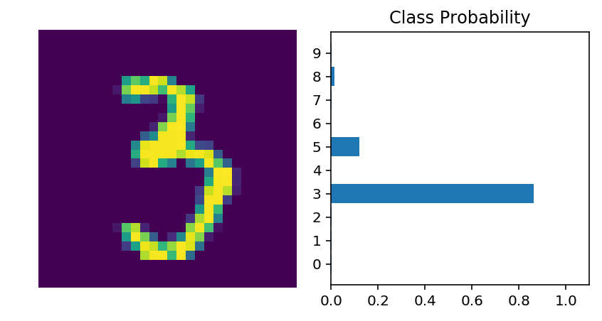

# Training Neural Networks

The network we built in the previous part isn't so smart, it doesn't know anything about our handwritten digits. Neural networks with non-linear activations work like universal function approximators. There is some function that maps your input to the output. For example, images of handwritten digits to class probabilities. The power of neural networks is that we can train them to approximate this function, and basically any function given enough data and compute time.


At first the network is naive, it doesn't know the function mapping the inputs to the outputs. We train the network by showing it examples of real data, then adjusting the network parameters such that it approximates this function.

To find these parameters, we need to know how poorly the network is predicting the real outputs. For this we calculate a **loss function** (also called the cost), a measure of our prediction error. For example, the mean squared loss is often used in regression and binary classification problems

$$
\ell = \frac{1}{2n}\sum_i^n{\left(y_i - \hat{y}_i\right)^2}
$$

where $n$ is the number of training examples, $y_i$ are the true labels, and $\hat{y}_i$ are the predicted labels.

By minimizing this loss with respect to the network parameters, we can find configurations where the loss is at a minimum and the network is able to predict the correct labels with high accuracy. We find this minimum using a process called **gradient descent**. The gradient is the slope of the loss function and points in the direction of fastest change. To get to the minimum in the least amount of time, we then want to follow the gradient (downwards). You can think of this like descending a mountain by following the steepest slope to the base.


## Backpropagation

For single layer networks, gradient descent is simple to implement. However, it's more complicated for deeper, multilayer neural networks like the one we've built. Complicated enough that it took about 30 years before researchers figured out how to train multilayer networks, although it's straightforward once you learn about it. 

This is done through **backpropagation** which is really just an application of the chain rule from calculus. It's easiest to understand if we convert a two layer network into a graph representation.


In the forward pass through the network, our data and operations go from right to left here. To train the weights with gradient descent, we propagate the gradient of the cost backwards through the network. Mathematically, this is really just calculating the gradient of the loss with respect to the weights using the chain rule.

$$
\frac{\partial \ell}{\partial w_1} = \frac{\partial l_1}{\partial w_1} \frac{\partial s}{\partial l_1} \frac{\partial l_2}{\partial s} \frac{\partial \ell}{\partial l_2}
$$

We update our weights using this gradient with some learning rate $\alpha$. 

$$
w^\prime = w - \alpha \frac{\partial \ell}{\partial w}
$$

The learning rate is set such that the weight update steps are small enough that the iterative method settles in a minimum.

The first thing we need to do for training is define our loss function. In PyTorch, you'll usually see this as `criterion`. Here we're using softmax output, so we want to use `criterion = nn.CrossEntropyLoss()` as our loss. Later when training, you use `loss = criterion(output, targets)` to calculate the actual loss.

We also need to define the optimizer we're using, SGD or Adam, or something along those lines. Here I'll just use SGD with `torch.optim.SGD`, passing in the network parameters and the learning rate.

## Autograd

Torch provides a module, `autograd`, for automatically calculating the gradient of tensors. It does this by keeping track of operations performed on tensors. To make sure PyTorch keeps track of operations on a tensor and calculates the gradients, you need to set `requires_grad` on a tensor. You can do this at creation with the `requires_grad` keyword, or at any time with `x.requires_grad_(True)`.

You can turn off gradients for a block of code with the `torch.no_grad()` content:
```python
x = torch.zeros(1, requires_grad=True)
>>> with torch.no_grad():
...     y = x * 2
>>> y.requires_grad
False
```

Also, you can turn on or off gradients altogether with `torch.set_grad_enabled(True|False)`.

The gradients are computed with respect to some variable `z` with `z.backward()`. This does a backward pass through the operations that created `z`.


```python
%matplotlib inline
%config InlineBackend.figure_format = 'retina'

from collections import OrderedDict

import numpy as np
import time

import torch
from torch import nn
from torch import optim
import torch.nn.functional as F

import helper
```


```python
x = torch.randn(2,2, requires_grad=True)
print(x)
```

    tensor([[ 1.5774, -2.2416],
            [-0.0962, -0.8233]], requires_grad=True)


```python
y = x**2
print(y)
```

    tensor([[2.4881, 5.0248],
            [0.0092, 0.6778]], grad_fn=<PowBackward0>)


Below we can see the operation that created `y`, a power operation `PowBackward0`.


```python
## grad_fn shows the function that generated this variable
print(y.grad_fn)
```

    <PowBackward0 object at 0x10806d1d0>


The autgrad module keeps track of these operations and knows how to calculate the gradient for each one. In this way, it's able to calculate the gradients for a chain of operations, with respect to any one tensor. Let's reduce the tensor `y` to a scalar value, the mean.


```python
z = y.mean()
print(z)
```

    tensor(2.0500, grad_fn=<MeanBackward1>)


You can check the gradients for `x` and `y` but they are empty currently.


```python
print(x.grad)
```

    None


To calculate the gradients, you need to run the `.backward` method on a Variable, `z` for example. This will calculate the gradient for `z` with respect to `x`

$$
\frac{\partial z}{\partial x} = \frac{\partial}{\partial x}\left[\frac{1}{n}\sum_i^n x_i^2\right] = \frac{x}{2}
$$


```python
z.backward()
print(x.grad)
print(x/2)
```

    tensor([[ 0.7887, -1.1208],
            [-0.0481, -0.4116]])
    tensor([[ 0.7887, -1.1208],
            [-0.0481, -0.4116]], grad_fn=<DivBackward0>)


These gradients calculations are particularly useful for neural networks. For training we need the gradients of the weights with respect to the cost. With PyTorch, we run data forward through the network to calculate the cost, then, go backwards to calculate the gradients with respect to the cost. Once we have the gradients we can make a gradient descent step. 

## Get the data and define the network

The same as we saw in part 3, we'll load the MNIST dataset and define our network.


```python
from torchvision import datasets, transforms

# Define a transform to normalize the data
transform = transforms.Compose([transforms.ToTensor(),
                              transforms.Normalize((0.5, 0.5, 0.5), (0.5, 0.5, 0.5)),
                             ])
# Download and load the training data
trainset = datasets.MNIST('MNIST_data/', download=True, train=True, transform=transform)
trainloader = torch.utils.data.DataLoader(trainset, batch_size=64, shuffle=True)
```

I'll build a network with `nn.Sequential` here. Only difference from the last part is I'm not actually using softmax on the output, but instead just using the raw output from the last layer. This is because the output from softmax is a probability distribution. Often, the output will have values really close to zero or really close to one. Due to [inaccuracies with representing numbers as floating points](https://docs.python.org/3/tutorial/floatingpoint.html), computations with a softmax output can lose accuracy and become unstable. To get around this, we'll use the raw output, called the **logits**, to calculate the loss.


```python
# Hyperparameters for our network
input_size = 784
hidden_sizes = [128, 64]
output_size = 10

# Build a feed-forward network
model = nn.Sequential(OrderedDict([
                      ('fc1', nn.Linear(input_size, hidden_sizes[0])),
                      ('relu1', nn.ReLU()),
                      ('fc2', nn.Linear(hidden_sizes[0], hidden_sizes[1])),
                      ('relu2', nn.ReLU()),
                      ('logits', nn.Linear(hidden_sizes[1], output_size))]))
```

## Training the network!

The first thing we need to do for training is define our loss function. In PyTorch, you'll usually see this as `criterion`. Here we're using softmax output, so we want to use `criterion = nn.CrossEntropyLoss()` as our loss. Later when training, you use `loss = criterion(output, targets)` to calculate the actual loss.

We also need to define the optimizer we're using, SGD or Adam, or something along those lines. Here I'll just use SGD with `torch.optim.SGD`, passing in the network parameters and the learning rate.


```python
criterion = nn.CrossEntropyLoss()
optimizer = optim.SGD(model.parameters(), lr=0.01)
```

First, let's consider just one learning step before looping through all the data. The general process with PyTorch:

* Make a forward pass through the network to get the logits 
* Use the logits to calculate the loss
* Perform a backward pass through the network with `loss.backward()` to calculate the gradients
* Take a step with the optimizer to update the weights

Below I'll go through one training step and print out the weights and gradients so you can see how it changes.


```python
print('Initial weights - ', model.fc1.weight)

images, labels = next(iter(trainloader))
images.resize_(64, 784)

# Clear the gradients, do this because gradients are accumulated
optimizer.zero_grad()

# Forward pass, then backward pass, then update weights
output = model.forward(images)
loss = criterion(output, labels)
loss.backward()
print('Gradient -', model.fc1.weight.grad)
optimizer.step()
```

    Initial weights -  Parameter containing:
    tensor([[ 0.0214,  0.0220, -0.0348,  ...,  0.0333,  0.0181,  0.0045],
            [-0.0264, -0.0208,  0.0085,  ...,  0.0044,  0.0214, -0.0103],
            [ 0.0143, -0.0283,  0.0063,  ...,  0.0056,  0.0046,  0.0323],
            ...,
            [-0.0139,  0.0073,  0.0151,  ..., -0.0270, -0.0134, -0.0234],
            [-0.0192, -0.0134, -0.0082,  ...,  0.0136,  0.0267, -0.0132],
            [-0.0180,  0.0188,  0.0158,  ...,  0.0327, -0.0304,  0.0203]],
           requires_grad=True)
    Gradient - tensor([[ 0.0000,  0.0000,  0.0000,  ...,  0.0000,  0.0000,  0.0000],
            [-0.0023, -0.0023, -0.0023,  ..., -0.0023, -0.0023, -0.0023],
            [ 0.0011,  0.0011,  0.0011,  ...,  0.0011,  0.0011,  0.0011],
            ...,
            [ 0.0037,  0.0037,  0.0037,  ...,  0.0037,  0.0037,  0.0037],
            [ 0.0009,  0.0009,  0.0009,  ...,  0.0009,  0.0009,  0.0009],
            [-0.0010, -0.0010, -0.0010,  ..., -0.0010, -0.0010, -0.0010]])


```python
print('Updated weights - ', model.fc1.weight)
```

    Updated weights -  Parameter containing:
    tensor([[ 0.0214,  0.0220, -0.0348,  ...,  0.0333,  0.0181,  0.0045],
            [-0.0264, -0.0208,  0.0085,  ...,  0.0044,  0.0214, -0.0102],
            [ 0.0143, -0.0283,  0.0063,  ...,  0.0056,  0.0046,  0.0323],
            ...,
            [-0.0140,  0.0073,  0.0150,  ..., -0.0271, -0.0135, -0.0234],
            [-0.0192, -0.0134, -0.0082,  ...,  0.0136,  0.0267, -0.0132],
            [-0.0180,  0.0188,  0.0158,  ...,  0.0327, -0.0304,  0.0203]],
           requires_grad=True)


### Training for real

Now we'll put this algorithm into a loop so we can go through all the images. This is fairly straightforward. We'll loop through the mini-batches in our dataset, pass the data through the network to calculate the losses, get the gradients, then run the optimizer.


```python
optimizer = optim.SGD(model.parameters(), lr=0.003)
```


```python
epochs = 3
print_every = 40
steps = 0
for e in range(epochs):
    running_loss = 0
    for images, labels in iter(trainloader):
        steps += 1
        # Flatten MNIST images into a 784 long vector
        images.resize_(images.size()[0], 784)
        
        optimizer.zero_grad()
        
        # Forward and backward passes
        output = model.forward(images)
        loss = criterion(output, labels)
        loss.backward()
        optimizer.step()
        
        running_loss += loss.item()
        
        if steps % print_every == 0:
            print("Epoch: {}/{}... ".format(e+1, epochs),
                  "Loss: {:.4f}".format(running_loss/print_every))
            
            running_loss = 0
```

    Epoch: 1/3...  Loss: 2.2990
    Epoch: 1/3...  Loss: 2.2833
    Epoch: 1/3...  Loss: 2.2613
    Epoch: 1/3...  Loss: 2.2416
    Epoch: 1/3...  Loss: 2.2228
    Epoch: 1/3...  Loss: 2.1953
    Epoch: 1/3...  Loss: 2.1700
    Epoch: 1/3...  Loss: 2.1387
    Epoch: 1/3...  Loss: 2.1136
    Epoch: 1/3...  Loss: 2.0794
    Epoch: 1/3...  Loss: 2.0455
    Epoch: 1/3...  Loss: 1.9975
    Epoch: 1/3...  Loss: 1.9519
    Epoch: 1/3...  Loss: 1.8912
    Epoch: 1/3...  Loss: 1.8539
    Epoch: 1/3...  Loss: 1.7857
    Epoch: 1/3...  Loss: 1.7059
    Epoch: 1/3...  Loss: 1.6420
    Epoch: 1/3...  Loss: 1.5942
    Epoch: 1/3...  Loss: 1.5278
    Epoch: 1/3...  Loss: 1.4393
    Epoch: 1/3...  Loss: 1.4180
    Epoch: 1/3...  Loss: 1.3148
    Epoch: 2/3...  Loss: 0.6966
    Epoch: 2/3...  Loss: 1.2005
    Epoch: 2/3...  Loss: 1.1478
    Epoch: 2/3...  Loss: 1.1016
    Epoch: 2/3...  Loss: 1.0512
    Epoch: 2/3...  Loss: 1.0161
    Epoch: 2/3...  Loss: 0.9827
    Epoch: 2/3...  Loss: 0.9330
    Epoch: 2/3...  Loss: 0.8993
    Epoch: 2/3...  Loss: 0.8845
    Epoch: 2/3...  Loss: 0.8416
    Epoch: 2/3...  Loss: 0.8307
    Epoch: 2/3...  Loss: 0.8066
    Epoch: 2/3...  Loss: 0.7887
    Epoch: 2/3...  Loss: 0.7628
    Epoch: 2/3...  Loss: 0.7287
    Epoch: 2/3...  Loss: 0.7358
    Epoch: 2/3...  Loss: 0.7100
    Epoch: 2/3...  Loss: 0.6938
    Epoch: 2/3...  Loss: 0.6646
    Epoch: 2/3...  Loss: 0.6776
    Epoch: 2/3...  Loss: 0.6332
    Epoch: 2/3...  Loss: 0.6346
    Epoch: 3/3...  Loss: 0.0574
    Epoch: 3/3...  Loss: 0.6123
    Epoch: 3/3...  Loss: 0.6029
    Epoch: 3/3...  Loss: 0.5831
    Epoch: 3/3...  Loss: 0.5942
    Epoch: 3/3...  Loss: 0.5482
    Epoch: 3/3...  Loss: 0.5953
    Epoch: 3/3...  Loss: 0.5699
    Epoch: 3/3...  Loss: 0.5366
    Epoch: 3/3...  Loss: 0.5425
    Epoch: 3/3...  Loss: 0.5093
    Epoch: 3/3...  Loss: 0.5033
    Epoch: 3/3...  Loss: 0.5071
    Epoch: 3/3...  Loss: 0.5247
    Epoch: 3/3...  Loss: 0.5128
    Epoch: 3/3...  Loss: 0.4652
    Epoch: 3/3...  Loss: 0.4766
    Epoch: 3/3...  Loss: 0.4965
    Epoch: 3/3...  Loss: 0.4938
    Epoch: 3/3...  Loss: 0.4786
    Epoch: 3/3...  Loss: 0.4752
    Epoch: 3/3...  Loss: 0.4598
    Epoch: 3/3...  Loss: 0.4916
    Epoch: 3/3...  Loss: 0.4779


With the network trained, we can check out it's predictions.


```python
images, labels = next(iter(trainloader))

img = images[20].view(1, 784)
# Turn off gradients to speed up this part
with torch.no_grad():
    logits = model.forward(img)

# Output of the network are logits, need to take softmax for probabilities
ps = F.softmax(logits, dim=1)
helper.view_classify(img.view(1, 28, 28), ps)
```





Now our network is brilliant. It can accurately predict the digits in our images. Next up you'll write the code for training a neural network on a more complex dataset.
