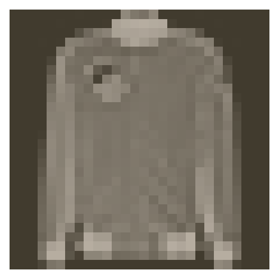
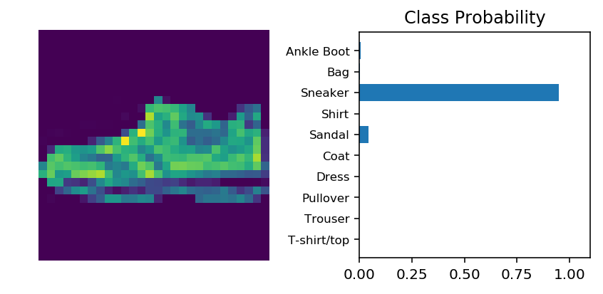

# Classifying Fashion-MNIST

Now it's your turn to build and train a neural network. You'll be using the [Fashion-MNIST dataset](https://github.com/zalandoresearch/fashion-mnist), a drop-in replacement for the MNIST dataset. MNIST is actually quite trivial with neural networks where you can easily achieve better than 97% accuracy. Fashion-MNIST is a set of 28x28 greyscale images of clothes. It's more complex than MNIST, so it's a better representation of the actual performance of your network, and a better representation of datasets you'll use in the real world.


In this notebook, you'll build your own neural network. For the most part, you could just copy and paste the code from Part 3, but you wouldn't be learning. It's important for you to write the code yourself and get it to work. Feel free to consult the previous notebook though as you work through this.

First off, let's load the dataset through torchvision.


```python
import torch
from torchvision import datasets, transforms
import helper

# Define a transform to normalize the data
transform = transforms.Compose([transforms.ToTensor(),
                                transforms.Normalize((0.5, 0.5, 0.5), (0.5, 0.5, 0.5))])
# Download and load the training data
trainset = datasets.FashionMNIST('F_MNIST_data/', download=True, train=True, transform=transform)
trainloader = torch.utils.data.DataLoader(trainset, batch_size=64, shuffle=True)

# Download and load the test data
testset = datasets.FashionMNIST('F_MNIST_data/', download=True, train=False, transform=transform)
testloader = torch.utils.data.DataLoader(testset, batch_size=64, shuffle=True)
```

Here we can see one of the images.


```python
image, label = next(iter(trainloader))
helper.imshow(image[0,:]);
```





With the data loaded, it's time to import the necessary packages.


```python
%matplotlib inline
%config InlineBackend.figure_format = 'retina'

import matplotlib.pyplot as plt
import numpy as np
import time

import torch
from torch import nn
from torch import optim
import torch.nn.functional as F
from torchvision import datasets, transforms

import helper

from collections import OrderedDict
```

## Building the network

Here you should define your network. As with MNIST, each image is 28x28 which is a total of 784 pixels, and there are 10 classes. You should include at least one hidden layer. We suggest you use ReLU activations for the layers and to return the logits from the forward pass. It's up to you how many layers you add and the size of those layers.


```python
# TODO: Define your network architecture here
input_size = 784
hidden_sizes = [256, 64]
output_size = 10

# Build a feed-forward network
model = nn.Sequential(OrderedDict([
                      ('fc1', nn.Linear(input_size, hidden_sizes[0])),
                      ('relu1', nn.ReLU()),
                      ('fc2', nn.Linear(hidden_sizes[0], hidden_sizes[1])),
                      ('relu2', nn.ReLU()),
                      ('logits', nn.Linear(hidden_sizes[1], output_size))]))


```

# Train the network

Now you should create your network and train it. First you'll want to define [the criterion](http://pytorch.org/docs/master/nn.html#loss-functions) ( something like `nn.CrossEntropyLoss`) and [the optimizer](http://pytorch.org/docs/master/optim.html) (typically `optim.SGD` or `optim.Adam`).

Then write the training code. Remember the training pass is a fairly straightforward process:

* Make a forward pass through the network to get the logits 
* Use the logits to calculate the loss
* Perform a backward pass through the network with `loss.backward()` to calculate the gradients
* Take a step with the optimizer to update the weights

By adjusting the hyperparameters (hidden units, learning rate, etc), you should be able to get the training loss below 0.4.


```python
# TODO: Create the network, define the criterion and optimizer
criterion = nn.CrossEntropyLoss()
optimizer = optim.SGD(model.parameters(), lr=0.01)
```


```python
# test
x = torch.rand(5,1,2, 2)
print(x)
x.resize_(5,4)
x

# the data has one batch that is size 32 instead of 64!
for images, label in iter(trainloader):
    if images.size()[0] != 64:
        print(images.size())
```

    tensor([[[[0.6024, 0.0058],
              [0.6974, 0.4434]]],
    
    
            [[[0.9870, 0.4782],
              [0.5325, 0.9174]]],
    
    
            [[[0.4197, 0.0594],
              [0.2415, 0.8400]]],
    
    
            [[[0.1822, 0.0604],
              [0.8852, 0.1078]]],
    
    
            [[[0.0921, 0.4648],
              [0.6790, 0.2433]]]])
    torch.Size([32, 1, 28, 28])


```python
# TODO: Train the network here
epochs = 5
print_every = 40
steps = 0

for e in range(epochs):
    running_loss = 0
    for images, labels in iter(trainloader):
        steps += 1
        
        d1,d2,d3,d4 = images.size()
        images.resize_(d1, 784)
        optimizer.zero_grad()
        
        # Forward and backward passes
        output = model.forward(images)
#         if output.size()[0] == 64:
            
        loss = criterion(output, labels)
        loss.backward()
        optimizer.step()


        running_loss += loss.item()

        if steps % print_every == 0:
            print("Epoch: {}/{}... ".format(e+1, epochs),
                  "Loss: {:.4f}".format(running_loss/print_every))

            running_loss = 0
        
```

    Epoch: 1/5...  Loss: 2.2472
    Epoch: 1/5...  Loss: 2.0848
    Epoch: 1/5...  Loss: 1.8769
    Epoch: 1/5...  Loss: 1.6111
    Epoch: 1/5...  Loss: 1.3922
    Epoch: 1/5...  Loss: 1.1980
    Epoch: 1/5...  Loss: 1.1096
    Epoch: 1/5...  Loss: 1.0097
    Epoch: 1/5...  Loss: 0.9261
    Epoch: 1/5...  Loss: 0.8697
    Epoch: 1/5...  Loss: 0.8125
    Epoch: 1/5...  Loss: 0.7681
    Epoch: 1/5...  Loss: 0.7566
    Epoch: 1/5...  Loss: 0.7111
    Epoch: 1/5...  Loss: 0.7274
    Epoch: 1/5...  Loss: 0.6953
    Epoch: 1/5...  Loss: 0.6771
    Epoch: 1/5...  Loss: 0.6920
    Epoch: 1/5...  Loss: 0.6516
    Epoch: 1/5...  Loss: 0.6200
    Epoch: 1/5...  Loss: 0.6128
    Epoch: 1/5...  Loss: 0.6293
    Epoch: 1/5...  Loss: 0.6214
    Epoch: 2/5...  Loss: 0.3272
    Epoch: 2/5...  Loss: 0.6092
    Epoch: 2/5...  Loss: 0.5904
    Epoch: 2/5...  Loss: 0.6367
    Epoch: 2/5...  Loss: 0.5728
    Epoch: 2/5...  Loss: 0.5927
    Epoch: 2/5...  Loss: 0.5675
    Epoch: 2/5...  Loss: 0.5793
    Epoch: 2/5...  Loss: 0.5447
    Epoch: 2/5...  Loss: 0.5611
    Epoch: 2/5...  Loss: 0.5101
    Epoch: 2/5...  Loss: 0.5503
    Epoch: 2/5...  Loss: 0.5547
    Epoch: 2/5...  Loss: 0.5304
    Epoch: 2/5...  Loss: 0.5343
    Epoch: 2/5...  Loss: 0.5230
    Epoch: 2/5...  Loss: 0.5129
    Epoch: 2/5...  Loss: 0.5075
    Epoch: 2/5...  Loss: 0.5612
    Epoch: 2/5...  Loss: 0.5513
    Epoch: 2/5...  Loss: 0.5353
    Epoch: 2/5...  Loss: 0.5388
    Epoch: 2/5...  Loss: 0.5142
    Epoch: 3/5...  Loss: 0.0568
    Epoch: 3/5...  Loss: 0.5394
    Epoch: 3/5...  Loss: 0.4894
    Epoch: 3/5...  Loss: 0.4927
    Epoch: 3/5...  Loss: 0.5039
    Epoch: 3/5...  Loss: 0.4927
    Epoch: 3/5...  Loss: 0.5140
    Epoch: 3/5...  Loss: 0.4959
    Epoch: 3/5...  Loss: 0.5339
    Epoch: 3/5...  Loss: 0.4947
    Epoch: 3/5...  Loss: 0.4559
    Epoch: 3/5...  Loss: 0.4785
    Epoch: 3/5...  Loss: 0.4910
    Epoch: 3/5...  Loss: 0.4880
    Epoch: 3/5...  Loss: 0.4802
    Epoch: 3/5...  Loss: 0.4768
    Epoch: 3/5...  Loss: 0.4646
    Epoch: 3/5...  Loss: 0.4475
    Epoch: 3/5...  Loss: 0.4483
    Epoch: 3/5...  Loss: 0.4996
    Epoch: 3/5...  Loss: 0.4888
    Epoch: 3/5...  Loss: 0.4502
    Epoch: 3/5...  Loss: 0.4656
    Epoch: 3/5...  Loss: 0.4779
    Epoch: 4/5...  Loss: 0.3042
    Epoch: 4/5...  Loss: 0.4630
    Epoch: 4/5...  Loss: 0.4730
    Epoch: 4/5...  Loss: 0.4598
    Epoch: 4/5...  Loss: 0.4399
    Epoch: 4/5...  Loss: 0.4420
    Epoch: 4/5...  Loss: 0.4637
    Epoch: 4/5...  Loss: 0.4676
    Epoch: 4/5...  Loss: 0.4827
    Epoch: 4/5...  Loss: 0.4627
    Epoch: 4/5...  Loss: 0.4396
    Epoch: 4/5...  Loss: 0.4548
    Epoch: 4/5...  Loss: 0.4277
    Epoch: 4/5...  Loss: 0.4580
    Epoch: 4/5...  Loss: 0.4464
    Epoch: 4/5...  Loss: 0.4136
    Epoch: 4/5...  Loss: 0.4447
    Epoch: 4/5...  Loss: 0.4610
    Epoch: 4/5...  Loss: 0.4330
    Epoch: 4/5...  Loss: 0.4503
    Epoch: 4/5...  Loss: 0.4596
    Epoch: 4/5...  Loss: 0.4345
    Epoch: 4/5...  Loss: 0.4545
    Epoch: 5/5...  Loss: 0.0930
    Epoch: 5/5...  Loss: 0.4197
    Epoch: 5/5...  Loss: 0.4700
    Epoch: 5/5...  Loss: 0.4103
    Epoch: 5/5...  Loss: 0.4543
    Epoch: 5/5...  Loss: 0.4245
    Epoch: 5/5...  Loss: 0.4411
    Epoch: 5/5...  Loss: 0.4387
    Epoch: 5/5...  Loss: 0.4218
    Epoch: 5/5...  Loss: 0.4218
    Epoch: 5/5...  Loss: 0.4194
    Epoch: 5/5...  Loss: 0.4282
    Epoch: 5/5...  Loss: 0.4276
    Epoch: 5/5...  Loss: 0.4185
    Epoch: 5/5...  Loss: 0.4102
    Epoch: 5/5...  Loss: 0.4684
    Epoch: 5/5...  Loss: 0.4037
    Epoch: 5/5...  Loss: 0.4014
    Epoch: 5/5...  Loss: 0.4419
    Epoch: 5/5...  Loss: 0.4320
    Epoch: 5/5...  Loss: 0.4171
    Epoch: 5/5...  Loss: 0.4281
    Epoch: 5/5...  Loss: 0.4039
    Epoch: 5/5...  Loss: 0.4503


```python
# Test out your network!

dataiter = iter(testloader)
images, labels = dataiter.next()
img = images[0]
# Convert 2D image to 1D vector
img = img.resize_(1, 784)

# TODO: Calculate the class probabilities (softmax) for img
ps = F.softmax(model.forward(img), dim=1)

# Plot the image and probabilities
helper.view_classify(img.resize_(1, 28, 28), ps, version='Fashion')
```





Now that your network is trained, you'll want to save it to disk so you can load it later instead of training it again. Obviously, it's impractical to train a network every time you need one. In practice, you'll train it once, save the model, then reload it for further training or making predictions. In the next part, I'll show you how to save and load trained models.
