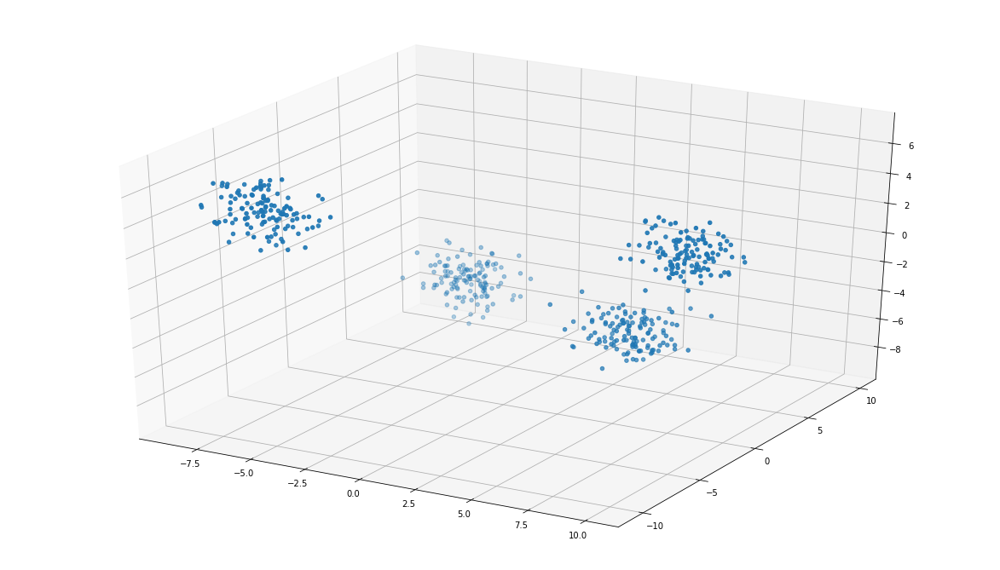
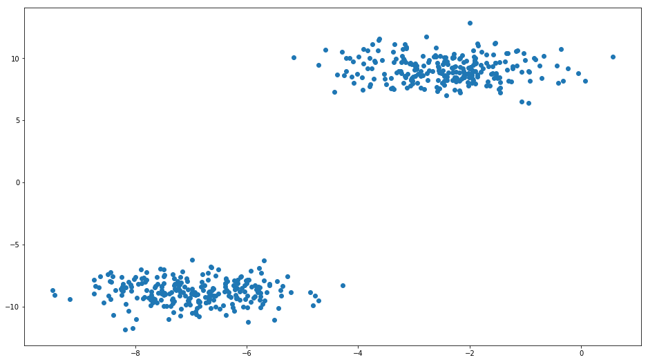
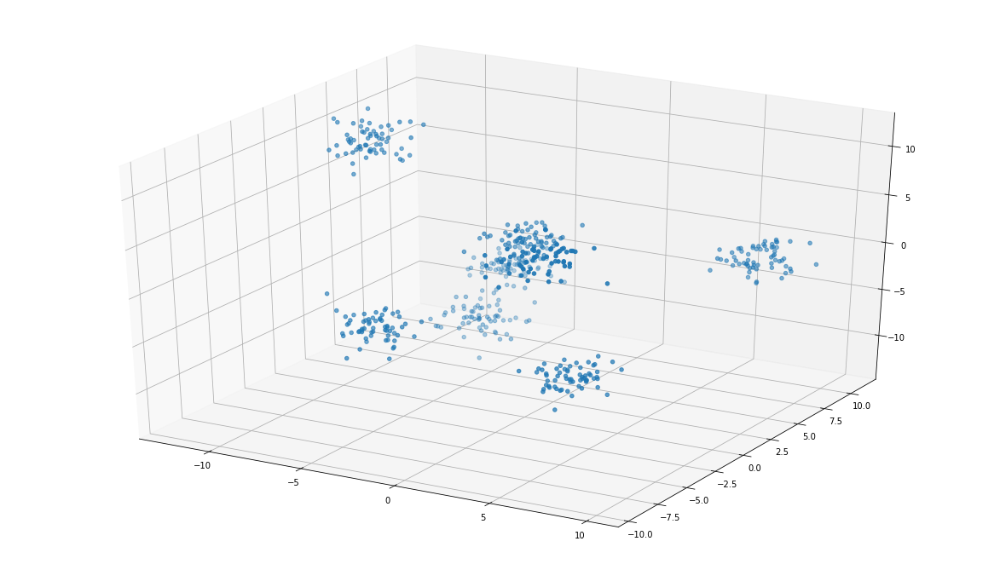
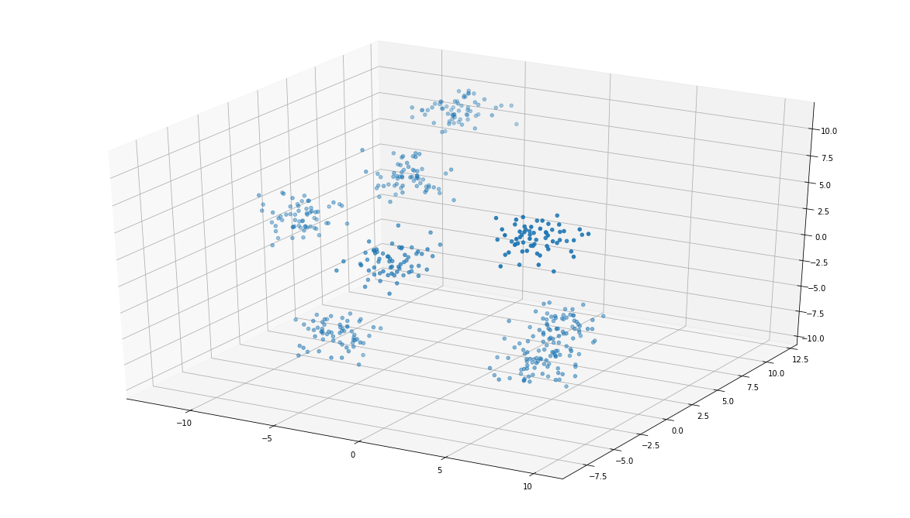

### Identifying Clusters

Before we get too far along, let's take a look at some different sets of data to practice identifying clusters.

Start by running the cell below.


```python
import numpy as np
import matplotlib.pyplot as plt
from mpl_toolkits.mplot3d import Axes3D
from sklearn.cluster import KMeans
from sklearn.datasets import make_blobs
import helper_functions as h
import test_file as t
from IPython import display

%matplotlib inline

# Make the images larger
plt.rcParams['figure.figsize'] = (16, 9)
```

`1.` Run the cell below to generate a set of data.  Then enter an integer next to **`question_1_clusters`** that identifies the number of clusters you think appear in the plot.

If you think that there are 2 clusters in the plot, you should enter:

```
question_1_clusters = 2
```


```python
h.plot_q1_data()
```





```python
question_1_clusters = 4# Enter the number of clusters you see here as an integer

#Then this will test your number against what we used to generate the data
t.test_question_1(question_1_clusters)
```

    That's right!  There are 4 clusters in this dataset.


`2.` Run the cell below to generate a set of data.  Then, similar to the first question, enter the number of clusters you think appear in the plot.


```python
h.plot_q2_data()
```





```python
question_2_clusters = 2# Enter the number of clusters you see here as an integer

#Then this will test your number against what we used to generate the data
t.test_question_2(question_2_clusters)
```

    That's right!  There are 2 clusters in this dataset.


`3.` Run the cell below to generate a set of data.  Then, similar to the previous questions, enter the number of clusters you think appear in the plot.


```python
h.plot_q3_data()
```





```python
question_3_clusters = 6# Enter the number of clusters you see here as an integer

#Then this will test your number against what we used to generate the data
t.test_question_3(question_3_clusters)
```

    6 is a reasonable guess for a the number of clusters here.  In the next question, you will see a different angle of this data.


`4.` Now one final time, run the cell below, and identify the number of clusters you think are in the plot created. 


```python
h.plot_q4_data()
```





```python
question_4_clusters = 7# Enter the number of clusters you see here as an integer

#Then this will test your number against what we used to generate the data
display.HTML(t.test_question_4(question_4_clusters))
```

    This data is actually the same as the data used in question 3.  Isn't it crazy how looking at data from a different angle can make us believe there are a different number of clusters in the data!  We will look at how to address this in the upcoming parts of this lesson.


**You can find a solution to this by clicking the orange jupyter image at the top of this notebook.**
