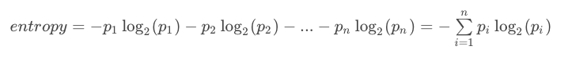
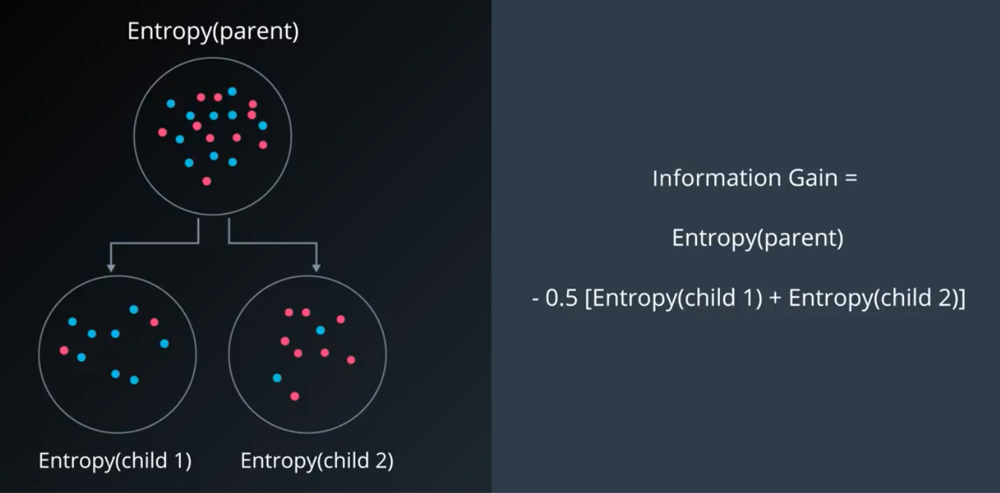
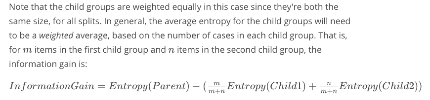

# calculate the information gain 
Fro Decision Tree, the steps to construct are:
1. calculate the total entropy
2. calculate entropy of different feature, see what is the information gain
3. pick the feature which has the highest entropy first

And the entropy formula is:



And in order to calculate the information gain, we do:




In the following problem, we are calculating which feature has the `highest information gain` for discriminating Mobugs from Lobugs, those features are color `brown`, `blue`, `green`, and `length < 17`, and `length < 20`


```python
import pandas as pd

data = pd.read_csv('data.csv')
data.head(10)

# glance of data
```


<div>
<style scoped>
    .dataframe tbody tr th:only-of-type {
        vertical-align: middle;
    }

    .dataframe tbody tr th {
        vertical-align: top;
    }

    .dataframe thead th {
        text-align: right;
    }
</style>
<table border="1" class="dataframe">
  <thead>
    <tr style="text-align: right;">
      <th></th>
      <th>Species</th>
      <th>Color</th>
      <th>Length (mm)</th>
    </tr>
  </thead>
  <tbody>
    <tr>
      <th>0</th>
      <td>Mobug</td>
      <td>Brown</td>
      <td>11.6</td>
    </tr>
    <tr>
      <th>1</th>
      <td>Mobug</td>
      <td>Blue</td>
      <td>16.3</td>
    </tr>
    <tr>
      <th>2</th>
      <td>Lobug</td>
      <td>Blue</td>
      <td>15.1</td>
    </tr>
    <tr>
      <th>3</th>
      <td>Lobug</td>
      <td>Green</td>
      <td>23.7</td>
    </tr>
    <tr>
      <th>4</th>
      <td>Lobug</td>
      <td>Blue</td>
      <td>18.4</td>
    </tr>
    <tr>
      <th>5</th>
      <td>Lobug</td>
      <td>Brown</td>
      <td>17.1</td>
    </tr>
    <tr>
      <th>6</th>
      <td>Mobug</td>
      <td>Brown</td>
      <td>15.7</td>
    </tr>
    <tr>
      <th>7</th>
      <td>Lobug</td>
      <td>Green</td>
      <td>18.6</td>
    </tr>
    <tr>
      <th>8</th>
      <td>Lobug</td>
      <td>Blue</td>
      <td>22.9</td>
    </tr>
    <tr>
      <th>9</th>
      <td>Lobug</td>
      <td>Blue</td>
      <td>21.0</td>
    </tr>
  </tbody>
</table>
</div>


```python
#--brown split vars---
brownMoLeft = 0
brownLoLeft= 0
brownMoRight = 0
brownLoRight = 0

# --blue split vars---
blueMoLeft = 0
blueLoLeft = 0 
blueMoRight = 0
blueLoRight = 0 

# --green split vars---
greenMoLeft = 0
greenLoLeft = 0  
greenMoRight = 0
greenLoRight = 0 

# --length < 17 split vars---
l17MoLeft = 0
l17LoLeft = 0   
l17MoRight = 0 
l17LoRight = 0   

# --length < 20 split vars---
l20MoLeft = 0
l20LoLeft = 0 
l20MoRight = 0
l20LoRight = 0

#--bug count----
moBug = 0
loBug = 0

for index, row in data.iterrows():
    #-------bug count--------
    if row[0] == 'Mobug':
        moBug += 1
    else:
        loBug += 1
        
    #----- brown splitting-----------
    
    if row[1] == 'Brown':
        if row[0] == 'Mobug':
            brownMoLeft += 1
        else:
            brownLoLeft+= 1
    else:
        if row[0] == 'Mobug':
            brownMoRight += 1
        else:
            brownLoRight += 1

    #----- add blue --------------   
    
    if row[1] == 'Blue':  
        if row[0] == 'Mobug':
            blueMoLeft += 1
        else:
            blueLoLeft += 1
    else:
        if row[0] == 'Mobug':
            blueMoRight += 1
        else:
            blueLoRight += 1
            
    #-----------add green-----------
     
    if row[1] == 'Green':  
        if row[0] == 'Mobug':
            greenMoLeft += 1
        else:
            greenLoLeft += 1
    else:
        if row[0] == 'Mobug':
            greenMoRight += 1
        else:
            greenLoRight += 1

    #-----------add < 17-----------
    
    if row[2] < 17 :  
        if row[0] == 'Mobug':
            l17MoLeft += 1
        else:
            l17LoLeft += 1
    else:
        if row[0] == 'Mobug':
            l17MoRight += 1
        else:
            l17LoRight += 1
     
            
    #-----------add < 20-----------
     
    if row[2] < 20:  
        if row[0] == 'Mobug':
            l20MoLeft += 1
        else:
            l20LoLeft += 1
    else:
        if row[0] == 'Mobug':
            l20MoRight += 1
        else:
            l20LoRight += 1

    
      
import math

def multiEntropy(*args):
  total = sum(args)
  result = 0
  for arg in args:
    p = arg/total
    result -= p*math.log(p,2)
  return result


def calcRes(left1, left2, right1, right2, parent1 = moBug, parent2 = loBug):
    p1 = (left1 + left2)/(moBug+loBug)
    p2 = (right1 + right2)/(moBug+loBug)
    
    # total entropy
    totalEntropy = multiEntropy(moBug,loBug)
    
    # left child entropy
    childEntropyLeft = multiEntropy(left1, left2)

    # right child entropy
    childEntropyRight = multiEntropy(right1, right2)
    
    return totalEntropy - p1*childEntropyLeft - p2*childEntropyRight


print('brown information gain is: ', calcRes(brownMoLeft,brownLoLeft,brownMoRight,brownLoRight))
print('blue information gain is: ', calcRes(blueMoLeft,blueLoLeft,blueMoRight,blueLoRight))
print('green information gain is: ', calcRes(greenMoLeft,greenLoLeft,greenMoRight,greenLoRight))
print('length < 17 information gain is: ', calcRes(l17MoLeft,l17LoLeft,l17MoRight,l17LoRight))
print('length < 20 information gain is: ', calcRes(l20MoLeft,l20LoLeft,l20MoRight,l20LoRight))
```

    brown information gain is:  0.06157292259666314
    blue information gain is:  0.000589596275060611
    green information gain is:  0.042776048498108454
    length < 17 information gain is:  0.11260735516748943
    length < 20 information gain is:  0.10073322588651712


As we can see from above, the `length < 17` has the highest information gain
