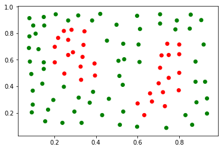

## sklearn DecisionTreeClassifier to fit data and predict 


```python
# Import statements 
from sklearn.tree import DecisionTreeClassifier
from sklearn.metrics import accuracy_score
import pandas as pd
import numpy as np

# Read the data.
data = np.asarray(pd.read_csv('data.csv', header=None))
# Assign the features to the variable X, and the labels to the variable y. 
X = data[:,0:2]
y = data[:,2]

#---------plot figure-------------
import matplotlib.pyplot as plt
from matplotlib.colors import ListedColormap

# ndarray
x1 = X[:,0:1]
x2 = X[:,1:2]
colors = ['red','green']
plt.scatter(x1.reshape(96,), x2.reshape(96,), c=y, cmap=ListedColormap(colors))
#--------- endplot figure-------------

```


    <matplotlib.collections.PathCollection at 0x1a1b661358>





```python
#------fit data --------
model = DecisionTreeClassifier()
model.fit(X,y)
#------------------------

#--------predict---------
y_pred = model.predict(X)
accuracy_score(y,y_pred)
```


    1.0


