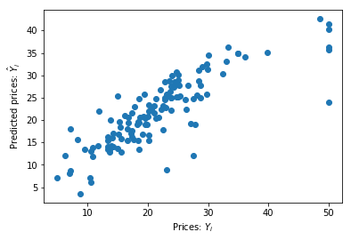

## Multiple Linear Regression - predict house price with 13 features

use `LinearRegression` from `sklearn.linear_model`


```python
from sklearn.linear_model import LinearRegression
from sklearn.datasets import load_boston
from sklearn.model_selection import train_test_split
import pandas as pd

# Load the data from the boston house-prices dataset 
boston_data = load_boston()
X = boston_data['data']
Y = boston_data['target']
```


```python
# explore the features
print('features:\n', boston_data.feature_names)
print(boston_data.DESCR)
print('X shape: ', X.shape)
print('Y shape: ', Y.shape)
```

    features:
     ['CRIM' 'ZN' 'INDUS' 'CHAS' 'NOX' 'RM' 'AGE' 'DIS' 'RAD' 'TAX' 'PTRATIO'
     'B' 'LSTAT']
    Boston House Prices dataset
    ===========================
    
    Notes
    ------
    Data Set Characteristics:  
    
        :Number of Instances: 506 
    
        :Number of Attributes: 13 numeric/categorical predictive
        
        :Median Value (attribute 14) is usually the target
    
        :Attribute Information (in order):
            - CRIM     per capita crime rate by town
            - ZN       proportion of residential land zoned for lots over 25,000 sq.ft.
            - INDUS    proportion of non-retail business acres per town
            - CHAS     Charles River dummy variable (= 1 if tract bounds river; 0 otherwise)
            - NOX      nitric oxides concentration (parts per 10 million)
            - RM       average number of rooms per dwelling
            - AGE      proportion of owner-occupied units built prior to 1940
            - DIS      weighted distances to five Boston employment centres
            - RAD      index of accessibility to radial highways
            - TAX      full-value property-tax rate per $10,000
            - PTRATIO  pupil-teacher ratio by town
            - B        1000(Bk - 0.63)^2 where Bk is the proportion of blacks by town
            - LSTAT    % lower status of the population
            - MEDV     Median value of owner-occupied homes in $1000's
    
        :Missing Attribute Values: None
    
        :Creator: Harrison, D. and Rubinfeld, D.L.
    
    This is a copy of UCI ML housing dataset.
    http://archive.ics.uci.edu/ml/datasets/Housing
    
    
    This dataset was taken from the StatLib library which is maintained at Carnegie Mellon University.
    
    The Boston house-price data of Harrison, D. and Rubinfeld, D.L. 'Hedonic
    prices and the demand for clean air', J. Environ. Economics & Management,
    vol.5, 81-102, 1978.   Used in Belsley, Kuh & Welsch, 'Regression diagnostics
    ...', Wiley, 1980.   N.B. Various transformations are used in the table on
    pages 244-261 of the latter.
    
    The Boston house-price data has been used in many machine learning papers that address regression
    problems.   
         
    **References**
    
       - Belsley, Kuh & Welsch, 'Regression diagnostics: Identifying Influential Data and Sources of Collinearity', Wiley, 1980. 244-261.
       - Quinlan,R. (1993). Combining Instance-Based and Model-Based Learning. In Proceedings on the Tenth International Conference of Machine Learning, 236-243, University of Massachusetts, Amherst. Morgan Kaufmann.
       - many more! (see http://archive.ics.uci.edu/ml/datasets/Housing)
    
    X shape:  (506, 13)
    Y shape:  (506,)


```python
bos = pd.DataFrame(boston_data.data)

# label the columbs
bos.columns = boston_data.feature_names
print(bos.head())
print(bos.describe())
```

          CRIM    ZN  INDUS  CHAS    NOX     RM   AGE     DIS  RAD    TAX  \
    0  0.00632  18.0   2.31   0.0  0.538  6.575  65.2  4.0900  1.0  296.0   
    1  0.02731   0.0   7.07   0.0  0.469  6.421  78.9  4.9671  2.0  242.0   
    2  0.02729   0.0   7.07   0.0  0.469  7.185  61.1  4.9671  2.0  242.0   
    3  0.03237   0.0   2.18   0.0  0.458  6.998  45.8  6.0622  3.0  222.0   
    4  0.06905   0.0   2.18   0.0  0.458  7.147  54.2  6.0622  3.0  222.0   
    
       PTRATIO       B  LSTAT  
    0     15.3  396.90   4.98  
    1     17.8  396.90   9.14  
    2     17.8  392.83   4.03  
    3     18.7  394.63   2.94  
    4     18.7  396.90   5.33  
                 CRIM          ZN       INDUS        CHAS         NOX          RM  \
    count  506.000000  506.000000  506.000000  506.000000  506.000000  506.000000   
    mean     3.593761   11.363636   11.136779    0.069170    0.554695    6.284634   
    std      8.596783   23.322453    6.860353    0.253994    0.115878    0.702617   
    min      0.006320    0.000000    0.460000    0.000000    0.385000    3.561000   
    25%      0.082045    0.000000    5.190000    0.000000    0.449000    5.885500   
    50%      0.256510    0.000000    9.690000    0.000000    0.538000    6.208500   
    75%      3.647423   12.500000   18.100000    0.000000    0.624000    6.623500   
    max     88.976200  100.000000   27.740000    1.000000    0.871000    8.780000   
    
                  AGE         DIS         RAD         TAX     PTRATIO           B  \
    count  506.000000  506.000000  506.000000  506.000000  506.000000  506.000000   
    mean    68.574901    3.795043    9.549407  408.237154   18.455534  356.674032   
    std     28.148861    2.105710    8.707259  168.537116    2.164946   91.294864   
    min      2.900000    1.129600    1.000000  187.000000   12.600000    0.320000   
    25%     45.025000    2.100175    4.000000  279.000000   17.400000  375.377500   
    50%     77.500000    3.207450    5.000000  330.000000   19.050000  391.440000   
    75%     94.075000    5.188425   24.000000  666.000000   20.200000  396.225000   
    max    100.000000   12.126500   24.000000  711.000000   22.000000  396.900000   
    
                LSTAT  
    count  506.000000  
    mean    12.653063  
    std      7.141062  
    min      1.730000  
    25%      6.950000  
    50%     11.360000  
    75%     16.955000  
    max     37.970000  


```python
# Make and fit the linear regression model
model = LinearRegression()

X_train, X_test, Y_train, Y_test = train_test_split(X,Y, test_size = 0.25)
model.fit(X_train,Y_train)

Y_pred = model.predict(X_test)

import matplotlib.pyplot as plt

plt.scatter(Y_test, Y_pred)
plt.xlabel("Prices: $Y_i$")
plt.ylabel("Predicted prices: $\hat{Y}_i$")
plt.show()
```





```python
# Make a prediction using the model
sample_house = [[2.29690000e-01, 0.00000000e+00, 1.05900000e+01, 0.00000000e+00, 4.89000000e-01,
                6.32600000e+00, 5.25000000e+01, 4.35490000e+00, 4.00000000e+00, 2.77000000e+02,
                1.86000000e+01, 3.94870000e+02, 1.09700000e+01]]

prediction = model.predict(sample_house)
print(prediction)
```

    [23.62893003]

