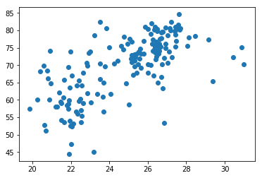
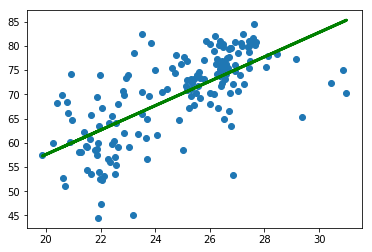

```python
from pandas import read_csv
from sklearn.linear_model import LinearRegression

# Assign the dataframe to this variable.
bmi_life_data = read_csv('data.csv') 

life_expenctancy = bmi_life_data[['Life expectancy']]
bmi = bmi_life_data[['BMI']]

# show data
import matplotlib.pyplot as plt
plt.scatter(bmi, life_expenctancy, zorder = 3)
plt.show()
```





```python
# Make and fit the linear regression model
model = LinearRegression()
bmi_life_model =  model.fit(bmi, life_expenctancy)
# Make a prediction using the model
life_expenctancy_pred = bmi_life_model.predict(bmi)


plt.scatter(bmi, life_expenctancy)
plt.plot(bmi, life_expenctancy_pred, color='green', linewidth=3)
plt.show()

# predict life_expenctancy of BMI of 21.07931
laos_life_exp = bmi_life_model.predict(21.07931)
print(laos_life_exp)
```





    [[60.31564716]]

