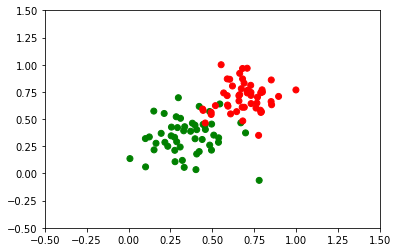

```python
import matplotlib
import matplotlib.pyplot as plt
import numpy as np
import pandas as pd

#---------read data------------
data = pd.read_csv('data.csv', header = None)
x = data[0]
y = data[1]
label = data[2]
colors = ['red','green']

#------------------------------


# fig = plt.figure(figsize=(8,8))
plt.scatter(x, y, c=label, cmap=matplotlib.colors.ListedColormap(colors))
plt.xlim(-0.5, 1.5)  
plt.ylim(-0.5, 1.5)  


```


    (-0.5, 1.5)





```python
import numpy as np

# Setting the random seed, feel free to change it and see different solutions.
np.random.seed(42)

def stepFunction(t):
    if t >=0:
        return 1
    return 0

def prediction(X,W,b):
    return stepFunction((np.matmul(X,W)+b)[0])

def perceptronStep(X, y, W, b, learn_rate = 0.01):
    W = W - np.array([[],[]])
    return W, b

W = np.array(np.random.rand(2,1))
np.array([1,2])
```


    array([1, 2])


