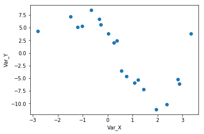
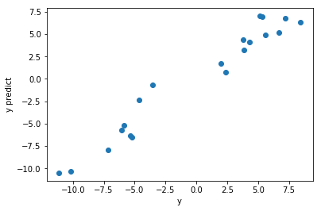
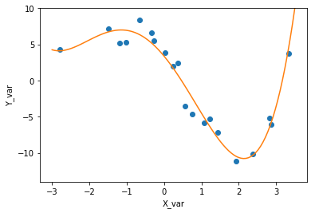

```python
from sklearn.preprocessing import PolynomialFeatures
from pandas import read_csv
# Assign the data to predictor and outcome variables
# Load the data
train_data = read_csv('data.csv')
train_data = train_data.sort_values(by=['Var_X'])
X = train_data['Var_X'].values.reshape(-1, 1)
y = train_data['Var_Y'].values

# show data
import matplotlib.pyplot as plt
plt.scatter(X, y, zorder = 3)
plt.xlabel('Var_X')
plt.ylabel('Var_Y')
plt.show()
train_data

```





<div>
<style scoped>
    .dataframe tbody tr th:only-of-type {
        vertical-align: middle;
    }

    .dataframe tbody tr th {
        vertical-align: top;
    }

    .dataframe thead th {
        text-align: right;
    }
</style>
<table border="1" class="dataframe">
  <thead>
    <tr style="text-align: right;">
      <th></th>
      <th>Var_X</th>
      <th>Var_Y</th>
    </tr>
  </thead>
  <tbody>
    <tr>
      <th>14</th>
      <td>-2.79140</td>
      <td>4.29794</td>
    </tr>
    <tr>
      <th>10</th>
      <td>-1.48662</td>
      <td>7.22328</td>
    </tr>
    <tr>
      <th>2</th>
      <td>-1.19438</td>
      <td>5.16161</td>
    </tr>
    <tr>
      <th>19</th>
      <td>-1.01925</td>
      <td>5.31123</td>
    </tr>
    <tr>
      <th>3</th>
      <td>-0.65046</td>
      <td>8.43823</td>
    </tr>
    <tr>
      <th>0</th>
      <td>-0.33532</td>
      <td>6.66854</td>
    </tr>
    <tr>
      <th>4</th>
      <td>-0.28001</td>
      <td>5.57201</td>
    </tr>
    <tr>
      <th>1</th>
      <td>0.02160</td>
      <td>3.86398</td>
    </tr>
    <tr>
      <th>13</th>
      <td>0.24183</td>
      <td>2.00412</td>
    </tr>
    <tr>
      <th>11</th>
      <td>0.37629</td>
      <td>2.38887</td>
    </tr>
    <tr>
      <th>17</th>
      <td>0.54924</td>
      <td>-3.52863</td>
    </tr>
    <tr>
      <th>7</th>
      <td>0.74727</td>
      <td>-4.63725</td>
    </tr>
    <tr>
      <th>15</th>
      <td>1.08176</td>
      <td>-5.86553</td>
    </tr>
    <tr>
      <th>6</th>
      <td>1.22620</td>
      <td>-5.31226</td>
    </tr>
    <tr>
      <th>12</th>
      <td>1.43918</td>
      <td>-7.13415</td>
    </tr>
    <tr>
      <th>5</th>
      <td>1.93258</td>
      <td>-11.13270</td>
    </tr>
    <tr>
      <th>18</th>
      <td>2.36449</td>
      <td>-10.16202</td>
    </tr>
    <tr>
      <th>16</th>
      <td>2.81555</td>
      <td>-5.20711</td>
    </tr>
    <tr>
      <th>9</th>
      <td>2.87457</td>
      <td>-6.06084</td>
    </tr>
    <tr>
      <th>8</th>
      <td>3.32853</td>
      <td>3.80650</td>
    </tr>
  </tbody>
</table>
</div>


```python
# Create polynomial features
# Create a PolynomialFeatures object, then fit and transform the predictor feature
poly_feat = PolynomialFeatures(degree = 4)
X_poly = poly_feat.fit_transform(X)

# Make and fit the polynomial regression model
# Create a LinearRegression object and fit it to the polynomial predictor features
from sklearn.linear_model import LinearRegression
model = LinearRegression(fit_intercept = False)
poly_model = model.fit(X_poly, y)

y_predict = poly_model.predict(X_poly)


plt.scatter(y, y_predict)
plt.xlabel('y')
plt.ylabel('y predict')
plt.show()

from sklearn.metrics import mean_squared_error
mse = mean_squared_error(y, y_predict)
print('mse: ', mse)
```





    mse:  1.7503964875892932


```python
# plt.scatter(X, y)
import numpy as np
xvals = np.linspace(-3, 3.5,100).reshape(-1, 1)
f, ax = plt.subplots(1)
poly_xvals = poly_feat.fit_transform(xvals)
yvalues = poly_model.predict(poly_xvals)
plt.plot(X, y, 'o', xvals, yvalues, '-')
plt.xlabel('X_var')
plt.ylabel('Y_var')
ax.set_ylim([-14,10])
plt.show()
```




