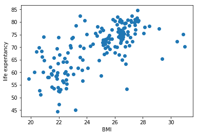
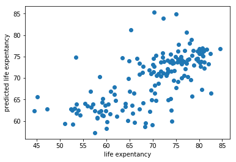
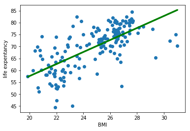
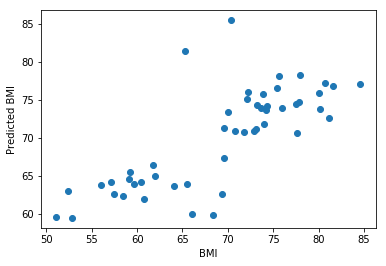

```python
from pandas import read_csv
from sklearn.linear_model import LinearRegression
from sklearn.metrics import mean_squared_error

# Assign the dataframe to this variable.
bmi_life_data = read_csv('data.csv') 

life_expenctancy = bmi_life_data[['Life expectancy']]
bmi = bmi_life_data[['BMI']]

# show data
import matplotlib.pyplot as plt
plt.scatter(bmi, life_expenctancy, zorder = 3)
plt.xlabel('BMI')
plt.ylabel('life expentancy')
plt.show()
```





```python
# Make and fit the linear regression model
model = LinearRegression()
bmi_life_model =  model.fit(bmi, life_expenctancy)
# Make a prediction using the model
life_expenctancy_pred = bmi_life_model.predict(bmi)


plt.scatter(life_expenctancy, life_expenctancy_pred)
plt.xlabel('life expentancy')
plt.ylabel('predicted life expentancy')
plt.show()

mse = mean_squared_error(life_expenctancy, life_expenctancy_pred)
print('mse: ', mse)
```





    mse:  43.02103118924391


```python
plt.scatter(bmi, life_expenctancy)
plt.plot(bmi, life_expenctancy_pred, color='green', linewidth=3)
plt.xlabel('BMI')
plt.ylabel('life expentancy')
plt.show()

# predict life_expenctancy of BMI of 21.07931
laos_life_exp = bmi_life_model.predict(21.07931)
print(laos_life_exp)
```





    [[60.31564716]]


#### Try train the data only using part of the dataset:


```python
from sklearn.model_selection import train_test_split

model2 = LinearRegression()
X_train, X_test, Y_train, Y_test = train_test_split(bmi,life_expenctancy, test_size = 0.3)
model2.fit(X_train,Y_train)

Y_pred = model2.predict(X_test)

plt.scatter(Y_test, Y_pred)
plt.xlabel("BMI")
plt.ylabel("Predicted BMI")
plt.show()

mse = mean_squared_error(Y_test, Y_pred)
print('mse: ', mse)
```





    mse:  31.29356316687032


####  Question: the mse above is different every time we run the above code, how should we choose? Just run 100 times, and choose smallest one?


```python
plt.scatter(bmi, life_expenctancy)
plt.plot(X_test, Y_pred, color='green', linewidth=3)
plt.xlabel('BMI')
plt.ylabel('life expentancy')
plt.show()

```


